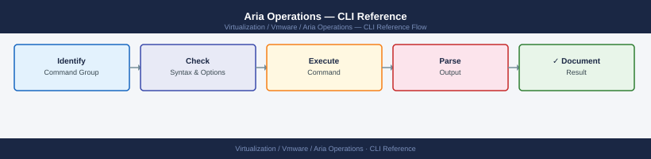

---
tags:
  - aria-operations
  - operations
  - vmware
---
# Aria Operations — CLI Reference


<div class="kb-summary">
CLI Reference reference covering vracli Commands, chkconfig (Legacy / Service Enable/Disable), Useful Paths, REST API Quick Reference, Related Sections.

*Applies to: Aria Ops 8.x*
</div>



Aria Operations — CLI Command Reference Map


```d2
direction: right

hub: "Aria Operations\nOperations" {shape: hexagon}
vcopsadmin_cli: "vcops-admin CLI" {shape: rectangle}
chkconfig_legacy_service_enabledisab: "chkconfig (Legacy / Service Enable/Disable)" {shape: rectangle}
useful_paths: "Useful Paths" {shape: rectangle}
rest_api_quick_reference: "REST API Quick Reference" {shape: rectangle}
related_sections: "Related Sections" {shape: rectangle}
verify: "Verify" {shape: rectangle}

hub -> vcopsadmin_cli
hub -> chkconfig_legacy_service_enabledisab
hub -> useful_paths
hub -> rest_api_quick_reference
hub -> related_sections
hub -> verify
```

## vcops-admin CLI

### Adapter Management

```bash
# List all adapters and collection status
vracli adapter list

# List adapters with verbose output
vracli adapter list --verbose

# Restart a specific adapter (get ID from list output)
vracli adapter restart --id <adapter-id>
```

### Status and Services

```bash
# Overall service health summary
vracli status

# Check individual service
systemctl status vmware-vcops-<service-name>

# List all VMware services
systemctl list-units 'vmware-*'
```

### Certificate Management

```bash
# View current certificate info
vracli certificate show

# Replace certificate (PEM format)
vracli certificate import --cert /tmp/aria-ops.crt --key /tmp/aria-ops.key --ca /tmp/ca-chain.crt
```

### Support

```bash
# Generate support bundle
vracli support bundle generate

# List existing support bundles
ls -lh /storage/log/support-bundle/

# View recent logs
vracli log tail --lines 100
```

### Authentication and Users

```bash
# List configured auth sources
vracli auth list

# Test LDAP connectivity
vracli auth test --source <ldap-source-name>
```

---

## Before you begin

- **Access:** vCenter read-only minimum; Administrator role for remediation steps
- **Timing:** safe to run during business hours unless a step is marked ⚠ (causes interruption)
- **Dependencies:** no active upgrades or migrations on the same infrastructure
- **Logging:** capture command output — paste into the change record on completion

---

## chkconfig (Legacy / Service Enable/Disable)

```bash
# List services and their runlevel status
chkconfig --list | grep vmware

# Enable a service at boot
chkconfig vmware-vcops on
```

---

## Useful Paths

| Path | Contents |
|------|----------|
| `/storage/log/` | All Aria Operations logs |
| `/storage/log/support-bundle/` | Generated support bundles |
| `/storage/core/` | Core data directory |
| `/usr/lib/vmware-vcopssuite/utilities/` | vracli utilities location |

---

## REST API Quick Reference

Base URL: `https://<aria-ops-fqdn>/suite-api/api`

```bash
# Authenticate and get token
curl -sk -X POST "https://<aria-ops>/suite-api/api/auth/token/acquire" \
  -H "Content-Type: application/json" \
  -d '{"username":"admin","authSource":"LOCAL","password":"<password>"}' | jq .

# List resources
curl -sk -H "Authorization: vRealizeOpsToken <token>" \
  "https://<aria-ops>/suite-api/api/resources" | jq .

# Get all active alerts
curl -sk -H "Authorization: vRealizeOpsToken <token>" \
  "https://<aria-ops>/suite-api/api/alerts?activeOnly=true" | jq .
```

---

## Related Sections

- [Operations](index.md) — operational runbooks
- [Scripts](scripts/index.md) — automation using the API
- [Troubleshooting](../troubleshooting/index.md) — diagnostic commands

---

## See also

- [Aria Operations Procedures](procedures/)
- [Aria Operations Scripts](scripts/)
- [Aria Operations Health Checks](health-checks/)

## Verify

- **Alarms:** vSphere Client → Home → Alarms — no new critical alarms after the operation
- **Events:** monitor the vCenter Events view for the affected object for 5 minutes
- **Health check:** run the morning health-check sequence for the affected product tier
