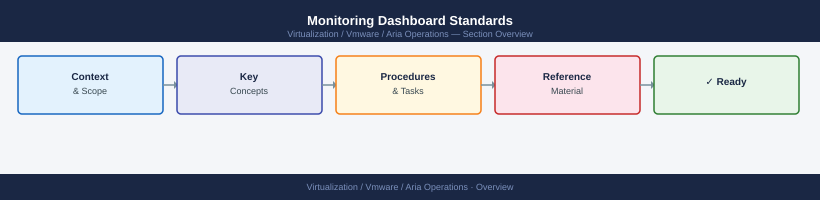

---
tags:
  - aria-operations
  - operations
  - vmware
---
# Monitoring Dashboard Standards


<div class="kb-summary">
Monitoring Dashboard Standards reference covering Grafana — Dashboard as Code, Validation Checklist, Dashboard Review Cadence.

*Applies to: Aria Ops 8.x*
</div>



```d2
direction: right

hub: "Aria Operations\nOperations" {shape: hexagon}
validation_checklist: "Validation Checklist" {shape: rectangle}
dashboard_review_cadence: "Dashboard Review Cadence" {shape: rectangle}
verify: "Verify" {shape: rectangle}

hub -> validation_checklist
hub -> dashboard_review_cadence
hub -> verify
```

## Before you begin

- **Access:** vCenter read-only minimum; Administrator role for remediation steps
- **Timing:** safe to run during business hours unless a step is marked ⚠ (causes interruption)
- **Dependencies:** no active upgrades or migrations on the same infrastructure
- **Logging:** capture command output — paste into the change record on completion

---

## Validation Checklist

- [ ] All required dashboards loading in monitoring tool
- [ ] Metrics updating at configured refresh interval
- [ ] Alert panel reflects current open alerts (not stale)
- [ ] Time-zone consistent across all panels (UTC preferred for ops dashboards)
- [ ] No broken panel queries (missing datasource or deleted metric)
- [ ] Access permissions: read for all ops, edit only for monitoring team
- [ ] Dashboard JSON committed to Git / versioned

## Dashboard Review Cadence

| Trigger | Action |
|---|---|
| Quarterly | Audit for stale panels and unused dashboards |
| After major infra change | Update panels affected by the change |
| New service onboarded | Add service to infrastructure overview within 5 days |
| Alert threshold change | Update the corresponding dashboard annotation |

---

## Verify

- All dashboards follow the naming convention: `[Team] — [Scope] — [Type]`
- Stale dashboards (unused for 90+ days) have been removed or archived
- Dashboard panels display data within the last 15 minutes for live metrics
- Newly onboarded services appear on the infrastructure overview dashboard

---

## See also

- [Aria Operations — Procedures](procedures/)
- [Aria Operations — Health Checks](health-checks/)
- [Aria Operations — Common Issues](../troubleshooting/common-issues/)
