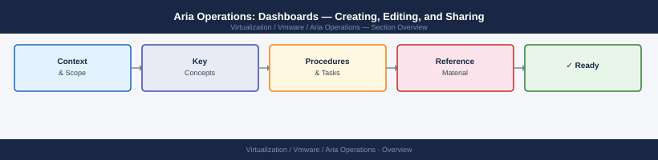

---
tags:
  - aria-operations
  - operations
  - vmware
---
# Aria Operations: Dashboards — Creating, Editing, and Sharing


<div class="kb-summary">
Creating, Editing, and Sharing reference covering Dashboard Interactions, Sharing and Cloning Dashboards, Importing Community Dashboards, Common Dashboard Issues.

*Applies to: Aria Ops 8.x*
</div>



Popular community packs:

| Pack | Coverage |
|---|---|
| vSphere Operations | CPU, memory, storage, network per cluster/host |
| NSX-T Operations | Logical network health and flow telemetry |
| vSAN Operations | Disk group health, capacity, performance |
| Kubernetes | Container resource usage via Telegraf |

```d2
direction: right

hub: "Aria Operations\nOperations" {shape: hexagon}
common_dashboard_issues: "Common Dashboard Issues" {shape: rectangle}
verify: "Verify" {shape: rectangle}

hub -> common_dashboard_issues
hub -> verify
```

## Before you begin

- **Access:** vCenter read-only minimum; Administrator role for remediation steps
- **Timing:** safe to run during business hours unless a step is marked ⚠ (causes interruption)
- **Dependencies:** no active upgrades or migrations on the same infrastructure
- **Logging:** capture command output — paste into the change record on completion

---

## Common Dashboard Issues

| Issue | Likely Cause | Fix |
|---|---|---|
| Widget shows "No Data" | Wrong object scope or metric key | Check widget configuration and object filter |
| Dashboard loads slowly | Too many widgets or long time ranges | Reduce widget count or shorten time range |
| Shared dashboard not visible | User lacks required role | Check user role permissions |
| Import fails | Dashboard JSON version mismatch | Re-export from same Aria Ops version |
| Widget interactions not working | Widgets not linked | Enable interactions in dashboard editor |

---

## Verify

- **Alarms:** vSphere Client → Home → Alarms — no new critical alarms after the operation
- **Events:** monitor the vCenter Events view for the affected object for 5 minutes
- **Health check:** run the morning health-check sequence for the affected product tier

## See also

- [Alert Management](alert-management.md)
- [Aria Operations: Alert Definitions and Policies](alerts.md)
- [Aria Operations Backup & Restore](backup-restore.md)
- [Aria Operations — Operations](index.md)
- [Aria Operations — Architecture](../architecture/)
- [Aria Operations — Deploy](../deploy/)
- [Aria Operations — Security](../security/)
- [Aria Operations — Troubleshooting](../troubleshooting/)
