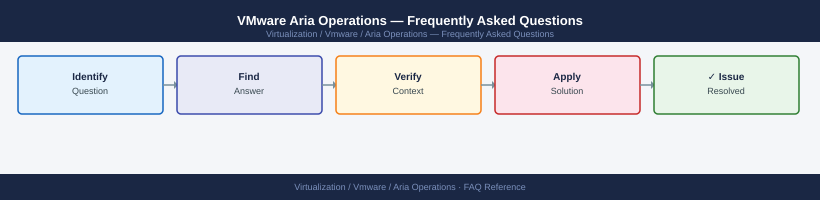

---
tags:
  - aria-operations
  - faq
  - operations
---
# VMware Aria Operations — Frequently Asked Questions

Common questions about VMware Aria Operations operations, configuration, and troubleshooting. For step-by-step procedures, see the <a href="index.md">Operations</a> section.

## General

**Q: What Aria Operations version is recommended?**
A: Aria Operations 8.16.x is the current recommendation. Check via Administration → Support → About.

**Q: How do I check the current VMware Aria Operations version?**
A: `Administration → Support → About`

## Configuration

**Q: What is the default collection interval for metrics?**
A: 5 minutes is the default collection interval. Reduce to 1 minute for high-frequency monitoring of critical VMs (increases storage). Aria Operations retains high-resolution data for 6 months, then rolls up to daily.

**Q: How do I enable Aria Operations Workload Optimization?**
A: Go to Optimize → Workload Optimization → Enable. Configure automation policies (Manual, Automated). Start with Manual mode to review recommendations before applying. Workload Optimization rebalances VMs across hosts based on capacity.

## Operations

**Q: How do I upgrade Aria Operations without downtime?**
A: Aria Operations supports rolling upgrades for clustered deployments. Use LCM or the PAK-based upgrade via Administration → Software Update. The primary node upgrades first, then data nodes one at a time.

**Q: What is the correct procedure to add a new vCenter adapter?**
A: Administration → Solutions → vCenter Server → Add New. Provide vCenter FQDN and credentials. Aria Operations discovers all inventory (VMs, hosts, clusters) within the first collection cycle (5 minutes).

## Troubleshooting

**Q: Aria Operations shows a VM with 'Anomalous Metrics'. What does it mean?**
A: Aria Operations' ML engine has detected metric values outside the normal baseline for that VM (CPU, memory, latency, etc.). Investigate whether this is expected load change or a problem. Check the 'What Changed' context in the alert details.

**Q: Aria Operations is slow and collectors are lagging — where do I start?**
A: Check Administration → Collector Groups for overloaded collectors. Balance object count across collectors. Check data node disk usage under Administration → Environment → Cluster Management. Consider adding data nodes for large environments.

## Backup and Recovery

**Q: How often should I back up Aria Operations?**
A: Daily via LCM or Administration → Administration → Global Settings → Scheduled Backup. Backup includes all dashboards, alerts, policies, and custom metrics. Store off-appliance.

**Q: Can I restore a single dashboard without a full Aria Operations restore?**
A: Yes — dashboards can be exported to JSON (Dashboard → Export) and re-imported. Super Metrics and custom groups can also be exported individually. Full restore is needed only for system-level configuration recovery.

## See Also

- [VMware Aria Operations Operations](index.md)
- [VMware Aria Operations Troubleshooting](../../../troubleshooting/index.md)
