---
tags:
  - aria-operations
  - operations
  - vmware
---
# Aria Operations Health Checks

<div class="kb-summary">
Health checks for Aria Operations — cluster node status, adapter collection health, disk usage, service states, NTP sync, alert pipeline validation, and capacity API queries.

*Applies to: Aria Ops 8.x*
</div>

## Before you begin

- **Access:** vCenter read-only minimum; Administrator role for remediation steps
- **Timing:** safe to run during business hours unless a step is marked ⚠ (causes interruption)
- **Dependencies:** no active upgrades or migrations on the same infrastructure
- **Logging:** capture command output — paste into the change record on completion

---

## Run This Routine

Run these 8 checks in order at the start of each shift or after any infrastructure change.

1. **Cluster health** — `curl -sk https://<aria-ops>/suite-api/api/deployment/node/status` or open the Admin UI → Cluster Management — all nodes must show ONLINE
2. **Adapter instance connectivity** — Administration → Solutions → check every adapter instance shows green (Collecting); investigate any showing "Not Collecting"
3. **Alert queue** — Operations → Alerts → review open P1/P2 alerts and confirm each is acknowledged or has an active investigation
4. **Data retention disk** — Admin UI → Administration → Disk Usage → confirm free space is above 20% on the `/storage/db` partition
5. **Collector node connectivity** — Administration → Cluster Management → Remote Collectors — confirm all remote collectors show Connected
6. **vCenter adapter last collection** — check each adapter Instance → Last Collection timestamp; flag if older than 15 minutes
7. **License status** — Administration → Licenses → confirm no licenses are expired or approaching expiry within 30 days
8. **Pending recommendations / reclamation** — Optimize → Reclamation → review pending items and action or defer any that have been open more than 7 days

---

## Adapter Collection Commands


```bash
# List adapters with verbose collection state
vracli adapter list --verbose

## Check the collector service log for adapter errors

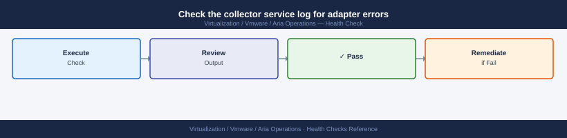
tail -200 /data/vcops/log/collector.log | grep -i "error\|exception\|fail"

## Restart an adapter that is stuck in "Not Collecting"

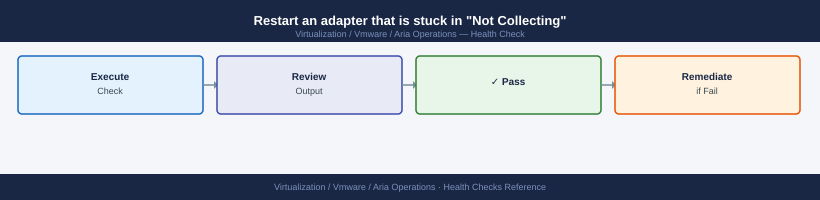
## UI: Administration → Solutions → select adapter → Restart Instance

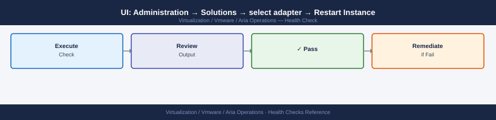
## Or via API:

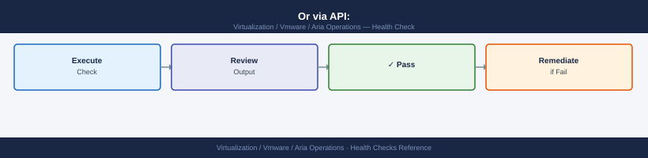
curl -sk -X POST -H "Authorization: vRealizeOpsToken $TOKEN" \
  "https://vrops-prod-01.example.local/suite-api/api/adapters/<adapter-id>/monitoringstatedescriptor" \
  -H "Content-Type: application/json" \
  -d '{"collectorId": "<collector-id>", "resourceKindKey": "ADAPTER", "adapterKindKey": "VMWARE"}'
```
## Disk and Resource Commands


```bash
ssh admin@vrops-prod-01.example.local

# Check disk usage on primary node
df -h /storage/db /storage/log /storage/core

## Check Cassandra data directory sizes (main metrics store)

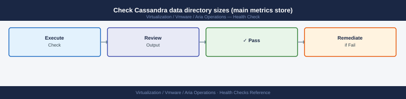
du -sh /storage/db/cassandra/data/*

## Check available inodes — can cause "disk full" errors even with space remaining

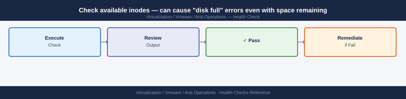
df -i /storage/db
```
## Service Health Commands


```bash
# Check all vmware services on the primary node
systemctl list-units 'vmware-*' --state=active

## Check a specific service that appears failed

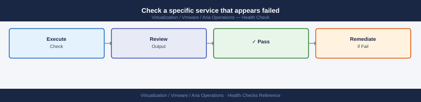
systemctl status vmware-vcops-analytics
journalctl -u vmware-vcops-analytics --since "1 hour ago" | tail -100

## Key services and expected states


## vmware-vcops-analytics   — active (running)


## vmware-vcops-cassandra   — active (running)

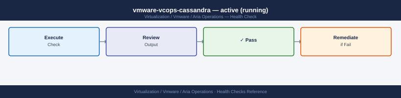
## vmware-vcops-postgres    — active (running)

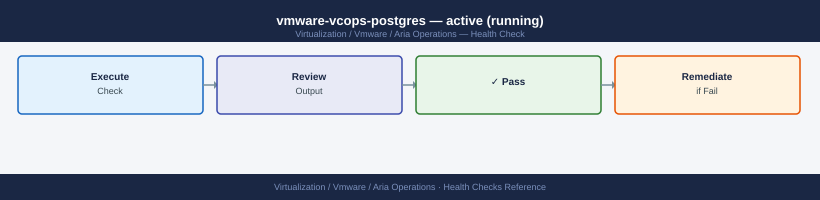
## vmware-vcops-gemfire     — active (running)

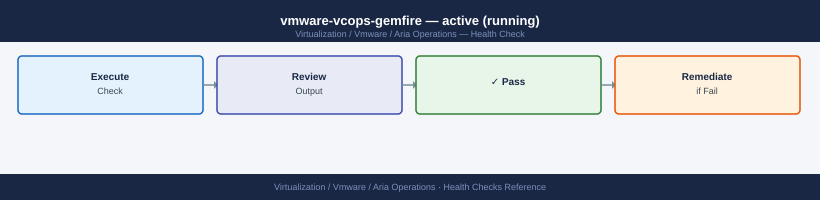
## vmware-casa              — active (running)


## nginx                    — active (running)

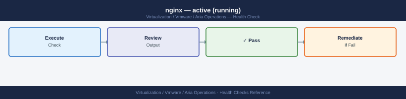
## vmware-vcops-watchdog    — active (running)

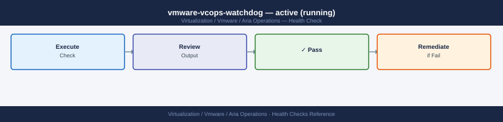
```
## NTP Health


```bash
# Check NTP sync on each cluster node
for node in vrops-prod-01 vrops-prod-02 vrops-prod-03; do
  echo -n "$node.example.local: "
  ssh admin@"$node.example.local" "chronyc tracking 2>/dev/null | grep 'System time'"
done

## Force sync if drift is detected


chronyc makestep

## See also

- [Aria Operations Common Issues](../../troubleshooting/common-issues/)
- [Aria Operations Procedures](../procedures/)
- [Aria Operations — CLI Reference](../cli-reference/)

## Verify NTP sources


chronyc sources -v
```
## Alert API Queries


```bash
# Get all active alerts grouped by criticality
curl -sk -H "Authorization: vRealizeOpsToken $TOKEN" \
  "https://vrops-prod-01.example.local/suite-api/api/alerts?activeOnly=true" | \
  jq '[.alerts[] | .criticality] | group_by(.) | map({criticality: .[0], count: length})'

## Get all CRITICAL alerts with their object and alert name

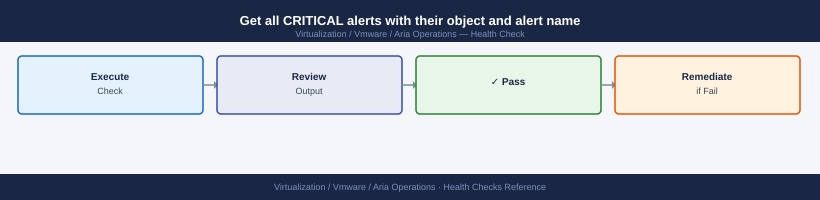
curl -sk -H "Authorization: vRealizeOpsToken $TOKEN" \
  "https://vrops-prod-01.example.local/suite-api/api/alerts?activeOnly=true&criticality=CRITICAL" | \
  jq '.alerts[] | {alert: .type.name, object: .resourceName, since: .startTimeUTC}'
```
## Capacity Summary via API

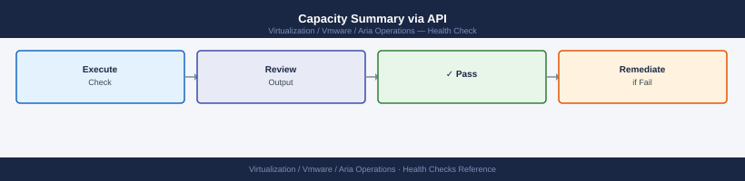

```bash
# Check cluster-level capacity summary
curl -sk -H "Authorization: vRealizeOpsToken $TOKEN" \
  "https://vrops-prod-01.example.local/suite-api/api/resources?resourceKind=ClusterComputeResource" | \
  jq '.resourceList[] | {name: .resourceKey.name}'
```

Also verify alert definitions are active: **Administration → Alert Settings → Alert Definitions** — confirm no policies are disabled unexpectedly.

---

## Remote Collector Health


1. **UI status**: Aria Ops → **Administration** → **Remote Collectors** — every collector must show **State: OK**; any showing **Offline** or **Error** needs immediate investigation
2. **Service check** — SSH to each remote collector node:
   ```bash
   ssh admin@vrops-rc-01.example.local
   systemctl status vmware-vrops-collector
   # Expected: active (running); if inactive — start with: systemctl start vmware-vrops-collector
   ```
3. **Collector log review**:
   ```bash
   # Check for collection failure entries in the last 30 minutes
   grep -i "error\|fail\|exception" /usr/lib/vmware-vcops/user/log/collector.log | tail -50
   # Check connectivity log for adapter reach failures
   grep -i "connection refused\|timeout\|unreachable" /usr/lib/vmware-vcops/user/log/adapters/*/adapter.log | tail -30
   ```
4. **Verify adapters assigned to the collector are collecting**: Administration → Remote Collectors → select collector → **Assigned Adapters** — all must show green last-collection timestamps

---

## Adapter Collection Status Check


1. **UI scan**: Aria Ops → **Administration** → **Solutions** → review the **Last Collection Time** column for every adapter instance
   - Stale > 15 minutes: investigate immediately — indicates collection failure
   - Stale > 60 minutes: high likelihood of service or network fault
2. **Check credential validity**: if an adapter shows `Authentication failed` in its status message → update credentials:
   - **Data Sources** → select adapter → **Edit** → update **Credentials** → **Test Connection** → **Save**
3. **Bulk collection status query via API**:
   ```bash
   curl -sk -H "Authorization: vRealizeOpsToken $TOKEN" \
     "https://vrops-prod-01.example.local/suite-api/api/adapters" | \
     jq '.adapterInstancesInfoDto[] | {name: .resourceKey.name, lastCollection: .lastCollectionTimeUTC, status: .adapterStatus}'
   ```
4. **Confirm object count stability**: Administration → Inventory → total object count; a sudden drop (>5%) indicates an adapter or credential failure causing object deletion

---

## Database Health (Cassandra)


Cassandra is the primary metrics store; node failures cause metric gaps and eventually alert misfires.

```bash
# SSH to the master node
ssh admin@vrops-prod-01.example.local

# Check Cassandra cluster membership
su -s /bin/bash vcops-svc -c "cd /usr/lib/vmware-vcops/cassandra/bin && ./nodetool status"
# All nodes must show: UN (Up/Normal)
# DN = node down (critical); UJ = joining/rebuilding (normal post-recovery)

# Check Cassandra data disk usage
df -h /dev/sdb
# Alert threshold: > 80% full; Cassandra needs headroom for compaction

# Check Cassandra repair status (run weekly)
su -s /bin/bash vcops-svc -c "cd /usr/lib/vmware-vcops/cassandra/bin && ./nodetool repair --full"

# Check for Cassandra errors in the last hour
grep -i "error\|exception" /storage/db/cassandra/logs/system.log | grep "$(date +'%Y-%m-%d %H')" | tail -30
```

If a node shows `DN`: check VM power state → if powered on, check service: `systemctl status vmware-vcops-cassandra` → if service is stopped, start it and monitor rejoining (nodetool status transitions `DN → UJ → UN` over 10–30 minutes).

---

## Capacity and Scaling Indicators


1. **Node resource utilisation**: Aria Ops → **Administration** → **Cluster Management** → review each node's CPU and memory usage bar
   - CPU > 85% sustained: add a data node or remote collector to distribute load
   - Memory > 90%: check for memory leak in analytics service — `systemctl restart vmware-vcops-analytics` as a short-term fix; engage VMware support if recurring
2. **Object count vs. license limit**:
   ```bash
   curl -sk -H "Authorization: vRealizeOpsToken $TOKEN" \
     "https://vrops-prod-01.example.local/suite-api/api/resources/count" | jq '.count'
   # Compare against licensed object count (Administration → Licenses)
   # Alert if object count > 90% of licensed capacity
   ```
3. **Disk growth trend**: check `/storage/db` growth over the last 7 days:
   ```bash
   du -sh /storage/db/cassandra/data/
   # Compare to previous week; if growing > 5 GB/day, review retention settings or add disk
   ```
4. **Collection cycle time**: if dashboards show metric freshness degrading (data > 10 minutes old), the analytics cluster is under-provisioned — check node CPU and consider scaling

---

## Alert Queue Health

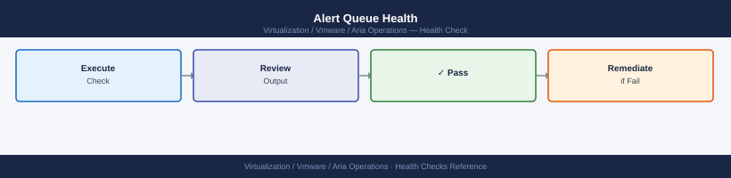

1. **Stale alert detection**: Aria Ops → **Alerts** → **All Alerts** → sort by **Start Time** ascending
   - Any alert in **Active** state older than 7 days without acknowledgement indicates policy or notification failure
   - Investigate: check if the triggering condition still exists; if resolved but alert persists, cancel the alert manually
2. **Notification delivery verification**:
   ```bash
   # Test SMTP outbound plugin
   # UI: Administration → Outbound Settings → select SMTP plugin → Test
   # Check SMTP relay logs for delivery confirmation or bounce
   ```
3. **Notification queue check**: Aria Ops → **Administration** → **Notifications** → **Outbound Settings** → select each plugin → click **Test** → confirm delivery
4. **Alert definition integrity**: **Configure → Alert Definitions** — confirm no definitions are in **Draft** state (draft definitions do not fire alerts); publish any that should be active
5. **Alert count trend**: compare today's active alert count to the 30-day rolling average using the Alert API:
   ```bash
   curl -sk -H "Authorization: vRealizeOpsToken $TOKEN" \
     "https://vrops-prod-01.example.local/suite-api/api/alerts?activeOnly=true" | \
     jq '.pageInfo.totalCount'
   # Sudden spike (>2x normal) indicates a broad infrastructure event or a misconfigured policy firing excessively
   ```
