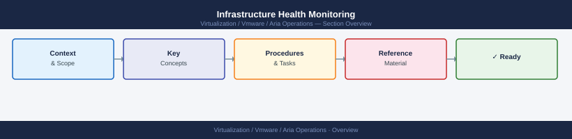

---
tags:
  - aria-operations
  - operations
  - vmware
---
# Infrastructure Health Monitoring


<div class="kb-summary">
Infrastructure Health Monitoring reference covering Server Health (Windows), Storage Array Health, Network Health, Monitoring Agent Validation, Escalation Thresholds (reference).

*Applies to: Aria Ops 8.x*
</div>



**Pure FlashArray:**
```bash
purecli array get                  # overall status
purecli drive list | grep -v healthy
purecli volume list --space        # capacity view
```

**Dell PowerMax / Unity:**
```bash
# PowerMax — Solutions Enabler
symcfg list -health
symsys -sid <sid> list -failed

# Unity — CLI
uemcli -d <ip> /sys/general show
uemcli -d <ip> /sys/alert show
```

```d2
direction: right

hub: "Aria Operations\nOperations" {shape: hexagon}
network_health: "Network Health" {shape: rectangle}
monitoring_agent_validation: "Monitoring Agent Validation" {shape: rectangle}
escalation_thresholds_reference: "Escalation Thresholds (reference)" {shape: rectangle}
verify: "Verify" {shape: rectangle}

hub -> network_health
hub -> monitoring_agent_validation
hub -> escalation_thresholds_reference
hub -> verify
```

## Before you begin

- **Access:** vCenter read-only minimum; Administrator role for remediation steps
- **Timing:** safe to run during business hours unless a step is marked ⚠ (causes interruption)
- **Dependencies:** no active upgrades or migrations on the same infrastructure
- **Logging:** capture command output — paste into the change record on completion

---

## Network Health

```bash
# OSPF neighbours (Cisco IOS / NX-OS)
show ip ospf neighbor

# BGP summary
show bgp ipv4 unicast summary

# Interface error counters
show interface | include "line protocol|input errors|output errors|CRC"
```

## Monitoring Agent Validation

```bash
# Check monitoring agent is running (Zabbix example)
systemctl status zabbix-agent2

# Check last contact with monitoring server
grep "sending data" /var/log/zabbix/zabbix_agent2.log | tail -5
```

## Escalation Thresholds (reference)

| Metric | Warning | Critical |
|---|---|---|
| CPU (sustained 15 min) | >70% | >90% |
| Memory | >80% | >95% |
| Disk usage | >75% | >90% |
| Storage latency (avg) | >5ms | >20ms |
| Backup failure | 1 job | 2+ consecutive |

---

## Verify

- **Alarms:** vSphere Client → Home → Alarms — no new critical alarms after the operation
- **Events:** monitor the vCenter Events view for the affected object for 5 minutes
- **Health check:** run the morning health-check sequence for the affected product tier

## See also

- [Alert Management](alert-management.md)
- [Aria Operations: Alert Definitions and Policies](alerts.md)
- [Aria Operations Backup & Restore](backup-restore.md)
- [Aria Operations — Operations](index.md)
- [Aria Operations — Architecture](../architecture/)
- [Aria Operations — Deploy](../deploy/)
- [Aria Operations — Security](../security/)
- [Aria Operations — Troubleshooting](../troubleshooting/)
