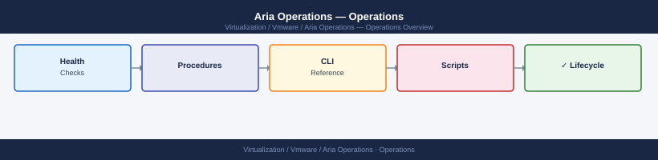

---
tags:
  - aria-operations
  - operations
  - vmware
---
# Aria Operations — Operations

<div class="kb-summary">
Aria Operations daily operations — policy management, alert tuning, dashboard maintenance, and capacity reporting.

*Applies to: Aria Ops 8.x*
</div>



<div class="kb-grid kb-grid-3">

<a class="kb-card" href="cli-reference/">
  <strong>CLI Reference</strong>
  <span>Commands, syntax, and quick reference.</span>
</a>

<a class="kb-card" href="health-checks/">
  <strong>Health Checks</strong>
  <span>Routine checks, service validation, and status verification.</span>
</a>

<a class="kb-card" href="procedures/">
  <strong>Procedures</strong>
  <span>Day-to-day operational tasks and how-to guides.</span>
</a>

<a class="kb-card" href="install-upgrade/">
  <strong>Install & Upgrade</strong>
  <span>Installation, upgrade, patching, and decommission.</span>
</a>

<a class="kb-card" href="backup-restore/">
  <strong>Backup & Restore</strong>
  <span>Backup configuration, restore procedures, and validation.</span>
</a>

<a class="kb-card" href="scripts/">
  <strong>Scripts</strong>
  <span>Automation scripts and reusable code.</span>
</a>

<a class="kb-card" href="alert-management/">
  <strong>Alert Management</strong>
  <span>Alert design, severity classification, threshold tuning, noise reduction, and on-call routing.</span>
</a>

<a class="kb-card" href="dashboard-standards/">
  <strong>Dashboard Standards</strong>
  <span>Dashboard structure, metric selection, audience-based layouts, and naming conventions.</span>
</a>

<a class="kb-card" href="health-monitoring/">
  <strong>Health Monitoring</strong>
  <span>Infrastructure health monitoring standards — what to monitor, check cadence, and threshold references.</span>
</a>

<a class="kb-card" href="metrics-baseline/">
  <strong>Metrics Baseline</strong>
  <span>Establishing and maintaining performance baselines for CPU, memory, storage I/O, and network.</span>
</a>

<a class="kb-card" href="performance-baselining/">
  <strong>Performance Baselining</strong>
  <span>Methodology for capturing, storing, and comparing performance baselines across environments.</span>
</a>

<a class="kb-card" href="capacity-forecasting/">
  <strong>Capacity Forecasting</strong>
  <span>Capacity trend analysis, forecasting models, and runway calculations for compute and storage.</span>
</a>

<a class="kb-card" href="resource-optimization/"><strong>Resource Optimisation</strong><span>Right-sizing VMs and clusters, reclaiming unused resources, and cost/performance optimisation.</span></a>
<a class="kb-card" href="capacity/"><strong>Capacity</strong><span>Capacity utilization views, runway analysis, and trending across compute and storage.</span></a>
<a class="kb-card" href="alerts/"><strong>Alerts</strong><span>Alert management, threshold tuning, suppression rules, and notification configuration.</span></a>
<a class="kb-card" href="dashboards/"><strong>Dashboards</strong><span>Dashboard creation, widget configuration, and dashboard sharing.</span></a>
<a class="kb-card" href="reports/"><strong>Reports</strong><span>Scheduled and on-demand reports for capacity, health, and performance.</span></a>

  <a class="kb-card" href="faq/"><strong>FAQ</strong><span>Frequently asked questions, common issues, and quick answers for day-to-day operations.</span></a>
</div>

```d2
direction: right

hub: "Aria Operations\nOperations" {shape: hexagon}
daily_checklist: "Daily Checklist" {shape: rectangle}
alert_triage_workflow: "Alert Triage Workflow" {shape: rectangle}
monthly_tasks: "Monthly Tasks" {shape: rectangle}

hub -> daily_checklist
hub -> alert_triage_workflow
hub -> monthly_tasks
```

## Daily Checklist

Run through these checks each morning before the ops team stand-up.

| Check | Location | Pass Criteria |
|---|---|---|
| Active Alerts review | Dashboards > Active Alerts | No unacknowledged Critical/Immediate alerts |
| Cluster node health | Admin > Cluster Management | All nodes show Online |
| Adapter collection status | Admin > Solutions | All adapters in Collecting state |
| Disk usage — analytics nodes | Admin > Cluster Management > [Node] > Disk | Below 80% used |
| Remote Collector status | Admin > Environment > Remote Collectors | All collectors Online |

Any failed check should be raised in the team channel and tracked in the ops log before the stand-up.

## Alert Triage Workflow

If a Remote Collector goes Offline, check:
- VM power state
- Network connectivity (TCP 443 to analytics cluster VIP)
- Collector service status: log into collector VM and run `systemctl status vmware-casa`

## Monthly Tasks

- Generate Monthly Executive Capacity Summary report and distribute
- Review alert noise: identify alert definitions with the highest fire frequency and tune thresholds
- Audit user accounts: Admin > Access Control > User Accounts — remove stale accounts
- Verify management pack versions are current (Admin > Solutions > check each adapter version)
- Review data node disk usage trend — project growth against retention policy
