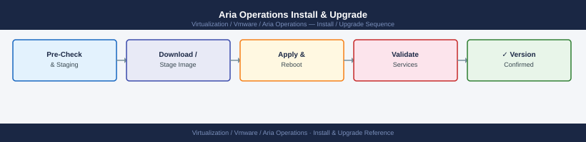

---
tags:
  - aria-operations
  - operations
  - vmware
---
# Aria Operations Install & Upgrade

## Before you begin

- **Access:** vCenter read-only minimum; Administrator role for remediation steps
- **Timing:** safe to run during business hours unless a step is marked ⚠ (causes interruption)
- **Dependencies:** no active upgrades or migrations on the same infrastructure
- **Logging:** capture command output — paste into the change record on completion

---

!!! warning "Host enters maintenance mode"
    ESXi remediation puts hosts into maintenance mode, triggering DRS evacuation. Confirm DRS is Fully Automated and HA admission control is satisfied before starting.

## Backup

Aria Operations does not have a native backup tool. Use the following:

| Method | What is Backed Up |
|---|---|
| VM snapshot (via vCenter) | Full appliance state — use before upgrades, not for operational backup |
| File-level backup agent | PostgreSQL data files + config (requires LCM configuration) |
| LCM backup | LCM configuration and product manifests |

## EOL Tracking

- Broadcom Product Lifecycle Matrix: [support.broadcom.com/group/ecx/productlifecycle](https://support.broadcom.com/group/ecx/productlifecycle)
- Aria Suite Lifecycle Manager — check installed product versions against the matrix quarterly
- Aim to be no more than one major version behind the current release

---

## See also

- [Aria Operations Health Checks](health-checks/)
- [Aria Operations Common Issues](../troubleshooting/common-issues/)
- [Aria Operations Procedures](procedures/)

## Verify

- **Alarms:** vSphere Client → Home → Alarms — no new critical alarms after the operation
- **Events:** monitor the vCenter Events view for the affected object for 5 minutes
- **Health check:** run the morning health-check sequence for the affected product tier
