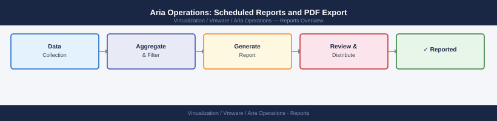

---
tags:
  - aria-operations
  - operations
  - vmware
---
# Aria Operations: Scheduled Reports and PDF Export

Aria Operations: Scheduled Reports and PDF Export reference covering Scheduling Reports, Downloading Generated Reports, Report Output Formats, Common Report Issues.

*Applies to: Aria Ops 8.x*

## Before you begin

- **Access:** vCenter read-only minimum; Administrator role for remediation steps
- **Timing:** safe to run during business hours unless a step is marked ⚠ (causes interruption)
- **Dependencies:** no active upgrades or migrations on the same infrastructure
- **Logging:** capture command output — paste into the change record on completion

---

## Report Output Formats

| Format | Use Case | Notes |
|---|---|---|
| PDF | Management delivery, archiving | Preserves charts and layout |
| CSV | Data export for spreadsheet analysis | Flat data only, no charts |

## Common Report Issues

| Issue | Likely Cause | Fix |
|---|---|---|
| Report email not received | SMTP not configured | Check Administration > Outbound Settings > Email |
| Report shows blank sections | View has no data for selected object | Verify object has metrics and is collecting |
| PDF layout broken | Too many columns in table view | Reduce columns or switch to landscape |
| Scheduled report never runs | Schedule timezone mismatch | Confirm server timezone in Administration |
| Report generation fails | Large dataset timeout | Reduce scope, use group-level filtering |

---

## Verify

- **Alarms:** vSphere Client → Home → Alarms — no new critical alarms after the operation
- **Events:** monitor the vCenter Events view for the affected object for 5 minutes
- **Health check:** run the morning health-check sequence for the affected product tier

## See also

- [Alert Management](alert-management.md)
- [Aria Operations: Alert Definitions and Policies](alerts.md)
- [Aria Operations Backup & Restore](backup-restore.md)
- [Aria Operations — Operations](index.md)
- [Aria Operations — Architecture](../../architecture/)
- [Aria Operations — Deploy](../../deploy/)
- [Aria Operations — Security](../../security/)
- [Aria Operations — Troubleshooting](../../troubleshooting/)
