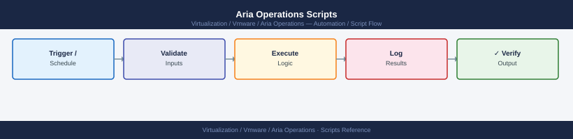

---
tags:
  - aria-operations
  - operations
  - vmware
---
# Aria Operations Scripts



```powershell
## Before you begin

- **Access:** vCenter read-only minimum; Administrator role for remediation steps
- **Timing:** safe to run during business hours unless a step is marked ⚠ (causes interruption)
- **Dependencies:** no active upgrades or migrations on the same infrastructure
- **Logging:** capture command output — paste into the change record on completion

---

## Export cluster capacity summary via REST API
$AriaOpsHost = "aria-ops.domain.local"
$Token       = "your-token-here"

$Headers = @{ Authorization = "vRealizeOpsToken $Token" }

## Get all cluster compute resources
$Uri = "https://$AriaOpsHost/suite-api/api/resources?resourceKind=ClusterComputeResource"
$Response = Invoke-RestMethod -Uri $Uri -Headers $Headers -SkipCertificateCheck

foreach ($cluster in $Response.resourceList) {
    Write-Output "Cluster: $($cluster.resourceKey.name)"
}
```
```bash
#!/usr/bin/env bash
## Quick Aria Operations cluster health check
HOST="aria-ops.domain.local"

echo "=== Aria Operations Cluster Health ==="
ssh admin@$HOST "vracli cluster health"

echo ""
echo "=== Adapter Status ==="
ssh admin@$HOST "vracli adapter list"

echo ""
echo "=== Service Status ==="
ssh admin@$HOST "vracli status"
```
```bash
#!/usr/bin/env bash
HOST="aria-ops.domain.local"
USER="admin"
PASS="changeme"

## Get token
TOKEN=$(curl -sk -X POST "https://$HOST/suite-api/api/auth/token/acquire" \
  -H "Content-Type: application/json" \
  -d "{\"username\":\"$USER\",\"authSource\":\"LOCAL\",\"password\":\"$PASS\"}" \
  | python3 -c "import sys,json; print(json.load(sys.stdin)['token'])")

echo "Token acquired"

## Export active alerts
curl -sk -H "Authorization: vRealizeOpsToken $TOKEN" \
  "https://$HOST/suite-api/api/alerts?activeOnly=true" \
  | python3 -m json.tool > /tmp/aria-ops-alerts-$(date +%Y%m%d).json

echo "Alerts saved to /tmp/aria-ops-alerts-$(date +%Y%m%d).json"
```

---

## See also

- [Aria Operations — CLI Reference](cli-reference/)
- [Aria Operations Procedures](procedures/)

## Verify

- **Alarms:** vSphere Client → Home → Alarms — no new critical alarms after the operation
- **Events:** monitor the vCenter Events view for the affected object for 5 minutes
- **Health check:** run the morning health-check sequence for the affected product tier
