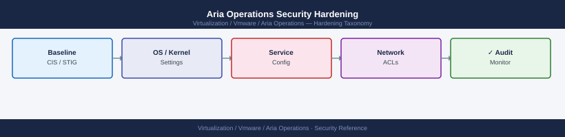

---
tags:
  - aria-operations
  - security
  - vmware
---
# Aria Operations Security Hardening


```bash
# Verify current certificate subject and expiry
echo | openssl s_client -connect vrops-prod-01.example.local:443 2>/dev/null | \
  openssl x509 -noout -subject -dates -issuer

# Confirm it is self-signed (Issuer == Subject)
```


```text title="Expected output"
subject=CN = vrops-prod-01.example.local, O = VMware, C = US
notBefore=Jan 15 10:23:45 2023 GMT
notAfter=Jan 15 10:23:45 2025 GMT
issuer=CN = vrops-prod-01.example.local, O = VMware, C = US
```

!!! warning "Common errors"
    **`unable to connect to vrops-prod-01.example.local:443`** — Verify the hostname is correct, the vROps appliance is running, and port 443 is accessible from your current network location.
    **`error:0900006e:PEM routines:PEM_read_bio:no start line`** — Ensure the openssl s_client connection succeeded; if the host is unreachable, the pipe receives no certificate data and x509 parsing fails.
```bash
# Limit SSH access to the management network
# Edit /etc/hosts.allow on the Aria Operations appliance
echo "sshd: 10.0.1.0/24" >> /etc/hosts.allow
echo "ALL: ALL" >> /etc/hosts.deny

# Disable root password login (prefer key-based)
# Edit /etc/ssh/sshd_config
PermitRootLogin prohibit-password
systemctl restart sshd
```

```text title="Expected output"
(no output — command completes silently)
(no output — command completes silently)
(no output — command completes silently)
(no output — command completes silently)
```

!!! warning "Common errors"
    **`sed: can't read /etc/ssh/sshd_config: No such file or directory`** — Use a text editor like `sed -i 's/^PermitRootLogin.*/PermitRootLogin prohibit-password/' /etc/ssh/sshd_config` or edit the file directly with `vi /etc/ssh/sshd_config`.
    **`Job for sshd.service failed because the control process exited with error code.`** — Validate the sshd_config syntax with `sshd -t` before restarting to catch configuration errors.
    **`Permission denied (publickey,password).`** — Ensure you have SSH key-based authentication configured and copied to `~/.ssh/authorized_keys` before restricting root password login, or you will lock yourself out.
```bash
# Configure syslog forwarding from Aria Operations appliance
cat >> /etc/rsyslog.d/vrops-remote.conf << 'EOF'
*.* @@vrli-prod-01.example.local:514
EOF
systemctl restart rsyslog
```

```text title="Expected output"
(no output — command completes silently)
(no output — command completes silently)
```

!!! warning "Common errors"
    **`Job for rsyslog.service failed because the control process exited with error code.`** — Verify the rsyslog configuration syntax with `rsyslog -N1` before restarting, and check `/var/log/messages` for parsing errors in the appended configuration.
    **`Name or service not known`** — Ensure the syslog server hostname `vrli-prod-01.example.local` is resolvable by testing with `nslookup vrli-prod-01.example.local` or updating `/etc/hosts` if DNS is unavailable.
```bash
# View authentication and admin action logs on the appliance
tail -f /data/vcops/log/casa.log | grep -i "login\|logout\|admin\|role"
```


```text title="Expected output"
2024-01-15 14:23:47,892 [INFO] User 'admin' login successful from 192.168.1.105
2024-01-15 14:24:12,445 [INFO] Role assignment: user 'jsmith' granted 'Administrator' role by 'admin'
2024-01-15 14:25:33,721 [WARN] Failed login attempt for user 'operator' from 192.168.1.110 - invalid credentials
2024-01-15 14:26:01,334 [INFO] User 'jsmith' logout from session 7f3e9c2a-1b4d-4e8f-9a2c-5d6e7f8g9h0i
2024-01-15 14:27:15,889 [INFO] Admin action: password policy updated by 'admin'
2024-01-15 14:28:44,556 [INFO] User 'operator' login successful from 192.168.1.112
2024-01-15 14:29:22,113 [INFO] Role revocation: user 'kchen' removed from 'ReadOnly' role by 'admin'
2024-01-15 14:30:05,667 [WARN] Suspicious login attempt - multiple failed logins from 192.168.1.115
```

!!! warning "Common errors"
    **`tail: cannot open '/data/vcops/log/casa.log' for reading: No such file or directory`** — Verify the Aria Operations appliance is fully deployed and the log directory exists; check mount points with `df -h /data`.
    **`tail: inotify resources exhausted`** — Increase the system's inotify watch limit by running `echo fs.inotify.max_user_watches=524288 | sudo tee -a /etc/sysctl.conf && sudo sysctl -p`.
    **`grep: (standard input): Permission denied`** — Run the command with `sudo` or ensure your user has read permissions on the casa.log file with `sudo chmod 644 /data/vcops/log/casa.log`.
## Before you begin

- **Access:** vCenter Administrator role
- **Change management:** security changes require CAB approval in most environments
- **Rollback plan:** document current state before any security control change
- **Testing:** validate in a non-production environment first where possible

---

## See also

- [Aria Operations — Access Control](../access-control/)
- [Aria Operations — Authentication](../authentication/)
- [Aria Operations Health Checks](../../operations/health-checks/)
