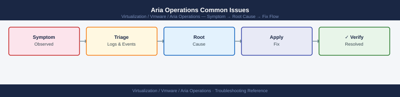

---
tags:
  - aria-operations
  - troubleshooting
  - vmware
search:
  boost: 1.5
---
# Aria Operations Common Issues


```bash
# SSH to primary node and inspect adapter state
ssh admin@vrops-prod-01.example.local
vracli adapter list --verbose

# Check the collector log for adapter-specific errors
tail -500 /data/vcops/log/collector.log | grep -i "error\|exception\|fail"

# Check per-adapter log
ls /data/vcops/log/adapters/
tail -200 /data/vcops/log/adapters/VMwareAdapter/adapter.log | grep -i "error\|auth\|connect"

# Restart the watchdog (restarts failed services automatically)
service vmware-vcops-watchdog restart
```

```bash
# Check analytics processing — if analytics queue is backed up, processing is delayed
tail -200 /data/vcops/log/analytics.log | grep -i "queue\|backlog\|warn\|error"

# Check GemFire (real-time cache) health
tail -100 /data/vcops/log/gemfire/vcopssuite_gemfire.log | grep -i "warn\|error"

# Confirm the adapter is actually collecting (not just in a Collecting state with zero data)
curl -sk -H "Authorization: vRealizeOpsToken $TOKEN" \
  "https://vrops-prod-01.example.local/suite-api/api/adapterkinds/VMWARE/resourcekinds/VirtualMachine/resources?pageSize=5" | \
  jq '.resourceList[] | {name: .resourceKey.name, lastCollected: .identifier}'
```
```bash
# Force a capacity recalculation
curl -sk -X POST -H "Authorization: vRealizeOpsToken $TOKEN" \
  "https://vrops-prod-01.example.local/suite-api/api/analytics/run" \
  -H "Content-Type: application/json" \
  -d '{"analyticsJobName": "CapacityAnalytics"}'

# Check analytics job status
curl -sk -H "Authorization: vRealizeOpsToken $TOKEN" \
  "https://vrops-prod-01.example.local/suite-api/api/analytics" | \
  jq '.[] | select(.name == "CapacityAnalytics") | {status: .status, lastRun: .lastRunTime}'
```
```bash
# Test LDAP connectivity from the Aria Operations appliance
ssh admin@vrops-prod-01.example.local
vracli auth test --source <ldap-source-name>

# Manually test LDAP bind
ldapsearch -H ldaps://dc01.example.local:636 \
  -D "CN=svc-vrops-ldap,OU=Service Accounts,DC=corp,DC=local" \
  -w '<password>' \
  -b "DC=corp,DC=local" \
  "(sAMAccountName=testuser)" sAMAccountName | head -10
```
```bash
# Verify SMTP configuration
curl -sk -H "Authorization: vRealizeOpsToken $TOKEN" \
  "https://vrops-prod-01.example.local/suite-api/api/notifications" | \
  jq '.notificationList[] | {name: .name, plugin: .pluginTypeId, enabled: .active}'

# Send a test notification via API
curl -sk -X POST -H "Authorization: vRealizeOpsToken $TOKEN" \
  "https://vrops-prod-01.example.local/suite-api/api/notifications/<notification-id>/actions/test"

# Check outbound SMTP from the appliance
ssh admin@vrops-prod-01.example.local
curl -v smtp://smtp.example.local:25 --mail-from aria-ops@corp.local \
  --mail-rcpt test@corp.local 2>&1 | head -30
```
```bash
# Check CPU and memory pressure on the primary node
ssh admin@vrops-prod-01.example.local
top -bn1 | head -20

# Check GemFire heap usage (in-memory cache)
tail -20 /data/vcops/log/gemfire/vcopssuite_gemfire.log | grep -i "heap\|memory"

# Check Cassandra compaction — heavy compaction causes query slowness
ssh admin@vrops-prod-01.example.local
nodetool compactionstats

# Check for very large queries — long-running queries appear in the analytics log
tail -200 /data/vcops/log/analytics.log | grep -i "slow\|timeout\|duration"
```

```d2
direction: down

symptom: Identify Symptom {shape: diamond}
diagnostic_flow: "Diagnostic Flow" {shape: rectangle}
verify_resolution: "Verify resolution" {shape: rectangle}
resolution: Resolve or Escalate {shape: oval}

symptom -> diagnostic_flow: investigate
symptom -> verify_resolution: investigate
diagnostic_flow -> resolution
verify_resolution -> resolution
```

## Diagnostic Flow

```d2
direction: right

S: "What is the symptom?" {shape: rectangle}
B1: "Adapter not collecting data" {shape: rectangle}
B2: "Dashboard blank or no data" {shape: rectangle}
B3: "Alert storm" {shape: rectangle}
B4: "Capacity calculation wrong" {shape: rectangle}
B5: "vSAN management pack missing metrics" {shape: rectangle}
B6: "Node offline or cluster issue" {shape: rectangle}
D1: "D1" {shape: rectangle}
R1: "Re-test Adapter Connection · Unlock Service Account\n→ Adapter Disconnected" {shape: rectangle}
R2: "Verify Source Reachability · Check Collector Log\n→ Adapter Disconnected" {shape: rectangle}
D2: "D2" {shape: rectangle}
R3: "Resolve Adapter Issue First\n→ Adapter Disconnected" {shape: rectangle}
R4: "Check Widget Scope · Widen Time Range\n→ No Data in Dashboards" {shape: rectangle}
R5: "Raise Alert Threshold · Add Wait Cycles · Suppress During Maintenance\n→ Alert Storm" {shape: rectangle}
R6: "Force Capacity Recalculation via API\n→ Capacity Calculation Wrong" {shape: rectangle}
R7: "Verify vSAN Management Pack Installed · Check Adapter Log\n→ vSAN Management Pack Missing Metrics" {shape: rectangle}
D3: "D3" {shape: rectangle}
R8: "Power On Node · Check Inter-node Network\n→ Node Offline / Cluster Issue" {shape: rectangle}
R9: "Restart vmware-vcops Service · Check VAMI Cluster Status\n→ Node Offline / Cluster Issue" {shape: rectangle}

S -> B1
S -> B2
S -> B3
S -> B4
S -> B5
S -> B6
D1 -> R1
D1 -> R2
D2 -> R3
D2 -> R4
B3 -> R5
B4 -> R6
B5 -> R7
D3 -> R8
D3 -> R9
```

---

## Before you begin

- **Access:** SSH to vCenter Shell and ESXi hosts; vSphere Client read access
- **Gather first:** recent error message text, event timestamps, and affected object names
- **Scope:** confirm whether the issue affects a single object, host, cluster, or site
- **Escalation:** open a vendor support ticket before running any destructive step
- **Logging:** document each command and output — required if escalation is needed

---

---

## See also

- [Aria Operations — Diagnostics](../diagnostics/)
- [Aria Operations — Escalation](../escalation/)
- [Aria Operations Health Checks](../../operations/health-checks/)

## Verify resolution

- **Alarms cleared:** Home → Alarms — the triggering alarm is no longer active
- **Event log:** confirm no new related error events in the last 5 minutes
- **Functional test:** perform the action that was failing (connect, vMotion, storage I/O) — confirm it succeeds
- **Monitor:** leave the vSphere Client open for 10 minutes and confirm the issue does not recur
