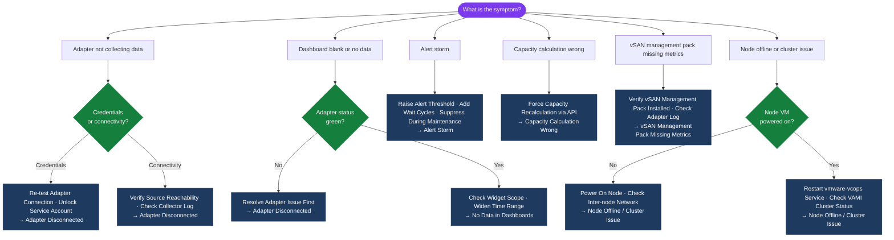

---
tags:
  - aria-operations
  - troubleshooting
  - vmware
search:
  boost: 1.5
---
# Aria Operations Common Issues

```bash
# SSH to primary node and inspect adapter state
ssh admin@vrops-prod-01.example.local
vracli adapter list --verbose

# Check the collector log for adapter-specific errors
tail -500 /data/vcops/log/collector.log | grep -i "error\|exception\|fail"

# Check per-adapter log
ls /data/vcops/log/adapters/
tail -200 /data/vcops/log/adapters/VMwareAdapter/adapter.log | grep -i "error\|auth\|connect"

# Restart the watchdog (restarts failed services automatically)
service vmware-vcops-watchdog restart
```
```text
┌──────────────────────────────────── Aria Operations Common Issues ────────────────────────────────────┐
│                                                                                                       │
│  Common issues: adapter disconnected, no data in dashboards, and alert storms.                        │
│                                                                                                       │
│   ┌──────────────────────────────────────────────┐  ┌─────────────────────────────────────────────┐   │
│   │             Adapter Disconnected             │  │            No Data in Dashboards            │   │
│   │          Check adapter credentials           │  │          Check adapter green status         │   │
│   │          Verify source reachability          │  │          Check collection interval          │   │
│   │           Service account locked?            │  │          Widget: correct resource?          │   │
│   │          Re-test adapter connection          │  │           Time range: too narrow?           │   │
│   └──────────────────────────────────────────────┘  └─────────────────────────────────────────────┘   │
│                                                                                                       │
│  Adapter and data issues are most frequent; alert storms require policy tuning.                       │
│                                                                                                       │
│                          ▼                                                 ▼                          │
│                                                                                                       │
│   ┌──────────────────────────────────────────────┐  ┌─────────────────────────────────────────────┐   │
│   │                 Alert Storm                  │  │         Node Offline / Cluster Issue        │   │
│   │            Identify noisy symptom            │  │          Check VAMI cluster status          │   │
│   │            Raise alert threshold             │  │         Verify node VM is powered on        │   │
│   │           Use wait cycles setting            │  │           Check inter-node network          │   │
│   │         Suppress during maintenance          │  │           Restart vmware-vcops svc          │   │
│   └──────────────────────────────────────────────┘  └─────────────────────────────────────────────┘   │
│                                                                                                       │
│  Physical Infrastructure (the hardware everything above runs on):                                     │
│  vROps cluster on vSphere; AD/LDAP for adapter auth; management network for nodes                     │
│                                                                                                       │
│  Key terms:                                                                                           │
│                                                                                                       │
│  Adapter Disconnected = Data source not collecting; shown as red/yellow in UI                         │
│  Service Acct Lock    = AD lockout from repeated failed vROps authentication                          │
│  No Dashboard Data    = Widget blank; adapter issue or wrong resource scope                           │
│  Alert Storm          = Excessive alert volume; caused by over-sensitive thresholds                   │
│  Wait Cycles          = Alert setting requiring symptom to persist N cycles to fire                   │
│  Symptom Suppression  = Temporarily disable alert during planned maintenance                          │
│  Node Offline         = Cluster node unreachable; check VM power and network                          │
│  vmware-vcops         = Main vROps service; restart if node appears stuck                             │
│  Cluster Status       = VAMI Admin page showing all node roles and health states                      │
│  Collection Interval  = Default 5 min; gap > 10 min indicates collection failure                      │
│  Re-test Connection   = vROps built-in adapter test; run after credential update                      │
│  Time Range           = Dashboard widget setting; widen if no data appears                            │
│                                                                                                       │
└───────────────────────────────────────────────────────────────────────────────────────────────────────┘
```
```bash
# Check analytics processing — if analytics queue is backed up, processing is delayed
tail -200 /data/vcops/log/analytics.log | grep -i "queue\|backlog\|warn\|error"

# Check GemFire (real-time cache) health
tail -100 /data/vcops/log/gemfire/vcopssuite_gemfire.log | grep -i "warn\|error"

# Confirm the adapter is actually collecting (not just in a Collecting state with zero data)
curl -sk -H "Authorization: vRealizeOpsToken $TOKEN" \
  "https://vrops-prod-01.example.local/suite-api/api/adapterkinds/VMWARE/resourcekinds/VirtualMachine/resources?pageSize=5" | \
  jq '.resourceList[] | {name: .resourceKey.name, lastCollected: .identifier}'
```
```bash
# Force a capacity recalculation
curl -sk -X POST -H "Authorization: vRealizeOpsToken $TOKEN" \
  "https://vrops-prod-01.example.local/suite-api/api/analytics/run" \
  -H "Content-Type: application/json" \
  -d '{"analyticsJobName": "CapacityAnalytics"}'

# Check analytics job status
curl -sk -H "Authorization: vRealizeOpsToken $TOKEN" \
  "https://vrops-prod-01.example.local/suite-api/api/analytics" | \
  jq '.[] | select(.name == "CapacityAnalytics") | {status: .status, lastRun: .lastRunTime}'
```
```bash
# Test LDAP connectivity from the Aria Operations appliance
ssh admin@vrops-prod-01.example.local
vracli auth test --source <ldap-source-name>

# Manually test LDAP bind
ldapsearch -H ldaps://dc01.example.local:636 \
  -D "CN=svc-vrops-ldap,OU=Service Accounts,DC=corp,DC=local" \
  -w '<password>' \
  -b "DC=corp,DC=local" \
  "(sAMAccountName=testuser)" sAMAccountName | head -10
```
```bash
# Verify SMTP configuration
curl -sk -H "Authorization: vRealizeOpsToken $TOKEN" \
  "https://vrops-prod-01.example.local/suite-api/api/notifications" | \
  jq '.notificationList[] | {name: .name, plugin: .pluginTypeId, enabled: .active}'

# Send a test notification via API
curl -sk -X POST -H "Authorization: vRealizeOpsToken $TOKEN" \
  "https://vrops-prod-01.example.local/suite-api/api/notifications/<notification-id>/actions/test"

# Check outbound SMTP from the appliance
ssh admin@vrops-prod-01.example.local
curl -v smtp://smtp.example.local:25 --mail-from aria-ops@corp.local \
  --mail-rcpt test@corp.local 2>&1 | head -30
```
```bash
# Check CPU and memory pressure on the primary node
ssh admin@vrops-prod-01.example.local
top -bn1 | head -20

# Check GemFire heap usage (in-memory cache)
tail -20 /data/vcops/log/gemfire/vcopssuite_gemfire.log | grep -i "heap\|memory"

# Check Cassandra compaction — heavy compaction causes query slowness
ssh admin@vrops-prod-01.example.local
nodetool compactionstats

# Check for very large queries — long-running queries appear in the analytics log
tail -200 /data/vcops/log/analytics.log | grep -i "slow\|timeout\|duration"
```

## Diagnostic Flow



---

## Before you begin

- **Access:** SSH to vCenter Shell and ESXi hosts; vSphere Client read access
- **Gather first:** recent error message text, event timestamps, and affected object names
- **Scope:** confirm whether the issue affects a single object, host, cluster, or site
- **Escalation:** open a vendor support ticket before running any destructive step
- **Logging:** document each command and output — required if escalation is needed

---

---

## Verify resolution

- **Alarms cleared:** Home → Alarms — the triggering alarm is no longer active
- **Event log:** confirm no new related error events in the last 5 minutes
- **Functional test:** perform the action that was failing (connect, vMotion, storage I/O) — confirm it succeeds
- **Monitor:** leave the vSphere Client open for 10 minutes and confirm the issue does not recur
