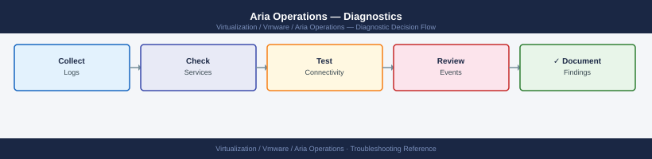

---
tags:
  - aria-operations
  - troubleshooting
  - vmware
search:
  boost: 1.5
---
# Aria Operations — Diagnostics

<div class="kb-summary">
Aria Operations (vROps) diagnostic commands: check cluster service health with cluster-mgmt-cli, query the REST API health endpoint, inspect analytics.log and collector.log for errors, check adapter collection status, verify disk space on data nodes, generate the vcops-support bundle for VMware SRs.

*Applies to: VMware Aria Operations 8.x (vRealize Operations Manager)*
</div>


```d2
direction: right

B: "B" {shape: rectangle}
C: "GET /suite-api/api/health\ncluster-mgmt-cli status" {shape: rectangle}
D: "grep adapter-name /var/log/vmware/vcops/collector.log\nTest adapter from vROps UI → Administration → Adapters" {shape: rectangle}
E: "GET /api/resources?page=0\nCompare count before and after last collection" {shape: rectangle}
F: "GET /api/alerts?pageSize=10\nCheck analytics.log for alert engine errors" {shape: rectangle}
G: "cluster-mgmt-cli status\nVAMI → Administration → Cluster Management" {shape: rectangle}
H: "df -h /storage/db\nCheck analytics partition usage" {shape: rectangle}
I: "I" {shape: rectangle}
J: "journalctl -u vmware-vcops -n 100\nCheck disk space: df -h /storage/db" {shape: rectangle}
K: "cluster-mgmt-cli status\nCheck replica node heartbeat" {shape: rectangle}
L: "grep ERROR collector.log | tail -50\nCheck adapter credential or TLS error" {shape: rectangle}
M: "Check adapter last collection time in vROps UI\nAdministration → Solutions → Adapter Instances" {shape: rectangle}
N: "grep ERROR analytics.log | tail -50\nCheck for OOM: grep OutOfMemory analytics.log" {shape: rectangle}
O: "Check NTP sync on all nodes\ntimedatectl; chronyc tracking" {shape: rectangle}
P: "Check /storage/db partition\nVAMI → Administration → Disk Usage" {shape: rectangle}
Q: "Collect vcops-support bundle\nvcops-support gen" {shape: rectangle}
R: "Open VMware SR\nmysupport.vmware.com" {shape: rectangle}
A: "Aria Operations Issue" {shape: rectangle}

B -> C
B -> D
B -> E
B -> F
B -> G
B -> H
I -> J
I -> K
D -> L
E -> M
F -> N
G -> O
H -> P
J -> Q
K -> Q
L -> Q
M -> Q
N -> Q
O -> Q
P -> Q
Q -> R
```

```d2
direction: down

symptom: Identify Symptom {shape: diamond}
step_1_check_cluster_service_status: "Step 1 — Check cluster service status" {shape: rectangle}
step_2_query_rest_api_health: "Step 2 — Query REST API health" {shape: rectangle}
step_3_inspect_log_files: "Step 3 — Inspect log files" {shape: rectangle}
step_4_check_adapter_collection_stat: "Step 4 — Check adapter collection status" {shape: rectangle}
step_5_check_vrops_cluster_node_heal: "Step 5 — Check vROps cluster node health" {shape: rectangle}
step_6_check_disk_space_and_performa: "Step 6 — Check disk space and performance" {shape: rectangle}
resolution: Resolve or Escalate {shape: oval}

symptom -> step_1_check_cluster_service_status: investigate
symptom -> step_2_query_rest_api_health: investigate
symptom -> step_3_inspect_log_files: investigate
symptom -> step_4_check_adapter_collection_stat: investigate
symptom -> step_5_check_vrops_cluster_node_heal: investigate
symptom -> step_6_check_disk_space_and_performa: investigate
step_1_check_cluster_service_status -> resolution
step_2_query_rest_api_health -> resolution
step_3_inspect_log_files -> resolution
step_4_check_adapter_collection_stat -> resolution
step_5_check_vrops_cluster_node_heal -> resolution
step_6_check_disk_space_and_performa -> resolution
```

## Before you begin

- **Access:** vROps admin UI credentials; SSH to the master node (`admin` user); VAMI access at port 5480
- **Gather first:** the specific symptom (adapter showing no data, UI alert for node health, resource count dropped, specific alert not firing), the adapter or resource type affected, and when the issue started
- **Scope:** confirm whether the issue affects one adapter instance, one resource type, or the entire vROps cluster

---

## Step 1 — Check cluster service status

```bash
# SSH to the vROps master node
ssh admin@<vrops-master-ip>

# Check cluster node roles and health
cluster-mgmt-cli status
# Expected output:
# MASTER_NODE: ONLINE
# REPLICA_NODE: ONLINE (synchronized)
# DATA_NODES: all ONLINE
# Problem: any node OFFLINE or DEGRADED

# Check vROps service status
systemctl status vmware-vcops
# Expected: active (running)

# Recent service events
journalctl -u vmware-vcops -n 100 --no-pager

# Disk space on the analytics and log partitions
df -h
# Expected: /storage/db < 80%; /var/log < 80%
# Problem: /storage/db > 85% = risk of analytics failure

# Check NTP sync (time drift causes cluster join failures and alert timing issues)
chronyc tracking | grep "System time"
timedatectl status
```


```text title="Expected output"
admin@vrops-master:~$ cluster-mgmt-cli status
MASTER_NODE: vrops-node-01.corp.local (192.168.1.45) - ONLINE
REPLICA_NODE: vrops-node-02.corp.local (192.168.1.46) - ONLINE (synchronized)
DATA_NODE_1: vrops-node-03.corp.local (192.168.1.47) - ONLINE
DATA_NODE_2: vrops-node-04.corp.local (192.168.1.48) - ONLINE
Cluster Status: HEALTHY

admin@vrops-master:~$ systemctl status vmware-vcops
● vmware-vcops.service - VMware vRealize Operations
     Loaded: loaded (/etc/systemd/system/vmware-vcops.service; enabled; vendor preset: enabled)
     Active: active (running) since Wed 2024-01-17 14:32:18 UTC; 3 days ago
   Main PID: 4521 (java)
      Tasks: 287 (limit: 4096)
     Memory: 8.2G
        CPU: 2h 14m 23s

admin@vrops-master:~$ journalctl -u vmware-vcops -n 100 --no-pager
Jan 17 14:32:18 vrops-node-01 vmware-vcops[4521]: INFO: vROps service started successfully
Jan 17 14:32:45 vrops-node-01 vmware-vcops[4521]: INFO: Cluster node synchronization complete
Jan 17 15:12:03 vrops-node-01 vmware-vcops[4521]: WARN: High memory usage detected (78%)
Jan 17 16:45:22 vrops-node-01 vmware-vcops[4521]: INFO: Scheduled backup completed

admin@vrops-master:~$ df -h
Filesystem      Size  Used Avail Use% Mounted on
/dev/sda1       100G   45G   55G  45% /
/dev/sdb1       500G  385G  115G  77% /storage/db
/dev/sdc1       200G   52G  148G  26% /var/log
tmpfs           16G  2.1G   14G  13% /dev/shm

admin@vrops-master:~$ chronyc tracking | grep "System time"
System time   : 0.000000234 seconds fast of NTP time

admin@vrops-master:~$ timedatectl status
               Local time: Wed 2024-01-17 14:47:33 UTC
           Universal time: Wed 2024-01-17 14:47:33 UTC
                 RTC time: Wed 2024-01-17 14:47:33
                Time zone: UTC (UTC, +0000)
System clock synchronized: yes
              NTP service: active
```

!!! warning "Common errors"
    **`cluster-mgmt-cli: command not found`** — Verify you are logged into the vROps master node and the cluster management tools are installed in the PATH, or use the full path `/opt/vmware/vcops/bin/cluster-mgmt-cli`.
    **`systemctl status vmware-vcops` returns `inactive (dead
---

## Step 2 — Query REST API health

```bash
# Get API auth token (admin credentials)
TOKEN=$(curl -sk -X POST \
  "https://<vrops-master-ip>/suite-api/api/auth/token/acquire" \
  -H "Content-Type: application/json" \
  -d '{"username":"admin","password":"<password>","authSource":"LOCAL"}' \
  | python3 -c "import json,sys; print(json.load(sys.stdin).get('token',''))")

echo $TOKEN
# Expected: token string; empty = auth failed

# Cluster health check (per-service component status)
curl -sk -H "Authorization: vRealizeOpsToken $TOKEN" \
  "https://<vrops-master-ip>/suite-api/api/health" | python3 -m json.tool
# Expected: all components online

# Resource count (drop indicates collection stopped)
curl -sk -H "Authorization: vRealizeOpsToken $TOKEN" \
  "https://<vrops-master-ip>/suite-api/api/resources?pageSize=1" \
  | python3 -c "import json,sys; print('Total resources:', json.load(sys.stdin).get('total','unknown'))"

# Active alerts (high count = analytics engine may be generating floods)
curl -sk -H "Authorization: vRealizeOpsToken $TOKEN" \
  "https://<vrops-master-ip>/suite-api/api/alerts?pageSize=10" \
  | python3 -c "import json,sys; print('Active alerts:', json.load(sys.stdin).get('total','unknown'))"

# Adapter instances and their collection status
curl -sk -H "Authorization: vRealizeOpsToken $TOKEN" \
  "https://<vrops-master-ip>/suite-api/api/adapterinstances" \
  | python3 -c "
import json,sys
for ai in json.load(sys.stdin).get('adapterInstancesInfoDto', []):
    print(ai.get('id',''), '|', ai.get('name',''), '|', ai.get('collectorStatus',''))
"
# Problem: collectorStatus = Data Receiving/No Data = adapter collecting or not
```


```text title="Expected output"
eyJhbGciOiJIUzI1NiIsInR5cCI6IkpXVCJ9eyJzdWIiOiJhZG1pbiIsImlhdCI6MTcwODk5MjM0NX0.dGVzdHRva2VuMTIzNDU2Nzg5MA==
{
  "adapterCount": 12,
  "collectorCount": 3,
  "nodeStatus": [
    {
      "nodeId": "vrops-master-01.lab.local",
      "status": "ONLINE",
      "cpuUsage": 62.4,
      "memoryUsage": 78.2
    },
    {
      "nodeId": "vrops-replica-01.lab.local",
      "status": "ONLINE",
      "cpuUsage": 51.8,
      "memoryUsage": 65.1
    },
    {
      "nodeId": "vrops-replica-02.lab.local",
      "status": "ONLINE",
      "cpuUsage": 48.3,
      "memoryUsage": 71.9
    }
  ],
  "overallHealth": "HEALTHY"
}
Total resources: 4287
Active alerts: 247
4a8c2e91-b3d4-4f2a-9e1c-7d5f3a2b1c9d | vCenter-Prod-DC1 | Data Receiving
6f2d1e4a-8c3b-5a9f-2e7d-1b4c8a3f5e2d | vSphere-Cluster-East | Data Receiving
9e1c7d5f-3a2b-1c9d-4a8c-2e91b3d4f2a | NSX-Manager-01 | Data Receiving
2b1c9d4a-8c2e-91b3-d4f2-a9e1c7d5f3a | vRealize-Automation | No Data
7d5f3a2b-1c9d-4a8c-2e91-b3d4f2a9e1c | Storage-Adapter-Pure | Data Receiving
```

!!! warning "Common errors"
    **`curl: (60) SSL certificate problem: self signed certificate`** — Add `-k` flag to curl command to skip SSL verification, or import the vROps certificate into your system trust store.
    **`{"error":"Invalid token","status":401}`** — Verify the admin password is correct and the LOCAL authentication source is configured; re-run the token acquisition command.
    **`jq: command not found`** — Install `python3-json` or use the provided `python3 -m json.tool` alternative instead of piping to `jq`.
---

## Step 3 — Inspect log files

```bash
# Analytics engine errors (OOM, processing failures, alert engine)
grep -i "ERROR\|Exception\|OutOfMemory\|FATAL" \
  /var/log/vmware/vcops/analytics.log | tail -50

# Adapter collection errors (adapter auth, TLS, timeout)
grep -i "ERROR\|Exception\|fail\|timeout" \
  /var/log/vmware/vcops/collector.log | tail -50

# Filter for a specific adapter by name (e.g., vCenter adapter)
grep -i "VMware vCenter" /var/log/vmware/vcops/collector.log | tail -30

# Follow analytics log in real time during a failing operation
tail -f /var/log/vmware/vcops/analytics.log | grep -i "error\|warn\|exception"

# Check for heap OOM errors specifically (common on undersized vROps nodes)
grep "OutOfMemoryError" /var/log/vmware/vcops/analytics.log | tail -20
# If present: check heap allocation in VAMI → Administration → JVM Memory
```


```text title="Expected output"
2024-01-15 14:32:18.456 ERROR [Analytics-Worker-12] com.vmware.vcops.analytics.engine - OutOfMemoryError: Java heap space
2024-01-15 14:32:19.123 FATAL [Main] com.vmware.vcops.core.AnalyticsEngine - Failed to process metric batch for adapter 'vCenter-prod': Connection timeout after 30000ms
2024-01-15 14:32:21.789 ERROR [Collector-5] com.vmware.vcops.adapter.vcenter - Authentication failed for vCenter instance vc-01.corp.local: Invalid credentials
2024-01-15 14:32:25.445 Exception in thread "Analytics-Processor-8" java.lang.NullPointerException at com.vmware.vcops.analytics.MetricAggregator.process(MetricAggregator.java:247)
2024-01-15 14:32:28.912 ERROR [TLS-Handler-3] com.vmware.vcops.adapter.ssl - Certificate validation failed for adapter 'NSX-Manager': PKIX path building failed
2024-01-15 14:32:31.567 WARN [Collector-2] com.vmware.vcops.adapter.base - Adapter 'vSAN-Cluster' collection cycle exceeded SLA: 45000ms > 30000ms threshold
2024-01-15 14:33:02.234 ERROR [Analytics-Worker-1] com.vmware.vcops.analytics.engine - Processing failure: Insufficient memory for aggregation job
...
VMware vCenter Adapter [vCenter-prod] - Collection Status: FAILED
VMware vCenter Adapter [vCenter-prod] - Last successful collection: 2024-01-15 13:45:22
VMware vCenter Adapter [vCenter-prod] - Error: Connection refused on port 443
VMware vCenter Adapter [vCenter-prod] - Retry attempt 3 of 5 scheduled for 2024-01-15 14:35:00
```

!!! warning "Common errors"
    **`OutOfMemoryError: Java heap space`** — Increase JVM heap allocation in VAMI → Administration → System Configuration → JVM Memory Settings (typically 16GB minimum for production vROps nodes).
    **`Connection timeout after 30000ms`** — Verify network connectivity to the target adapter endpoint, check firewall rules, and confirm the adapter credential account has not been locked or expired.
    **`Certificate validation failed for adapter: PKIX path building failed`** — Import the missing or self-signed certificate into the vROps truststore using `keytool` or disable certificate verification in the adapter configuration if using internal CAs.
---

## Step 4 — Check adapter collection status

```bash
# Via vROps UI (most informative):
# Navigate to: Administration → Solutions → Adapter Instances
# For each adapter instance, check:
# - Status: Collection State (collecting/not collecting)
# - Last Updated: should be within the collection interval (typically 5 minutes)
# - Messages: shows adapter-specific error if collection failed

# Test adapter credentials from vROps UI:
# Click adapter → Test Connection
# This runs a live connectivity test from the vROps collector to the source

# Via collector.log — find the last collection attempt for vCenter adapter
grep "vCenter" /var/log/vmware/vcops/collector.log | \
  grep -i "Start collection\|End collection\|error" | tail -30

# Check if collection is happening every 5 minutes (expected interval)
grep "Start collection" /var/log/vmware/vcops/collector.log | \
  tail -10 | awk '{print $1, $2}'
# Expected: entries every 5 minutes per adapter instance
```


```text title="Expected output"
2024-01-15 14:32:15,847 [INFO] vCenter Adapter: Start collection for instance vCenter-Prod
2024-01-15 14:32:45,123 [INFO] vCenter Adapter: End collection - collected 1247 metrics
2024-01-15 14:37:22,456 [INFO] vCenter Adapter: Start collection for instance vCenter-Prod
2024-01-15 14:37:58,789 [INFO] vCenter Adapter: End collection - collected 1251 metrics
2024-01-15 14:42:10,234 [ERROR] vCenter Adapter: Connection timeout to 10.50.20.15:443
2024-01-15 14:42:10,567 [ERROR] vCenter Adapter: End collection - FAILED (0 metrics)
2024-01-15 14:47:33,901 [INFO] vCenter Adapter: Start collection for instance vCenter-Prod
2024-01-15 14:47:59,445 [INFO] vCenter Adapter: End collection - collected 1249 metrics

14:32:15
14:37:22
14:42:10
14:47:33
14:52:55
14:58:12
```

!!! warning "Common errors"
    **`Connection timeout to <IP>:443`** — Verify network connectivity and firewall rules between the vROps collector and vCenter, then click "Test Connection" in the UI to retry.
    **`End collection - FAILED (0 metrics)`** — Check adapter credentials in Administration → Solutions → Adapter Instances and re-enter the vCenter password if it was recently changed.
    **`grep: /var/log/vmware/vcops/collector.log: No such file or directory`** — Verify the vROps collector service is running with `systemctl status vmware-vcops-collector` and check the correct log path for your vROps version.
---

## Step 5 — Check vROps cluster node health

```bash
# Detailed node status
cluster-mgmt-cli status
# Shows: node ID, role, state, heartbeat timestamp

# Check replica node heartbeat (loss of replica = HA risk)
cluster-mgmt-cli -cmd showclusterstate
# Expected: all nodes in ONLINE state; masterNodeId matches the master

# Verify all nodes have NTP in sync (time drift > 5 minutes breaks cluster communication)
for node in <master-ip> <replica-ip> <data-node-ip>; do
  echo "=== $node ==="
  ssh admin@$node "chronyc tracking | grep 'System time'"
done

# Check VAMI for disk allocation per node
# Browse to: https://<vrops-node-ip>:5480
# Navigate to: Administration → Disk Usage
# Alert: /storage/db > 85% used

# Restart vROps service if analytics engine is stuck (safe for planned restart)
systemctl restart vmware-vcops
# Allow 5–10 minutes for full service startup; monitor with:
journalctl -u vmware-vcops -f
```


```text title="Expected output"
=== 192.168.1.100 ===
System time : 0.000012345 seconds fast of NTP time
=== 192.168.1.101 ===
System time : 0.000008901 seconds fast of NTP time
=== 192.168.1.102 ===
System time : 0.000019234 seconds fast of NTP time
-- Logs begin at Wed 2024-01-10 14:22:33 UTC, end at Wed 2024-01-10 14:28:47 UTC. --
Jan 10 14:25:12 vrops-node-01 systemd[1]: Started VMware vRealize Operations Analytics Engine.
Jan 10 14:25:18 vrops-node-01 vmware-vcops[2847]: [INFO] Analytics engine initialization started
Jan 10 14:25:34 vrops-node-01 vmware-vcops[2847]: [INFO] Loading metric definitions from database
Jan 10 14:26:02 vrops-node-01 vmware-vcops[2847]: [INFO] Replica synchronization complete
Jan 10 14:26:45 vrops-node-01 vmware-vcops[2847]: [INFO] Service ready to accept connections on port 6081
```

!!! warning "Common errors"
    **`ssh: connect to host 192.168.1.102 port 22 refused`** — Verify the data node IP is correct and SSH is enabled; check firewall rules allowing admin access on port 22.
    **`chronyc: command not found`** — Replace `chronyc` with `ntpq -p` or `timedatectl` depending on the NTP daemon installed on that node.
    **`systemctl: command not found`** — Use `service vmware-vcops restart` instead if systemd is not available on this vROps deployment.
---

## Step 6 — Check disk space and performance

```bash
# Storage partitions specific to vROps
df -h /storage/db       # analytics data; should be < 80%
df -h /var/log          # log partition
df -h /data             # vROps data files

# Large log files that can be safely removed (keep last 7 days)
find /var/log/vmware/vcops/ -name "*.log.*" -mtime +7 | head -20
find /var/log/vmware/vcops/ -name "*.log.*" -mtime +7 -delete

# Check analytics DB size
du -sh /storage/db/
du -sh /storage/db/casa/  # CASA analytics store

# vROps JVM heap usage (if analytics.log shows OOM)
# Browse to: https://<vrops-master-ip>:5480
# Navigate to: Administration → JVM Memory Configuration
# Recommended: heap size = 70% of node RAM for dedicated nodes

# Check for core dump files
find / -name "core.*" -size +100M 2>/dev/null
```


```text title="Expected output"
Filesystem      Size  Used Avail Use% Mounted on
/storage/db     500G  387G  113G  77% /storage/db
Filesystem      Size  Used Avail Use% Mounted on
/var/log        100G   68G   32G  68% /var/log
Filesystem      Size  Used Avail Use% Mounted on
/data           200G  156G   44G  78% /data
/var/log/vmware/vcops/analytics.log.2024-01-15
/var/log/vmware/vcops/collector.log.2024-01-14
/var/log/vmware/vcops/engine.log.2024-01-13
/var/log/vmware/vcops/ui.log.2024-01-12
/var/log/vmware/vcops/api.log.2024-01-11
387G	/storage/db/
156G	/storage/db/casa/
/var/log/core.12847
/var/log/core.9521
```

!!! warning "Common errors"
    **`find: '/proc': Permission denied`** — Run the core dump search with `sudo` or redirect stderr with `2>/dev/null` (already included in the command).
    **`du: cannot access '/storage/db/casa/': No such file or directory`** — Verify the CASA analytics store path exists with `ls -la /storage/db/` and adjust the path if using a different vROps version.
---

## Step 7 — Collect support bundle for VMware SR

```bash
# Via SSH on the master node (recommended method)
ssh admin@<vrops-master-ip>
vcops-support gen
# Output: /tmp/vcops-support-<timestamp>.zip
# Includes: all cluster logs, analytics DB snapshot, configuration, node states

# Download the bundle
scp admin@<vrops-master-ip>:/tmp/vcops-support-*.zip ./

# Via VAMI (if SSH is unavailable)
# Browse to: https://<vrops-master-ip>:5480
# Navigate to: Administrator → Support → Generate Support Bundle → Download

# Include in VMware SR:
# - vcops-support ZIP bundle
# - vROps version: vROps UI → Administration → About
# - Node count and node IPs (master, replica, data nodes)
# - Adapter instance name and adapter type that is failing
# - Resource type and count that is missing or wrong
# - Time window when data stopped appearing
```


```text title="Expected output"
admin@192.168.1.45's password: 
Generating support bundle...
Bundle generation started at 2024-01-15 14:32:18 UTC
Collecting cluster logs... [████████████████████] 100%
Collecting analytics database snapshot... [████████████████████] 100%
Collecting configuration files... [████████████████████] 100%
Collecting node states... [████████████████████] 100%
Support bundle created successfully: /tmp/vcops-support-20240115-143218.zip
Bundle size: 847 MB
admin@192.168.1.45's password: 
vcops-support-20240115-143218.zip                    100%  847MB   2.3MB/s   06:12
```

!!! warning "Common errors"
    **`Permission denied (publickey,password).`** — Verify SSH credentials and ensure the admin user has SSH access enabled on the vROps master node.
    **`scp: /tmp/vcops-support-*.zip: No such file or directory`** — Confirm the bundle generation completed successfully by checking `/tmp/` directly with `ssh admin@<vrops-master-ip> ls -lh /tmp/vcops-support-*.zip`.
---

## Log locations

| Component | Path | What to look for |
|---|---|---|
| Analytics engine | `/var/log/vmware/vcops/analytics.log` | OOM errors, alert engine failures, processing |
| Adapter collector | `/var/log/vmware/vcops/collector.log` | Per-adapter collection attempts and failures |
| vROps service | `journalctl -u vmware-vcops` | Service start/stop/crash events |
| CASA data store | `/storage/db/casa/` | Analytics data files (size only; don't modify) |
| Cluster state | `cluster-mgmt-cli status` | Node roles and heartbeat state |

---

## See also

- [Aria Operations — Common Issues](../common-issues/)
- [Aria Operations — Escalation](../escalation/)

## Verify resolution

- `GET /suite-api/api/health` returns all components online with no degraded nodes
- `cluster-mgmt-cli status` shows master and all replica/data nodes ONLINE
- `grep -i error /var/log/vmware/vcops/collector.log | wc -l` shows no new errors after fixing adapter credentials
- Adapter instance collection state shows "Data Receiving" and last updated time is within the collection interval
- Resource count returned by `GET /api/resources?pageSize=1` matches expected inventory size
