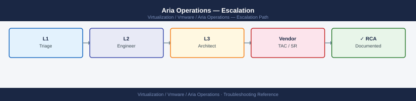
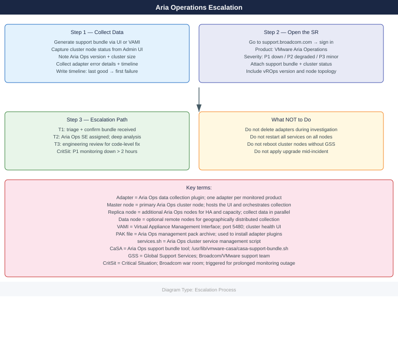
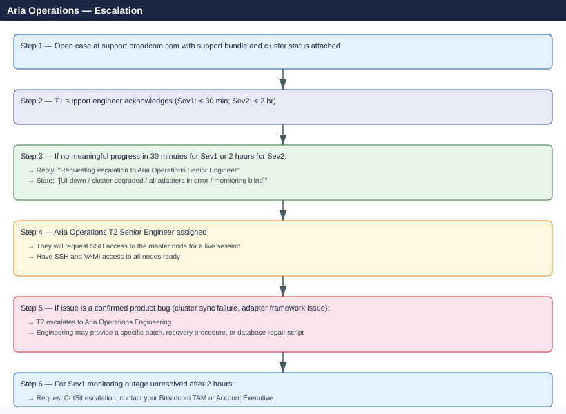

---
tags:
  - aria-operations
  - troubleshooting
  - vmware
search:
  boost: 1.5
---
# Aria Operations — Escalation

<div class="kb-summary">
How to escalate VMware Aria Operations issues to Broadcom support: what data to collect, how to generate the support bundle, step-by-step case creation on support.broadcom.com, and the escalation path when progress stalls.

*Applies to: Aria Operations (formerly vRealize Operations) 8.x*
</div>





---

## Before you begin

- **Access required:** Aria Ops Administrator role in the UI; SSH root access to the master node; Broadcom support account at support.broadcom.com with active Aria Operations entitlement
- **Do NOT reboot cluster nodes** without GSS guidance — the cluster has a specific startup order, and rebooting nodes out of sequence can prevent the cluster from forming quorum
- **Do NOT delete adapters** while the investigation is active — adapter configuration contains the connection history GSS uses to trace collection failures
- **Do NOT restart all services simultaneously** — restarting services on all nodes at once causes a cluster-wide disruption; only restart services on specific nodes if GSS directs you to

---

## Pre-Escalation Self-Check

Run these before opening the case.

| Check | Where to look | Expected result |
|---|---|---|
| Aria Ops version | Administration → About | Note full version (e.g. 8.14.0 build 22546279) |
| Cluster node health | Administration → Cluster Management | All nodes show `Online` |
| Adapter collection status | Administration → Integrations → Adapter Instances | All adapters show `OK` or note error count |
| UI accessibility | Browse to `https://<vra-ops-fqdn>/ui/` | Login page loads |
| VAMI health | Browse to `https://<vra-ops-fqdn>:5480` | Cluster status page loads |
| Disk space | SSH: `df -h` or VAMI → Cluster Utilities | All partitions above 15% free |
| Recent alerts | Aria Ops UI → Alerts → Active | Note any CRITICAL alerts on the vROps objects themselves |
| Data collection time | Aria Ops UI → Administration → Integrations | Note last collection timestamp per adapter |

---

## Step-by-Step Data Collection

### 1. Get the Aria Operations version and cluster topology

In Aria Ops UI: click **Administration → About**. Note:
- Full version (e.g. `8.14.0`)
- Build number
- Number of nodes (master + replica + data nodes)

Also in **Administration → Cluster Management**: note the role and status of each node.

### 2. Generate the support bundle

**Via UI (recommended):**

1. In Aria Ops UI: click **Administration → Cluster Management**.
2. Click **Actions → Export Support Bundle** (or the wrench icon → Support).
3. Select all nodes.
4. Wait 5–20 minutes for the bundle to be generated.
5. Download the resulting archive.

**Via SSH (for when UI is inaccessible):**

```bash
# SSH to the Aria Operations master node
ssh root@<vra-ops-fqdn>

# Generate the support bundle using CaSA script
/usr/lib/vmware-casa/casa-support-bundle.sh

# Bundle is written to /tmp/ — check filename
ls -lh /tmp/support-bundle-*.zip

# Copy to a local machine
# scp root@<vra-ops-fqdn>:/tmp/support-bundle-*.zip /tmp/
```

### 3. Check cluster node and service status

```bash
# SSH to the master node
ssh root@<vra-ops-fqdn>

# Check overall cluster service status (run on master node only)
service-control --status

# Or use the Aria Ops script directly
/usr/lib/vmware-vcopssuite/python/bin/vcops-admin status

# Check which services are running on this node
/usr/lib/vmware-vcopssuite/python/bin/vcops-admin --platform-service list

# Check disk space (low disk commonly causes collection failures)
df -h

# Check memory usage
free -h
```

### 4. Collect adapter error details

In Aria Ops UI: navigate to **Administration → Integrations → Adapter Instances**.

For each adapter showing an error:
1. Click the adapter name.
2. Click **Test Connection** — note the result.
3. Click **View Logs** → note the most recent error message.

Export the adapter list: **Administration → Integrations → Adapter Instances → Export**.

### 5. Write the timeline

```text
Aria Operations version: 8.14.0 build 22546279
Cluster: 1 master + 2 replica nodes (vrops01, vrops02, vrops03)
Adapters: 14 (vCenter, NSX, vSAN, vROps Self, Log Insight, etc.)
Issue first observed: 2026-06-14 08:00 UTC
Last known good collection: 2026-06-14 06:00 UTC
Changes in 24h before the issue:
  - 07:00: vrops03 (replica node) rebooted for OS patch
  - 08:00: vROps UI shows "Cluster degraded" — vrops03 not rejoining the cluster
  - 08:15: All adapters showing collection error; no data received in UI
Steps already taken:
  - VAMI on vrops03: node shows "Joining cluster" stuck for 45 min
  - SSH to vrops03: services appear running but cluster sync is failing
  - Did NOT restart services on vrops01 or vrops02
  - Did NOT delete any adapters
Blast radius: Monitoring data collection halted for entire environment; 1,400 objects have no new data
```

---

## How to Open the SR on support.broadcom.com

1. Go to **support.broadcom.com** and sign in with your Broadcom account.

2. Click **Open a Support Request**.

3. Under **Product Group**, select **VMware Cloud Foundation and Virtualization** → **VMware Aria Operations** (or search for "vRealize Operations").

4. Under **Version**, select your Aria Ops version from Step 1.

5. Under **Severity**, select:
   - **Severity 1 — Critical**: Aria Ops UI completely down; all monitoring data collection has stopped; cluster has lost quorum; no workaround; production monitoring is blind
   - **Severity 2 — High**: Cluster degraded (node offline); significant adapter collection failures; most data not being received; UI accessible but unreliable
   - **Severity 3 — Medium**: Single adapter failing; specific management pack broken; some objects not collecting; workaround exists
   - **Severity 4 — Low**: How-to question, pre-upgrade planning, custom dashboard or policy question

6. In the **Summary** field: product + symptom + scope. Example: `Aria Operations 8.14 — replica node vrops03 not rejoining cluster after reboot, all 14 adapters in collection error, 1,400 objects with no data`.

7. In the **Description** field, paste:
   - Aria Ops version and cluster topology from Step 1
   - Cluster node status from Step 3 (`service-control --status`)
   - Adapter error message from Step 4
   - The timeline from Step 5

8. Under **Attachments**, upload the support bundle from Step 2.

9. Click **Submit**. You will receive a case number by email immediately.

10. **Severity 1 only:** call Broadcom/VMware support after submission:
    - North America: +1 877-486-9273 (24×7 for Severity 1)
    - EMEA: +44 (0)3453 700 100
    - State "Severity 1 — Aria Operations cluster degraded, monitoring down for entire environment" at the start of the call.

---

## Escalation Path



---

## What NOT to Do

| Do NOT do this | Why | What to do instead |
|---|---|---|
| Restart all services on all cluster nodes simultaneously | Causes cluster-wide disruption; all nodes go through a service restart together, which may prevent quorum from reforming | Only restart services on one node at a time if GSS instructs |
| Reboot cluster nodes without GSS direction | Nodes have a specific startup order (master must be fully up before replicas); out-of-order reboots prevent cluster formation | Let GSS confirm the safe reboot sequence |
| Delete adapters during investigation | Adapter config contains connection history needed for diagnosis | Leave all adapters in place; only reconfigure if GSS instructs |
| Apply a management pack (PAK) upgrade mid-incident | Changes the adapter codebase GSS is analysing | Freeze all PAK upgrades until the incident is resolved |
| Remove a node from the cluster without GSS | Node removal triggers data rebalancing; in a degraded state this may not complete | Let GSS confirm the node state before any cluster topology change |
| Run `vcops-admin cluster-restart` without GSS | Full cluster restart in a partially degraded state may cause data loss | Only run with explicit GSS instruction |

---

## Useful Commands for Case Updates

```bash
# Paste these into every case update (SSH to master node as root)

# Version
/usr/lib/vmware-vcopssuite/python/bin/vcops-admin version

# Cluster node and service status
service-control --status
/usr/lib/vmware-vcopssuite/python/bin/vcops-admin status

# Disk space (low disk is a common cause)
df -h

# Memory usage
free -h

# Node cluster health check
cat /data/vcops/log/analytics/analytics.log | tail -100

# Adapter collection log (replace <adapter-name> with actual adapter name)
ls /data/vcops/log/solutions/<adapter-name>/
tail -100 /data/vcops/log/solutions/<adapter-name>/<adapter>.log
```

---

## Support SLA Reference

| Severity | Definition | Initial Response SLA |
|---|---|---|
| Sev 1 — Critical | UI down; all collection stopped; cluster lost quorum | < 30 min (24×7) |
| Sev 2 — High | Cluster degraded; node offline; significant adapter failures | < 2 hours (24×7) |
| Sev 3 — Medium | Single adapter failing; management pack issue; workaround exists | < 8 hours |
| Sev 4 — Low | How-to, pre-upgrade, custom report/policy, non-urgent | Next business day |

---

## See also

- [Aria Operations — Diagnostics](diagnostics/)
- [Aria Operations — Common Issues](common-issues/)

---

## Verify resolution

- Browse to the Aria Ops UI: login page loads and Dashboard displays
- Navigate to **Administration → Cluster Management**: all nodes show `Online`
- Navigate to **Administration → Integrations → Adapter Instances**: all adapters show `OK` or `Collecting Data`
- Verify recent data is flowing: check a vCenter adapter and confirm the most recent collection timestamp is within the last collection cycle (typically 5 minutes)
- Check disk space: `df -h` on all nodes — all partitions above 15% free
- Monitor for one full collection cycle (5 minutes) to confirm all adapters complete collection without errors
