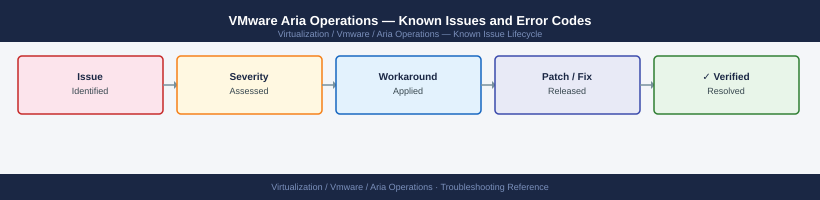

---
tags:
  - troubleshooting
  - aria-operations
  - vmware
  - known-issues
---
# VMware Aria Operations — Known Issues and Error Codes

Catalog of known Aria Operations (vROps) bugs, error codes, and workarounds covering collector issues, adapter failures, and alerting.

*Applies to: Aria Operations 8.x*

## Before you begin

- Aria Operations errors appear in `Administration → Management → Collector Groups` and `Administration → Management → Solutions`.
- Logs: `/data/vcops/log/` on the Analytics cluster node; key log is `vcops-analytics.log`.

## Adapters and Collectors

| Error / Symptom | Affected Versions | Cause | Workaround / Fix | Fixed In |
|---|---|---|---|---|
| vCenter adapter shows `No data collecting` | Aria Ops 8.x | Adapter credentials expired or vCenter certificate changed | Re-validate vCenter credentials in adapter instance; accept new cert fingerprint | N/A |
| Remote Collector shows `Offline` after IP change | Aria Ops 8.x | Collector registered with old IP; cluster can't reach it | Re-register Collector with new IP; update Collector IP in cluster settings | N/A |
| `SNMP adapter timeout` for network device | Aria Ops 8.x | SNMP community string incorrect or UDP 161 blocked | Verify community string; verify UDP 161 from Collector to device | N/A |
| CIM adapter fails: `SSL handshake failure` | Aria Ops 8.x | ESXi CIM SSL certificate not trusted by Aria Ops | Add ESXi CIM certificate to Aria Ops trust store | N/A |

## Alerting and Dashboards

| Error / Symptom | Affected Versions | Cause | Workaround / Fix | Fixed In |
|---|---|---|---|---|
| Alert `High CPU` never clears despite low CPU | Aria Ops 8.x | Cancel threshold not configured (only trigger threshold set) | Set `Cancel Trigger` in alert definition to auto-cancel when metric normalizes | N/A |
| Dashboard widget shows `No Data` for custom metric | Aria Ops 8.x | Metric path typo in widget configuration | Verify metric path via `Administration → Metric Configuration`; use metric picker | N/A |

## Cluster

| Error / Symptom | Affected Versions | Cause | Workaround / Fix | Fixed In |
|---|---|---|---|---|
| Data node stuck in `Initializing` after cluster expand | Aria Ops 8.x | Time skew >60s between cluster nodes | Sync NTP on all nodes; verify same NTP source | N/A |
| Analytics node OOM — containers restarting | Aria Ops 8.x | Insufficient RAM for inventory size | Upgrade VM to minimum 48 GB RAM for large environments (>5000 objects) | N/A |

## See also

- [VMware Aria Operations — Common Issues](common-issues/)
- [VMware Aria Operations for Logs — Known Issues](../../aria-operations-for-logs/troubleshooting/known-issues.md)
- [VMware vCenter — Known Issues](../../vcenter/troubleshooting/known-issues.md)
