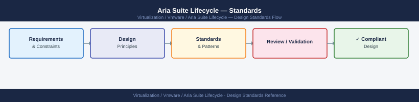

---
tags:
  - architecture
  - aria-lcm
  - vmware
---
# Aria Suite Lifecycle — Standards


<div class="kb-summary">
Standards reference covering Pre-Deployment Checklist, Deployment Size Reference, Certificate Standards, Upgrade Sequence Rules, Version Matrix Compliance.

*Applies to: Aria Suite Lifecycle 8.x*
</div>



  LCM Design Standards at a Glance

| Product | Short Name | Example |
|---|---|---|
| Aria Suite Lifecycle | lcm | `lcm-prod-01.example.local` |
| Workspace ONE Access | vidm | `vidm-prod-01.example.local` |
| Aria Operations | vrops | `vrops-prod-01.example.local` |
| Aria Automation | vra | `vra-prod-01.example.local` |
| Aria Log Insight | vrli | `vrli-prod-01.example.local` |

Node numbering: `-01`, `-02`, `-03` for clustered deployments.

```d2
direction: right

center: "Aria Suite Lifecycle" {shape: hexagon}
predeployment_checklist: "Pre-Deployment Checklist" {shape: rectangle}
deployment_size_reference: "Deployment Size Reference" {shape: rectangle}
certificate_standards: "Certificate Standards" {shape: rectangle}
upgrade_sequence_rules: "Upgrade Sequence Rules" {shape: rectangle}
version_matrix_compliance: "Version Matrix Compliance" {shape: rectangle}

center -> predeployment_checklist
center -> deployment_size_reference
center -> certificate_standards
center -> upgrade_sequence_rules
center -> version_matrix_compliance
```

## Pre-Deployment Checklist

Before running Easy Installer or deploying any managed product:

- [ ] DNS A record created for each appliance FQDN — verify: `nslookup <fqdn>`
- [ ] DNS PTR record created for each appliance IP — verify: `nslookup <ip>`
- [ ] NTP reachable from appliance subnet; time delta < 5 seconds — verify: `chronyc tracking`
- [ ] NFS export accessible with read/write from LCM appliance IP
- [ ] NFS export size: minimum 200 GB per major product version to be stored
- [ ] Proxy configured with bypass for all management FQDNs (`*.example.local`, vCenter, NSX)
- [ ] CA certificate chain (root + intermediates) ready for upload to Locker
- [ ] Static IP addresses reserved and documented in IPAM
- [ ] vCenter cluster has sufficient resources for target deployment size

## Deployment Size Reference

| Size | vCPU | RAM | Disk | Environment |
|---|---|---|---|---|
| Extra Small (XS) | 4 | 16 GB | 250 GB | Lab / PoC |
| Small | 8 | 24 GB | 250 GB | Dev / Pre-Prod |
| Medium | 16 | 32 GB | 250 GB | Production < 500 nodes |
| Large | 24 | 48 GB | 500 GB | Production 500–2,000 nodes |

## Certificate Standards

| Requirement | Standard |
|---|---|
| Algorithm | RSA 4096-bit (minimum RSA 2048-bit) |
| Signature | SHA-256 |
| SAN entries | Product FQDN + load-balancer VIP (if applicable) |
| Validity | Maximum 2 years; 1 year preferred |
| CA | Internal PKI CA or public CA |
| Wildcard | Permitted for lab; not recommended for production nodes |

Import full chain (leaf + intermediate + root) into Locker.

## Upgrade Sequence Rules

1. LCM before all products — without exception
2. Workspace ONE Access before all Aria products
3. Never upgrade two products simultaneously in the same environment
4. Validate product health after each upgrade step before proceeding to the next
5. VM snapshots must be taken before each upgrade; snapshots must be present for rollback

## Version Matrix Compliance

Maintain a version compliance table in CMDB:

| Product | Deployed Version | Latest Available | Status |
|---|---|---|---|
| Aria Suite Lifecycle | 8.x.y | <check Broadcom> | Current / Update Needed |
| Workspace ONE Access | 3.3.x | <check Broadcom> | Current / Update Needed |
| Aria Operations | 8.x.y | <check Broadcom> | Current / Update Needed |

Review and update this table after every upgrade cycle and monthly for new releases.

## See also

- [Aria Suite Lifecycle — How It Works](how-it-works/)
- [Aria Suite Lifecycle — Deploy](../deploy/)
