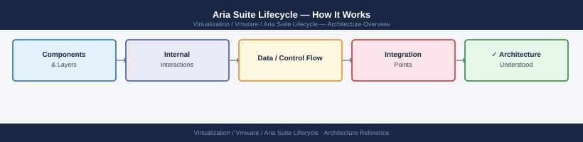
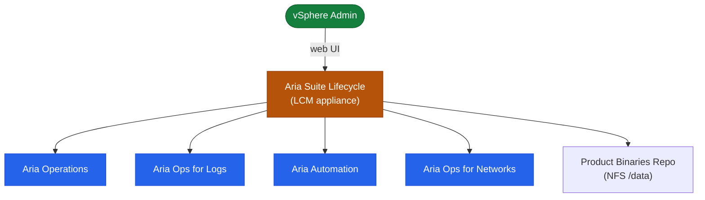

---
tags:
  - architecture
  - aria-lcm
  - vmware
---
# Aria Suite Lifecycle — How It Works

How It Works reference covering Overview, Product Management Topology.

*Applies to: Aria Suite Lifecycle 8.x*

## Overview

Aria Suite Lifecycle (LCM) is a management appliance that deploys, upgrades, and manages the entire VMware Aria product suite from a single control plane. LCM eliminates per-product upgrade complexity by orchestrating pre-checks, snapshots, binary staging, sequential node upgrades, and post-checks as a single audited workflow. All credentials and certificates are stored in the integrated **Locker** vault.

## Product Management Topology

| API Path | Purpose |
|---|---|
| `/lcm/authz/api/v2` | Authentication — login and token management |
| `/lcm/lcmservice/api/v2/environments` | Environment and product inventory |
| `/lcm/lcmservice/api/v2/requests` | Request tracking and audit |
| `/lcm/locker/api/v2/certificates` | Locker — certificate management |
| `/lcm/locker/api/v2/passwords` | Locker — password management |

## See also

- [Aria Suite Lifecycle — Standards](design-standards/)
- [Aria Suite Lifecycle — Deploy](../deploy/)
- [Aria Suite Lifecycle — Integrations](integrations/)
