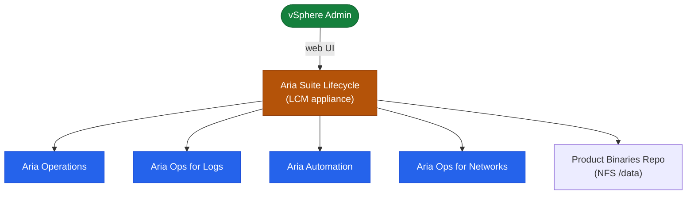

# Aria Suite Lifecycle — How It Works


<div class="kb-summary">
How It Works reference covering Overview, Product Management Topology.
</div>

## Overview

Aria Suite Lifecycle (LCM) is a management appliance that deploys, upgrades, and manages the entire VMware Aria product suite from a single control plane. LCM eliminates per-product upgrade complexity by orchestrating pre-checks, snapshots, binary staging, sequential node upgrades, and post-checks as a single audited workflow. All credentials and certificates are stored in the integrated **Locker** vault.

## Product Management Topology


┌────────────────────────────────────── How Aria Suite LCM Works ───────────────────────────────────────┐
│                                                                                                       │
│  Depot sync, environment creation, product deployment, and cert management in LCM.                    │
│                                                                                                       │
│   ┌──────────────────────────────────────────────┐  ┌─────────────────────────────────────────────┐   │
│   │               Depot & Content                │  │            Environment Lifecycle            │   │
│   │          Depot: online or local NFS          │  │           Create environment in UI          │   │
│   │          Sync PAK files from depot           │  │           Associate vCenter + vIDM          │   │
│   │           Download: vROps/vRLI/vRA           │  │           Add products one by one           │   │
│   │          Binary stored on LCM disk           │  │          LCM runs pre-checks first          │   │
│   └──────────────────────────────────────────────┘  └─────────────────────────────────────────────┘   │
│                                                                                                       │
│  Depot provides binaries; environments group products; LCM orchestrates deployment.                   │
│                                                                                                       │
│                          ▼                                                 ▼                          │
│                                                                                                       │
│   ┌──────────────────────────────────────────────┐  ┌─────────────────────────────────────────────┐   │
│   │           Product Deployment Flow            │  │            Certificate Management           │   │
│   │           1. Select PAK from depot           │  │           Import cert to LCM trust          │   │
│   │        2. LCM deploys OVA to vSphere         │  │          Assign cert to environment         │   │
│   │          3. LCM configures product           │  │          LCM pushes cert to product         │   │
│   │         4. Product joins environment         │  │            Rotate cert via LCM UI           │   │
│   └──────────────────────────────────────────────┘  └─────────────────────────────────────────────┘   │
│                                                                                                       │
│  Physical Infrastructure (the hardware everything above runs on):                                     │
│  LCM VM on vSphere; vCenter for product VM deployment; NFS/S3 for depot storage                       │
│                                                                                                       │
│  Key terms:                                                                                           │
│                                                                                                       │
│  Depot               = Content source: VMware online or local NFS with PAK files                      │
│  PAK File            = Product Activation Key; contains binaries for deploy/upgrade                   │
│  Environment         = LCM grouping of related products sharing vCenter and vIDM                      │
│  Pre-check           = LCM automated validation before deployment or upgrade                          │
│  OVA Deploy          = LCM deploys product VM from OVA via vCenter API                                │
│  Product Config      = LCM automates post-deploy config: IP, DNS, vIDM registration                   │
│  Cert Trust Store    = LCM internal store of trusted CA certs and product certs                       │
│  Cert Assignment     = Linking a TLS cert to a specific product in an environment                     │
│  Cert Rotation       = LCM-orchestrated cert replacement across all product nodes                     │
│  vIDM Registration   = Product registration with vIDM for SSO; done by LCM                            │
│  Logscraper          = LCM diagnostic tool collecting logs from all products                          │
│  Content Sync        = LCM downloads and caches PAK files from online depot                           │
│                                                                                                       │
└───────────────────────────────────────────────────────────────────────────────────────────────────────┘
```

| API Path | Purpose |
|---|---|
| `/lcm/authz/api/v2` | Authentication — login and token management |
| `/lcm/lcmservice/api/v2/environments` | Environment and product inventory |
| `/lcm/lcmservice/api/v2/requests` | Request tracking and audit |
| `/lcm/locker/api/v2/certificates` | Locker — certificate management |
| `/lcm/locker/api/v2/passwords` | Locker — password management |
