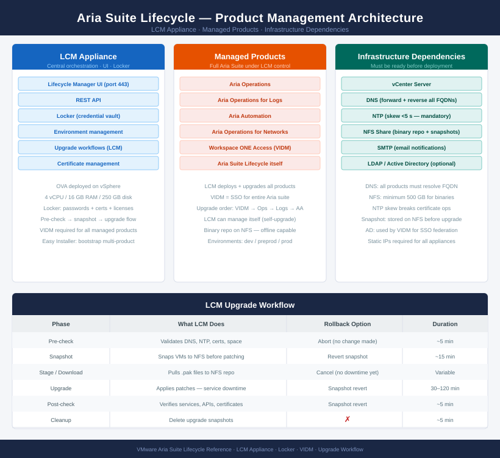

---
tags:
  - architecture
  - aria-lcm
  - vmware
---
# Aria Suite Lifecycle — Architecture

Central management appliance for deploying and upgrading the full VMware Aria Suite. Orchestrates pre-check → snapshot → stage → upgrade → post-check as a single audited workflow; stores all credentials and certificates in the integrated Locker vault.

<a class="kb-card" href="how-it-works/"><strong>How It Works</strong>How it works, integrations, and design standards.</a>
<a class="kb-card" href="integrations/"><strong>Integrations</strong>Integration with vCenter, VIDM, NFS, and managed Aria products.</a>
<a class="kb-card" href="design-standards/"><strong>Design Standards</strong>Pre-requisite checklist, upgrade sequencing, and DNS/NTP requirements.</a>

## Core Components

| Component | Role |
|---|---|
| LCM Appliance | Central orchestration, UI, REST API, Locker vault |
| Workspace ONE Access (VIDM) | Identity provider and SSO for all Aria products |
| vRealize Easy Installer | Bootstrap ISO for initial multi-product deployment |
| NFS Share | Binary repository (`.pak` files) and snapshot storage |
| NTP Server | Time synchronisation — mandatory; certificate operations fail on >5 s skew |
| DNS | Forward + reverse resolution required for every node FQDN |

