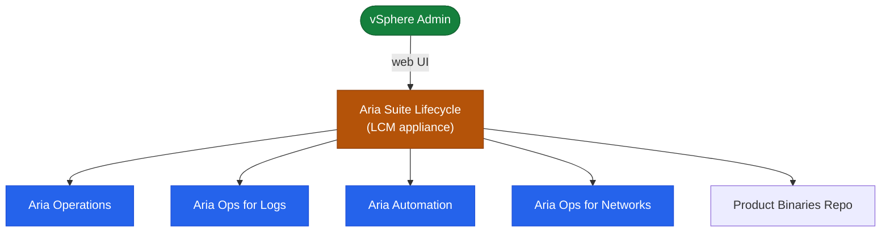

# Aria Suite Lifecycle — Architecture Overview

## Overview

Aria Suite Lifecycle (LCM) is a management appliance that deploys, upgrades, and manages the entire VMware Aria product suite from a single control plane. LCM eliminates the need to update each Aria product independently.

## Product Management Topology



## Core Components

| Component | Role |
|---|---|
| LCM Appliance | Central orchestration, UI, API, Locker (certificate/password vault) |
| Workspace ONE Access (VIDM) | Identity provider and SSO for all Aria products |
| vRealize Easy Installer | Bootstrap ISO for initial multi-product deployment |
| NFS Share | Binary repository and snapshot storage |
| NTP Server | Time synchronisation — mandatory for certificate validity |
| DNS | Forward and reverse resolution required for every node FQDN |

---

## LCM Functional Areas

LCM is divided into distinct functional areas, each accessible from the main navigation:

### Lifecycle Operations

The primary area for day-to-day product management:

- **Environments**: logical groupings of deployed Aria products (e.g., "Production", "Dev"). Each environment card shows installed product versions and health indicators.
- **Requests**: a full audit log of every deployment, upgrade, certificate replacement, and health check operation, with stage-by-stage progress tracking.
- **Marketplace**: browsable catalogue of available product versions and upgrade bundles.
- **Settings → Binary Mapping**: maps downloaded `.pak` files to product versions. Required before any upgrade can be initiated.

### Locker

The secure credential vault within LCM:

- **Certificates**: stores PEM certificate chains and private keys. Apply to products via the certificate replacement workflow. All certificates show days-to-expiry, alias, and subject.
- **Passwords**: encrypted storage for service account credentials (vCenter, NSX, VIDM, database). Passwords are used by LCM during product operations and are never returned in plain text via the API.
- **Licences**: product licence keys stored for automated assignment during deployment.

### My Services (Content Lifecycle Manager)

Manages cross-environment content promotion:

- **Extract content** from a source environment (Aria Operations dashboards, Aria Automation blueprints)
- **Deploy content** to a target environment (e.g., promote from Dev → Production)
- Content mappings allow environment-specific variables (cloud account names, network profiles) to be rewritten during promotion

---

## Authentication and Access Flow

```
Browser
  → LCM UI (HTTPS:443)
    → VIDM (SAML redirect for interactive users)
      → Active Directory (LDAP/LDAPS)
        → LCM session (role-based: Admin / Content Developer / Viewer)

API clients
  → POST /lcm/authz/api/v2/login (Basic auth)
    → Bearer token (x-xenon-auth-token header for subsequent calls)
```

The local `admin@local` account bypasses VIDM and uses LCM's internal authentication. Use this account only as a break-glass fallback — all interactive users should authenticate via VIDM-backed AD accounts.

---

## Product Upgrade Orchestration

LCM orchestrates upgrades as a series of tasks within a request workflow:

1. **Pre-check**: validates DNS, NTP, disk space, NFS connectivity, and vCenter reachability. All checks must pass before LCM proceeds.
2. **Snapshot**: LCM takes VM snapshots of the product appliances before modifying them. These snapshots serve as the rollback point.
3. **Binary stage**: LCM copies the upgrade bundle from the NFS repository to the product appliances.
4. **Upgrade**: LCM runs the in-product upgrade agent. For clustered products (Aria Operations, Aria Automation), nodes are upgraded sequentially.
5. **Post-check**: LCM verifies services are running and health indicators return to green.
6. **Rollback** (if needed): if the upgrade fails or post-check fails, LCM can revert product VMs to the pre-upgrade snapshots.

Upgrade progress is tracked in real time in **Lifecycle Operations → Requests**, with task-level detail available on each request.

---

## Easy Installer (Initial Deployment)

The vRealize Easy Installer is a bootable ISO that automates the initial deployment of the full Aria Suite stack:

1. Boot a Windows or Linux installer VM from the Easy Installer ISO
2. The wizard deploys in order: LCM → VIDM → selected Aria products
3. All networking parameters (IPs, FQDNs, NTP, DNS) are entered once and applied across all deployed appliances
4. After Easy Installer completes, all further operations are managed through the LCM UI

Easy Installer is the recommended approach for greenfield deployments. For adding products to an existing LCM-managed environment, use **Lifecycle Operations → Environments → Add Product**.

---

## Key Deployment Pre-Requisites

Before using LCM to deploy any product:

| Prerequisite | Why Required | Verification |
|---|---|---|
| DNS A + PTR records for every FQDN | LCM product agents communicate by FQDN; PTR is required for SSO | `nslookup <fqdn>` from LCM appliance |
| NTP reachable; delta < 5 seconds | Certificate operations fail on time skew | `chronyc tracking` on LCM appliance |
| NFS share mounted at `/data` | Stores product binaries (`.pak` files) | `df -h /data && touch /data/.test` |
| vCenter service account with correct permissions | LCM deploys OVAs via vCenter API | Test credentials: LCM → Settings → vCenter |
| CA-signed certificate ready | Locker imports must include full chain | `openssl verify -CAfile chain.pem leaf.pem` |
| VIDM registered or deployed by Easy Installer | All Aria products use VIDM for SSO | `curl -sk https://vidm.corp.local/SAAS/API/1.0/REST/system/health` |

---

## LCM API Overview

LCM exposes a REST API for all operations available in the UI. All API calls require a token obtained from the authentication endpoint.

| API Base Path | Purpose |
|---|---|
| `/lcm/authz/api/v2` | Authentication — login and token management |
| `/lcm/lcmservice/api/v2/environments` | Environment and product inventory |
| `/lcm/lcmservice/api/v2/requests` | Request tracking and audit |
| `/lcm/locker/api/v2/certificates` | Locker — certificate management |
| `/lcm/locker/api/v2/passwords` | Locker — password management |
| `/lcm/locker/api/v2/licenses` | Locker — licence management |
| `/lcm/lcmservice/api/v2/system` | LCM system details and version |

```bash
# Authenticate and store token
TOKEN=$(curl -sk -X POST "https://lcm-prod-01.corp.local/lcm/authz/api/v2/login" \
  -H "Content-Type: application/json" \
  -d '{"username":"admin@local","password":"<password>"}' | jq -r '.token')

# List all environments
curl -sk -H "x-xenon-auth-token: $TOKEN" \
  "https://lcm-prod-01.corp.local/lcm/lcmservice/api/v2/environments" | \
  jq '.[] | {name: .environmentName, health: .environmentHealth}'

# Get LCM system version
curl -sk -H "x-xenon-auth-token: $TOKEN" \
  "https://lcm-prod-01.corp.local/lcm/lcmservice/api/v2/system/details" | \
  jq '{version: .lcmVersion, build: .buildNumber}'
```

Swagger documentation is available at:
`https://lcm-prod-01.corp.local/lcm/api-explorer` — browse all available endpoints, parameters, and response schemas.

---

## In this section

<div class="kb-grid kb-grid-3">
<a class="kb-card" href="components/"><strong>Components</strong><span>Core components, services, and technical specifications.</span></a>
<a class="kb-card" href="integrations/"><strong>Integrations</strong><span>Integration with other platforms and external systems.</span></a>
<a class="kb-card" href="standards/"><strong>Standards</strong><span>Sizing guidelines, design standards, and best practices.</span></a>
</div>
