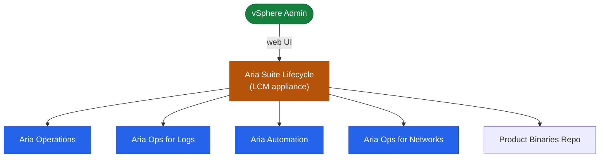

# Aria Suite Lifecycle — Architecture Overview

## Overview

Aria Suite Lifecycle (LCM) is a management appliance that deploys, upgrades, and manages the entire VMware Aria product suite from a single control plane. LCM eliminates the need to update each Aria product independently.

## Product Management Topology

## Core Components

| Component | Role |
|---|---|
| LCM Appliance | Central orchestration, UI, API, Locker (certificate/password vault) |
| Workspace ONE Access (VIDM) | Identity provider and SSO for all Aria products |
| vRealize Easy Installer | Bootstrap ISO for initial multi-product deployment |
| NFS Share | Binary repository and snapshot storage |
| NTP Server | Time synchronisation — mandatory for certificate validity |
| DNS | Forward and reverse resolution required for every node FQDN |
