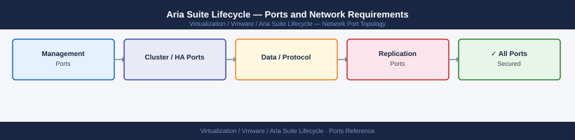

---
tags:
  - aria-suite-lifecycle
  - vrslcm
  - networking
  - firewall
  - ports
  - vmware
---
# Aria Suite Lifecycle — Ports and Network Requirements

<div class="kb-summary">
Firewall port reference for VMware Aria Suite Lifecycle Manager (formerly vRealize Suite Lifecycle Manager). Covers inbound admin access, outbound connections to managed Aria products and vCenter, and product download depot access.

*Applies to: Aria Suite Lifecycle 8.x / 2403+*
</div>



## Before you begin

- Aria Suite Lifecycle is a single appliance (no HA cluster); open ports to its single IP
- Aria LC manages product lifecycle for all Aria Suite products — it must reach every managed product's appliance on 443 and 5480 (VAMI)
- Aria LC deploys new product VMs via vCenter — it must reach vCenter on 443
- Product bundle downloads require outbound HTTPS to Broadcom/VMware depot — plan an outbound proxy if direct internet access is not available

---

## Inbound — Client to Aria Suite Lifecycle

| Port | Protocol | Source | Purpose |
|---|---|---|---|
| 443 | TCP | Admin workstations | Aria LC web UI and API |
| 22 | TCP | Jump hosts | SSH — appliance management |
| 5480 | TCP | Admin workstations | VAMI appliance management |

---

## Outbound — Aria LC to vCenter

| Port | Protocol | Destination | Purpose |
|---|---|---|---|
| 443 | TCP | vCenter Server | OVF deployment of Aria product appliances, snapshot operations for upgrades |

---

## Outbound — Aria LC to Managed Aria Products

For each managed Aria product appliance:

| Port | Protocol | Destination | Purpose |
|---|---|---|---|
| 443 | TCP | Aria Automation cluster VIP / node IPs | Product API — health checks, configuration, certificate management |
| 5480 | TCP | Aria Automation node IPs | VAMI — product upgrade and patch deployment |
| 443 | TCP | Aria Operations cluster VIP / node IPs | Product API |
| 5480 | TCP | Aria Operations node IPs | VAMI |
| 443 | TCP | Aria Operations for Logs VIP / node IPs | Product API |
| 5480 | TCP | Aria Operations for Logs node IPs | VAMI |
| 443 | TCP | Aria Operations for Networks VIP / node IPs | Product API |
| 5480 | TCP | Aria Operations for Networks node IPs | VAMI |
| 443 | TCP | vRealize Orchestrator node IPs | Product API (if standalone vRO) |
| 5480 | TCP | vRO node IPs | VAMI |

---

## Outbound — Product Bundle Downloads

| Port | Protocol | Destination | Purpose |
|---|---|---|---|
| 443 | TCP | *.broadcom.com | Product bundle and patch downloads from My Broadcom portal |
| 443 | TCP | packages.broadcom.com | Alternative download path |
| 123 | UDP | NTP servers | Time synchronisation |

---

## Outbound — Active Directory Integration

| Port | Protocol | Destination | Purpose |
|---|---|---|---|
| 389 | TCP | Active Directory DCs | LDAP — admin user authentication |
| 636 | TCP | Active Directory DCs | LDAPS (recommended) |
| 88 | TCP/UDP | Active Directory DCs | Kerberos |

---

## Firewall Zone Summary

| From | To | Ports | Notes |
|---|---|---|---|
| Admin workstations | Aria LC | 443, 5480 | UI, API, and VAMI |
| Aria LC | vCenter | 443 | OVF deployment |
| Aria LC | Each managed Aria product | 443, 5480 | Lifecycle management |
| Aria LC | *.broadcom.com | 443 | Bundle downloads — outbound proxy if needed |
| Aria LC | Active Directory | 389/636, 88 | Admin auth |

---

## Verify

```bash
# From admin workstation — test Aria LC UI
curl -sk -o /dev/null -w "%{http_code}" https://<aria-lc-ip>/lcm/login

# From Aria LC SSH — test vCenter connectivity
curl -sk -o /dev/null -w "%{http_code}" https://<vcenter-fqdn>/rest/com/vmware/cis/session

# From Aria LC SSH — test Aria Automation API
curl -sk -o /dev/null -w "%{http_code}" https://<aria-automation-fqdn>/csp/gateway/am/api/auth/discovery

# From Aria LC SSH — test bundle depot connectivity
curl -sk -o /dev/null -w "%{http_code}" https://packages.broadcom.com

# From Aria LC SSH — test NTP
ntpq -p
```

---

## See also

- [Aria Suite Lifecycle — Architecture](how-it-works/)
- [Aria Suite Lifecycle — Deploy](../deploy/)
- [Aria Automation — Ports](../../aria-automation/architecture/ports.md)
- [Aria Operations — Ports](../../aria-operations/architecture/ports.md)
- [vCenter — Ports](../../vcenter/architecture/ports.md)
