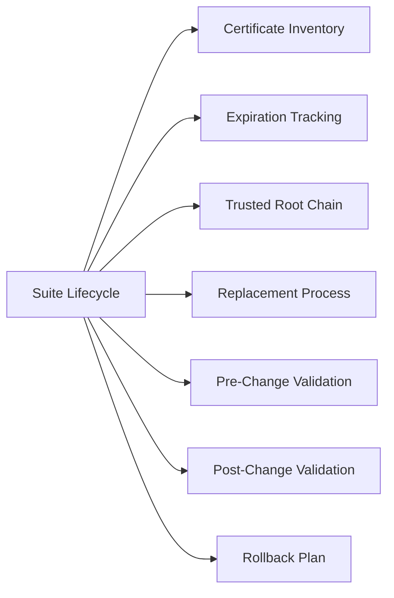

# Aria Suite Lifecycle — Certificate Management

## Certificate Inventory

Track the following for each Aria product:

- Product name and version
- Certificate subject and SANs
- Expiration date
- Issuing CA
- Trust chain status

## Expiration Tracking

- Review certificate expiration dates monthly
- Flag certificates expiring within 60 days
- Confirm renewals are planned before the 30-day mark

## Trusted Root Chain

- Confirm the CA root and intermediate certs are trusted by all Aria products
- A broken trust chain causes integration failures between products and with vCenter

## Replacement Process

1. Generate a new CSR from Aria Suite Lifecycle
2. Submit to the CA and retrieve the signed certificate
3. Import the certificate into Aria Suite Lifecycle
4. Apply to the affected product endpoint
5. Validate product health after replacement

## Pre-Change Validation

- Confirm current certificates are still valid
- Confirm the CA is accessible
- Confirm backup of current product configuration

## Post-Change Validation

- Confirm product UI is accessible
- Confirm integrations with vCenter and other products are working
- Confirm no certificate warnings in browser or product health views

## Rollback Plan

- Keep the previous certificate available for re-import if needed
- If the product becomes unreachable, restore from Aria Suite Lifecycle backup
