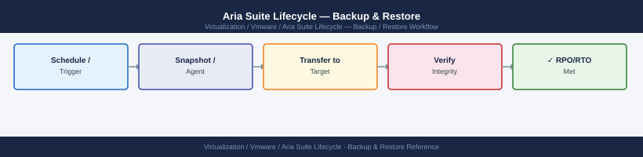

---
tags:
  - aria-lcm
  - operations
  - vmware
---
# Aria Suite Lifecycle — Backup & Restore


<div class="kb-summary">
Backup & Restore reference covering Option 2 — VADP-Compatible Backup (Preferred for Production), Backing Up the NFS Binary Repository, Exporting LCM Environment Configuration via API, Restore Procedure, Backup Verification Checklist.

*Applies to: Aria LCM 8.x*
</div>



  LCM Backup Strategy

```d2
direction: right

hub: "Aria Suite Lifecycle\nOperations" {shape: hexagon}
option_2_vadpcompatible_backup_prefe: "Option 2 — VADP-Compatible Backup (Preferred for Production)" {shape: rectangle}
backing_up_the_nfs_binary_repository: "Backing Up the NFS Binary Repository" {shape: rectangle}
exporting_lcm_environment_configurat: "Exporting LCM Environment Configuration via API" {shape: rectangle}
restore_procedure: "Restore Procedure" {shape: rectangle}
backup_verification_checklist: "Backup Verification Checklist" {shape: rectangle}
verify: "Verify" {shape: rectangle}

hub -> option_2_vadpcompatible_backup_prefe
hub -> backing_up_the_nfs_binary_repository
hub -> exporting_lcm_environment_configurat
hub -> restore_procedure
hub -> backup_verification_checklist
hub -> verify
```

## Before you begin

- **Access:** vCenter read-only minimum; Administrator role for remediation steps
- **Timing:** safe to run during business hours unless a step is marked ⚠ (causes interruption)
- **Dependencies:** no active upgrades or migrations on the same infrastructure
- **Logging:** capture command output — paste into the change record on completion

---

## Option 2 — VADP-Compatible Backup (Preferred for Production)

Use your enterprise backup solution (Veeam, Commvault, Veritas) to back up the LCM appliance VM with application-consistent quiesce. Schedule nightly full or incremental backups. Retain at least 14 daily restore points.

Requirements:
- VMware Tools must be running on the LCM appliance (verify: `vmware-toolsd --version` from SSH)
- Backup job should quiesce the guest filesystem
- LCM services do not need to be stopped for VADP backup — quiesce handles this

---

## Backing Up the NFS Binary Repository

The `/data` NFS share contains all downloaded product bundles (`.pak` files). These are large and re-downloadable from Broadcom, but backing them up avoids re-downloading during disaster recovery.

```bash
# Check NFS mount and size from LCM appliance
df -h /data
du -sh /data/*

# On the NFS server — verify export path
showmount -e <nfs-server-ip>
```

Backup options:
- **NFS server snapshot**: if the NFS server supports snapshots (NetApp, Pure, vSAN File Services), schedule daily snapshots of the export volume
- **rsync to secondary storage**:

```bash
# Run from NFS server or a jump host with access to both locations
rsync -avz --progress /exports/lcm-repo/ /backup/lcm-repo-$(date +%Y%m%d)/
```

---

## Exporting LCM Environment Configuration via API

The LCM API can export environment inventory, which documents deployed product configurations for rebuild reference.

```bash
# Authenticate
TOKEN=$(curl -sk -X POST "https://lcm-prod-01.example.local/lcm/authz/api/v2/login" \
  -H "Content-Type: application/json" \
  -d '{"username":"admin@local","password":"<password>"}' | jq -r '.token')

# List all environments
curl -sk -H "x-xenon-auth-token: $TOKEN" \
  "https://lcm-prod-01.example.local/lcm/lcmservice/api/v2/environments" | \
  jq '.' > lcm-environments-$(date +%Y%m%d).json

# Export a specific environment (replace <env-id> with actual ID)
ENV_ID="<env-id>"
curl -sk -H "x-xenon-auth-token: $TOKEN" \
  "https://lcm-prod-01.example.local/lcm/lcmservice/api/v2/environments/$ENV_ID" | \
  jq '.' > lcm-env-${ENV_ID}-$(date +%Y%m%d).json

# Export Locker certificate inventory (metadata only — not private keys)
curl -sk -H "x-xenon-auth-token: $TOKEN" \
  "https://lcm-prod-01.example.local/lcm/locker/api/v2/certificates" | \
  jq '.' > lcm-locker-certs-$(date +%Y%m%d).json
```

Store these JSON exports alongside the backup job output in a version-controlled location.

---

## Restore Procedure

### Restoring the LCM Appliance from VM Backup

1. Power off the LCM appliance VM (coordinate with teams — LCM UI will be unavailable)
2. Restore the VM from the backup job or revert to snapshot
3. Power on the restored appliance
4. Verify LCM services are running:

```bash
ssh admin@lcm-prod-01.example.local
sudo systemctl status lcm
sudo systemctl status nginx
vracli status
```

5. Open the LCM UI and verify:
   - Environments show correct products and versions
   - Locker contains all expected certificates and passwords
   - vCenter and VIDM integrations show green

6. If restoring from a snapshot that predates a completed upgrade, the product appliances may be at a newer version than LCM expects. In this case, open a Broadcom SR — do not attempt manual re-registration without guidance.

### Restoring After NFS Data Loss

If the `/data` NFS mount is lost but the LCM appliance is intact:

1. Re-provision or restore the NFS export
2. Remount on LCM:

```bash
# Edit /etc/fstab if the NFS entry is missing
echo "<nfs-server>:/lcm-repo /data nfs defaults,_netdev 0 0" >> /etc/fstab
mount -a
df -h /data
```

3. Re-download required product bundles from Broadcom Support Portal
4. Re-map binaries: **Lifecycle Operations → Settings → Binary Mapping → Map Binaries**

---

## Backup Verification Checklist

Run monthly or after every restore test:

- [ ] LCM appliance VM backup job succeeded within last 24 hours
- [ ] Backup restore test performed: restore to isolated network, verify LCM UI accessible
- [ ] NFS backup or snapshot current (within 24 hours)
- [ ] API export JSON files archived and stored off-appliance
- [ ] Locker Master Password documented in offline vault (required for decryption after restore)
- [ ] All Locker certificate private keys have source copies in secure offline storage (PEM files)

---

## See also

- [Aria Suite Lifecycle — Procedures](procedures/)
- [Aria Suite Lifecycle — Common Issues](../troubleshooting/common-issues/)
- [Aria Suite Lifecycle — Health Checks](health-checks/)

## Verify

- **Alarms:** vSphere Client → Home → Alarms — no new critical alarms after the operation
- **Events:** monitor the vCenter Events view for the affected object for 5 minutes
- **Health check:** run the morning health-check sequence for the affected product tier
