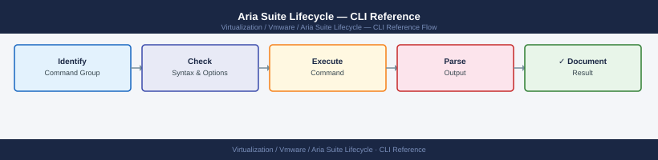

---
tags:
  - aria-lcm
  - operations
  - vmware
---
# Aria Suite Lifecycle — CLI Reference

<div class="kb-summary">
CLI Reference reference covering Services, Certificates, Proxy & Network, NTP & Time, Logs.

*Applies to: Aria LCM 8.x*
</div>


  LCM CLI Coverage (SSH to LCM as root)

---

## Before you begin

- **Access:** vCenter read-only minimum; Administrator role for remediation steps
- **Timing:** safe to run during business hours unless a step is marked ⚠ (causes interruption)
- **Dependencies:** no active upgrades or migrations on the same infrastructure
- **Logging:** capture command output — paste into the change record on completion

---

## Certificates

The Locker stores certificates used by Aria products. Manage them here before triggering certificate replacement operations in LCM.

```bash
# List all certificates in the Locker
vracli certificate list

# Show detail for a certificate
vracli certificate show --alias <alias>

# Import a certificate and key pair
vracli certificate import --cert <cert.pem> --key <key.pem> --alias <alias>

# Delete a certificate from the Locker
vracli certificate delete --alias <alias>

# Check certificate expiry
vracli certificate list | grep -E "alias|expiry"
```

---

## Proxy & Network

```bash
# Show current proxy configuration
vracli proxy show

# Set outbound proxy for bundle downloads
vracli proxy set --host <proxy_host> --port <proxy_port>

# Clear proxy
vracli proxy clear

# Show network configuration
vracli network show

# Update DNS servers
vracli network dns set --servers <dns1>,<dns2>
```

---

## NTP & Time

```bash
# Show current NTP configuration
vracli ntp show

# Set NTP servers
vracli ntp set <ntp_server1> <ntp_server2>

# Verify time sync
timedatectl status

# Force NTP sync
chronyc makestep
```

---

## Logs

```bash
# Follow the main LCM application log
tail -f /var/log/lcm/lcm-app.log

# Follow the LCM debug log
tail -f /var/log/lcm/lcm-debug.log

# Collect a support bundle
vracli support-bundle

# View recent system journal
journalctl --since "2 hours ago" -u lcm
```

---

## See also

- [Aria Suite Lifecycle — Procedures](procedures/)
- [Aria Suite Lifecycle — Scripts](scripts/)
- [Aria Suite Lifecycle — Health Checks](health-checks/)

## Verify

- **Alarms:** vSphere Client → Home → Alarms — no new critical alarms after the operation
- **Events:** monitor the vCenter Events view for the affected object for 5 minutes
- **Health check:** run the morning health-check sequence for the affected product tier
