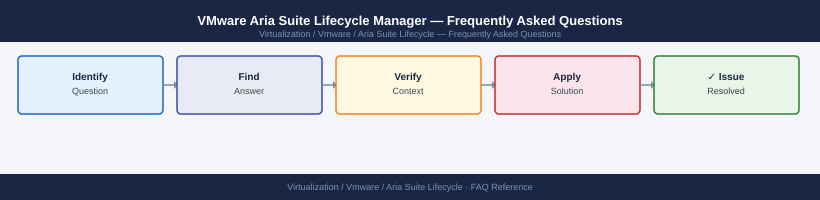

---
tags:
  - aria-suite-lifecycle
  - faq
  - operations
---
# VMware Aria Suite Lifecycle Manager — Frequently Asked Questions

<div class="kb-summary">
Common questions about VMware Aria Suite Lifecycle Manager operations, configuration, and troubleshooting. For step-by-step procedures, see the <a href="index.md">Operations</a> section.
</div>



```d2
direction: right

hub: "Aria Suite Lifecycle\nOperations" {shape: hexagon}
general: "General" {shape: rectangle}
configuration: "Configuration" {shape: rectangle}
operations: "Operations" {shape: rectangle}
troubleshooting: "Troubleshooting" {shape: rectangle}
backup_and_recovery: "Backup and Recovery" {shape: rectangle}

hub -> general
hub -> configuration
hub -> operations
hub -> troubleshooting
hub -> backup_and_recovery
```

## General

**Q: What Aria Suite Lifecycle Manager version is recommended?**
A: LCM 8.16.x is the current recommendation — it must be upgraded first before any Aria Suite products. Check via Administration → System Details → Product Version.

**Q: How do I check the current VMware Aria Suite Lifecycle Manager version?**
A: `Administration → System Details → Product Version`

## Configuration

**Q: What is the default certificate management approach in LCM?**
A: LCM uses its own internal CA by default for Aria Suite product certificates. For production, integrate with your enterprise CA under Lifecycle Operations → Certificate Management → Request Certificate. This avoids browser certificate warnings.

**Q: How do I enable LCM integration with vRealize Easy Installer for greenfield deployments?**
A: Download the Aria Suite Easy Installer OVA from VMware Customer Connect. Deploy it and run the installer wizard, which deploys and configures LCM, Identity Manager, and selected Aria Suite products in the correct order.

## Operations

**Q: What is the correct upgrade order for Aria Suite products via LCM?**
A: Always upgrade in this order: 1) LCM itself, 2) VMware Identity Manager (Workspace ONE Access), 3) Aria Operations for Logs, 4) Aria Operations, 5) Aria Operations for Networks, 6) Aria Automation. Never skip this sequence.

**Q: What is the correct procedure to add a new environment to LCM?**
A: LCM → Lifecycle Operations → Create Environment. Specify datacenter and vCenter. Add product installers to the binary mapping. LCM will deploy and configure the product within the environment.

## Troubleshooting

**Q: LCM shows 'Precheck failed: certificate validation error'. What does it mean?**
A: LCM cannot validate SSL certificates for connected products — usually caused by certificate expiry or a CA mismatch. Renew the certificate via LCM → Locker → Certificates before retrying the upgrade.

**Q: LCM upgrades are timing out mid-way — where do I start?**
A: Check LCM appliance resources (CPU, memory, disk). Verify network connectivity to all product appliances. Review LCM logs: `tail -f /var/log/vlcm/vlcm-app.log`. Increase LCM VM memory if running multiple product upgrades simultaneously.

## Backup and Recovery

**Q: How often should I back up LCM?**
A: Weekly LCM backup via Administration → System Details → Request Backup. LCM backup includes all product mappings, environments, and locker content (certificates, passwords). Store off-appliance.

**Q: Can I restore LCM without restoring all managed Aria Suite products?**
A: Yes — LCM restore only restores the LCM management plane (inventory, mappings, locker). The Aria Suite products themselves are unaffected by an LCM restore. Reconnect products to the restored LCM after restore.

## See Also

- [VMware Aria Suite Lifecycle Manager Operations](index.md)
- [VMware Aria Suite Lifecycle Manager Troubleshooting](../../../troubleshooting/index.md)
