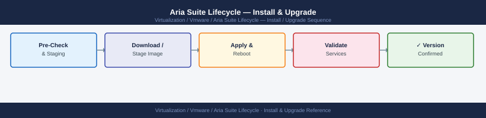

---
tags:
  - aria-lcm
  - operations
  - vmware
---
# Aria Suite Lifecycle — Install & Upgrade

Install & Upgrade reference covering LCM Recovery, Product Decommission via LCM, Full Suite Upgrade Procedure.

*Applies to: Aria LCM 8.x*

  LCM Upgrade Sequence (strict order)

Store backup archives off the LCM appliance (NFS, S3, or external storage).

## Before you begin

- **Access:** vCenter read-only minimum; Administrator role for remediation steps
- **Timing:** safe to run during business hours unless a step is marked ⚠ (causes interruption)
- **Dependencies:** no active upgrades or migrations on the same infrastructure
- **Logging:** capture command output — paste into the change record on completion

---

!!! warning "Host enters maintenance mode"
    ESXi remediation puts hosts into maintenance mode, triggering DRS evacuation. Confirm DRS is Fully Automated and HA admission control is satisfied before starting.

## LCM Recovery

If LCM appliance is lost:
1. Deploy fresh LCM OVA from Easy Installer
2. Restore configuration from backup (Settings → System Details → Restore)
3. Reconnect managed products — LCM re-discovers product state
4. Verify Locker certificates are intact after restore

## Product Decommission via LCM

To remove a managed product (e.g., decommission Aria Log Insight):
1. LCM → Lifecycle Operations → Environments → select product → Delete
2. LCM powers off and unregisters product VMs
3. Delete VMs from vCenter after LCM confirms completion
4. Remove DNS records and CMDB entries

---

## Full Suite Upgrade Procedure

Covers upgrades for Aria Suite Lifecycle, Aria Operations, Aria Operations for Logs, and Aria Automation.

### Upgrade Order

1. Aria Suite Lifecycle
2. Aria Operations
3. Aria Operations for Logs
4. Aria Automation
5. Integrations and dashboards validation

Upgrade Aria Suite Lifecycle first if it manages the other products.

---

### Phase 1: Pre-Upgrade Checks

#### Access Validation

Confirm access to: Aria Suite Lifecycle, Aria Operations, Aria Logs, Aria Automation, vCenter, NSX if integrated, identity provider.

#### Health Validation

- Product UI loads
- Cluster and nodes healthy
- No failed services, disk space warnings, or certificate warnings
- Data collection active
- Authentication working
- Dashboards loading

#### Backup and Content Export

Before upgrade:

- Take supported product backup
- Export important dashboards
- Export custom alerts
- Export Aria Automation blueprints and templates
- Export extensibility workflows if needed
- Confirm rollback plan

#### Certificate Review

- Product, vCenter, NSX, load balancer, and identity provider certificates valid

---

### Phase 2: Aria Suite Lifecycle Upgrade

**Pre-check:** Suite Lifecycle appliance health, repository access, product inventory sync, password and certificate locker health, disk space.

**Steps:**
1. Log into Aria Suite Lifecycle
2. Confirm repository access and select target version
3. Run pre-check and resolve issues
4. Start upgrade
5. Monitor request status
6. Confirm services restart and validate login

**Post-check:** Product inventory visible, password and certificate lockers working, environment sync working.

---

### Phase 3: Aria Operations Upgrade

**Pre-check:** Cluster healthy, all nodes online, data collection active, vCenter adapters collecting, cloud proxies connected, dashboards loading.

**Steps:**
1. Upload upgrade package or use Suite Lifecycle
2. Run pre-check and resolve issues
3. Start upgrade and monitor node upgrade order
4. Wait for cluster to come online
5. Confirm UI access

**Post-check:** Cluster and all nodes online, data collection resumed, dashboards and alerts working, management packs healthy.

---

### Phase 4: Aria Operations for Logs Upgrade

**Pre-check:** Cluster healthy, log ingestion active, disk usage healthy, agents reporting, content packs compatible.

**Steps:**
1. Upload upgrade package or use Suite Lifecycle
2. Run pre-check
3. Start upgrade and monitor each node
4. Confirm cluster returns online

**Post-check:** Logs being received, searches return recent logs, dashboards and alerts working, agents connected.

---

### Phase 5: Aria Automation Upgrade

#### Pre-check

- Appliance cluster healthy, services running
- vCenter and NSX integrations working
- Cloud zones, projects, catalog items, and deployments visible
- Identity provider working

#### Content to Export Before Upgrade

- Cloud accounts, cloud zones, projects
- Flavor and image mappings
- Network and storage profiles
- Catalog items and blueprints
- Approval policies and extensibility workflows

#### Steps

1. Start upgrade from Suite Lifecycle if managed
2. Run pre-check and resolve issues
3. Start upgrade and monitor progress
4. Validate UI login and integrations

#### Post-check

- Catalog items load
- Existing deployments visible
- New test deployment works
- Day-2 actions work
- Approval workflow works
- vCenter and NSX integrations working
- Identity login working

---

### Phase 6: Final Validation

- All Aria products reachable and show target version
- Dashboards load and data collection active
- Alerts working, reports running, logs ingesting
- Automation catalog working
- Certificates trusted, integrations healthy

### Documentation

Update product versions, upgrade notes, pre/post-check results, issues found, integrations validated, rollback notes, and lessons learned.

---

## See also

- [Aria Suite Lifecycle — Health Checks](health-checks/)
- [Aria Suite Lifecycle — Common Issues](../troubleshooting/common-issues/)
- [Aria Suite Lifecycle — Procedures](procedures/)

## Verify

- **Alarms:** vSphere Client → Home → Alarms — no new critical alarms after the operation
- **Events:** monitor the vCenter Events view for the affected object for 5 minutes
- **Health check:** run the morning health-check sequence for the affected product tier
