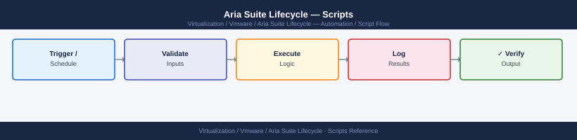

---
tags:
  - aria-lcm
  - operations
  - vmware
---
# Aria Suite Lifecycle — Scripts

<div class="kb-summary">
Scripts reference covering Pre-Upgrade Disk Check, Environment Health Summary, Bulk Locker Password Export (Alias List), NTP Validation Across All Product Nodes, Trigger Upgrade via API (Non-Interactive).

*Applies to: Aria LCM 8.x*
</div>


  LCM Automation Scripts

---

## Before you begin

- **Access:** vCenter read-only minimum; Administrator role for remediation steps
- **Timing:** safe to run during business hours unless a step is marked ⚠ (causes interruption)
- **Dependencies:** no active upgrades or migrations on the same infrastructure
- **Logging:** capture command output — paste into the change record on completion

---

## Environment Health Summary

Queries LCM API and prints the health status of all environments and products.

```bash
#!/usr/bin/env bash
# Usage: ./lcm-health-summary.sh <lcm-fqdn> <username> <password>
LCM=$1; USER=$2; PASS=$3

TOKEN=$(curl -sk -X POST "https://$LCM/lcm/authz/api/v2/login" \
  -H 'Content-Type: application/json' \
  -d "{\"username\":\"$USER\",\"password\":\"$PASS\"}" | jq -r '.token')

echo "=== LCM Environment Health ==="
curl -sk -H "x-xenon-auth-token: $TOKEN" \
  "https://$LCM/lcm/lcmservice/api/v2/environments" | \
  jq -r '.[] | "Environment: \(.environmentName)  Health: \(.environmentHealth)"'

echo ""
echo "=== Running Requests ==="
curl -sk -H "x-xenon-auth-token: $TOKEN" \
  "https://$LCM/lcm/lcmservice/api/v2/requests?state=RUNNING" | \
  jq -r '.[] | "[\(.requestType)] ID:\(.requestId)  Started:\(.startTime)"'

echo ""
echo "=== Disk Usage on LCM Appliance ==="
df -h / /data /var/log 2>/dev/null | column -t
```

---

## Bulk Locker Password Export (Alias List)

Exports the list of password aliases and associated usernames stored in Locker (values are never exposed via API).

```bash
#!/usr/bin/env bash
LCM=$1; USER=$2; PASS=$3

TOKEN=$(curl -sk -X POST "https://$LCM/lcm/authz/api/v2/login" \
  -H 'Content-Type: application/json' \
  -d "{\"username\":\"$USER\",\"password\":\"$PASS\"}" | jq -r '.token')

echo "alias,username,description"
curl -sk -H "x-xenon-auth-token: $TOKEN" \
  "https://$LCM/lcm/locker/api/v2/passwords" | \
  jq -r '.passwords[] | [.alias, .userName, .description] | @csv'
```

---

## NTP Validation Across All Product Nodes

After LCM deploys products, verify NTP sync on all appliances to prevent certificate failures.

```bash
#!/usr/bin/env bash
# Usage: ./ntp-check.sh
# Edit NODES to match your environment
NODES=(
  "lcm-prod-01.example.local"
  "vidm-prod-01.example.local"
  "vrops-prod-01.example.local"
  "vrops-prod-02.example.local"
  "vra-prod-01.example.local"
  "vrli-prod-01.example.local"
)

for node in "${NODES[@]}"; do
  echo -n "$node: "
  ssh -o StrictHostKeyChecking=no -o ConnectTimeout=5 root@"$node" \
    "chronyc tracking 2>/dev/null | grep 'System time'" 2>/dev/null || echo "SSH failed"
done
```

---

## Trigger Upgrade via API (Non-Interactive)

Useful for scripted maintenance windows. Substitute environment ID and payload from UI inspection.

```bash
#!/usr/bin/env bash
LCM=$1; USER=$2; PASS=$3; ENV_ID=$4; PRODUCT_ID=$5; TARGET_VERSION=$6

TOKEN=$(curl -sk -X POST "https://$LCM/lcm/authz/api/v2/login" \
  -H 'Content-Type: application/json' \
  -d "{\"username\":\"$USER\",\"password\":\"$PASS\"}" | jq -r '.token')

# Trigger upgrade
RESPONSE=$(curl -sk -X POST -H "x-xenon-auth-token: $TOKEN" \
  -H "Content-Type: application/json" \
  "https://$LCM/lcm/lcmservice/api/v2/environments/$ENV_ID/products/$PRODUCT_ID/upgrade" \
  -d "{\"targetVersion\":\"$TARGET_VERSION\"}")

REQUEST_ID=$(echo "$RESPONSE" | jq -r '.requestId')
echo "Upgrade triggered — Request ID: $REQUEST_ID"
echo "Monitor: https://$LCM/lcm/lcmservice/api/v2/requests/$REQUEST_ID"

# Poll until complete
while true; do
  STATE=$(curl -sk -H "x-xenon-auth-token: $TOKEN" \
    "https://$LCM/lcm/lcmservice/api/v2/requests/$REQUEST_ID" | jq -r '.state')
  echo "$(date '+%H:%M:%S') — Request state: $STATE"
  [[ "$STATE" == "COMPLETED" || "$STATE" == "FAILED" ]] && break
  sleep 60
done
```

---

## See also

- [Aria Suite Lifecycle — CLI Reference](../cli-reference/)
- [Aria Suite Lifecycle — Procedures](../procedures/)

## Verify

- **Alarms:** vSphere Client → Home → Alarms — no new critical alarms after the operation
- **Events:** monitor the vCenter Events view for the affected object for 5 minutes
- **Health check:** run the morning health-check sequence for the affected product tier
