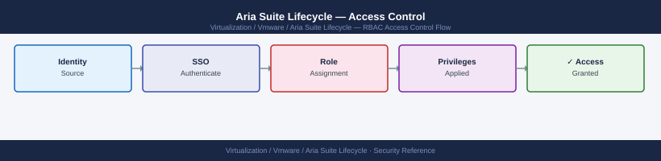

---
tags:
  - aria-lcm
  - security
  - vmware
---
# Aria Suite Lifecycle — Access Control


<div class="kb-summary">
Access Control reference covering Service Account for API Automation, Separation of Duties, Auditing Access.

*Applies to: Aria LCM 8.x*
</div>



  LCM RBAC — AD Groups → LCM Roles

Assign the minimum role required for the automation task — use `LCM_CONTENT_DEVELOPER` for scripts that only query health; use `LCM_ADMIN` only for scripts that trigger upgrades or certificate replacements.

---

```d2
direction: down

external: External / Untrusted {shape: rectangle}
separation_of_duties: "Separation of Duties" {shape: rectangle}
auditing_access: "Auditing Access" {shape: rectangle}
core: "Aria Suite Lifecycle Core" {shape: hexagon}

external -> separation_of_duties: traffic in
separation_of_duties -> auditing_access
auditing_access -> core: secured path
```

## Before you begin

- **Access:** vCenter Administrator role
- **Change management:** security changes require CAB approval in most environments
- **Rollback plan:** document current state before any security control change
- **Testing:** validate in a non-production environment first where possible

---

## Separation of Duties

Apply the principle of least privilege across team functions:

| Function | Required Role | Team |
|---|---|---|
| Deploy/upgrade Aria products | LCM Admin | Platform team lead |
| Manage Locker certificates | LCM Admin | Platform team / PKI team |
| Rotate Locker passwords | LCM Admin | Platform team |
| View environment health | Viewer | Any team |
| Extract/deploy content packs | LCM Content Developer | Operations team |
| API health monitoring | LCM Content Developer | Monitoring team (service account) |

---

## Auditing Access

LCM logs all write operations (deploy, upgrade, certificate import) to the application log. Parse for audit records:

```bash
# List all login events
grep -i "login\|authenticated\|logout" /var/log/vmware/vrlcm/lcm-app.log | \
  grep -v "health\|ping" | tail -100

# List all Locker write operations (certificate/password imports and updates)
grep -i "locker\|certificate\|password" /var/log/vmware/vrlcm/lcm-app.log | \
  grep -i "import\|update\|delete\|create" | tail -100

# List all upgrade/deploy requests with user attribution
grep -i "upgrade\|deploy\|install" /var/log/vmware/vrlcm/lcm-app.log | \
  grep -i "user\|request" | tail -100
```

For formal audit trails, forward the LCM syslog to Aria Operations for Logs or a SIEM:

```bash
# Configure syslog forwarding from LCM appliance
# Edit /etc/rsyslog.d/lcm-remote.conf (create if not present)
echo '*.* @@vrli-prod-01.example.local:514' > /etc/rsyslog.d/lcm-remote.conf
systemctl restart rsyslog
```

## See also

- [Aria Suite Lifecycle — Authentication](authentication/)
- [Aria Suite Lifecycle — Hardening](hardening/)
