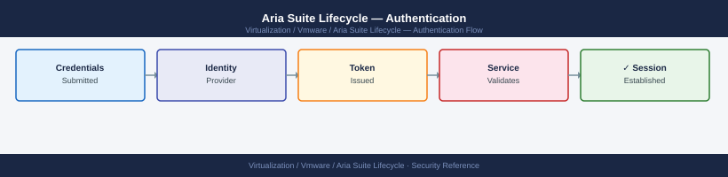

---
tags:
  - aria-lcm
  - security
  - vmware
---
# Aria Suite Lifecycle — Authentication


<div class="kb-summary">
Authentication reference covering Workspace ONE Access Integration, Active Directory Group Sync via VIDM, API Authentication, Local Accounts, Certificate Trust for API Clients and 2 more sections.

*Applies to: Aria LCM 8.x*
</div>



  LCM Authentication Architecture

Provide:
- VIDM FQDN (must be resolvable from LCM)
- VIDM admin credentials
- Accept the VIDM SSL certificate (or ensure it is trusted by the LCM appliance trust store)

Verify VIDM connectivity from LCM:

```bash
ssh admin@lcm-prod-01.example.local
curl -sk https://vidm.example.local/SAAS/API/1.0/REST/system/health
# Expected: {"status": "UP"}
```

After registration, the LCM login page shows a "Log In with Workspace ONE" button that redirects to VIDM for authentication.

---

## Before you begin

- **Access:** vCenter Administrator role
- **Change management:** security changes require CAB approval in most environments
- **Rollback plan:** document current state before any security control change
- **Testing:** validate in a non-production environment first where possible

---

## Active Directory Group Sync via VIDM

LCM does not connect to AD directly. AD group membership is resolved through VIDM.

**Configure AD connector in VIDM:**

1. VIDM console → **Catalog → Connectors** → select the connector appliance
2. **Add Directory** → Active Directory over LDAP/LDAPS
3. Provide:
   - Domain controller FQDN (use LDAPS port 636 for production)
   - Bind DN: `CN=svc-vidm,OU=Service Accounts,DC=corp,DC=local`
   - Bind password
   - Base DN: `DC=corp,DC=local`
   - Sync scope: select specific OUs containing admin groups (avoid syncing the entire domain)
4. Map user attributes: `sAMAccountName` → Username, `mail` → Email
5. Schedule group sync: every 60 minutes

**Map AD groups to LCM roles:**

```text
LCM → Settings → Access Control → Add Role Assignment
```

| AD Group | LCM Role |
|---|---|
| `GG-LCM-Admins` | LCM Admin |
| `GG-LCM-Operators` | LCM Content Developer |
| `GG-LCM-Viewers` | Viewer |

---

## API Authentication

Service accounts and automation scripts use the LCM REST API with token-based authentication.

```bash
# Obtain a session token (token is valid for 30 minutes by default)
TOKEN=$(curl -sk -X POST "https://lcm-prod-01.example.local/lcm/authz/api/v2/login" \
  -H "Content-Type: application/json" \
  -d '{"username":"svc-lcm-api@local","password":"<password>"}' | jq -r '.token')

# Use the token in subsequent calls
curl -sk -H "x-xenon-auth-token: $TOKEN" \
  "https://lcm-prod-01.example.local/lcm/lcmservice/api/v2/environments"
```

For automation pipelines, store the service account password in a secrets manager (HashiCorp Vault, CyberArk) and retrieve it at runtime rather than hardcoding in scripts.

---

## Local Accounts

| Account | Default Username | Purpose |
|---|---|---|
| LCM Admin | `admin@local` | Web UI and API access — break-glass fallback |
| Appliance SSH | `root` | OS-level shell — restrict to privileged users |
| Appliance SSH (non-root) | `admin` | Limited shell — use for diagnostics |

**Hardening local accounts:**

- Change the `admin@local` password immediately after deployment
- Disable or rotate `root` SSH access — prefer `admin` for routine access
- Do not share credentials — use named VIDM-backed accounts for day-to-day access
- Store break-glass passwords in an offline vault or privileged access workstation

```bash
# Change local admin password via API
curl -sk -X PATCH -H "x-xenon-auth-token: $TOKEN" \
  -H "Content-Type: application/json" \
  "https://lcm-prod-01.example.local/lcm/authz/api/v2/user/password" \
  -d '{"oldPassword":"<old>","newPassword":"<new>"}'
```

---

## Certificate Trust for API Clients

LCM uses TLS for all API endpoints. Scripts connecting to LCM must either:

1. Trust the LCM certificate CA (add CA to the OS trust store on the client)
2. Use `-sk` (skip verify) for internal tooling only — not acceptable for production pipelines

```bash
# Add LCM CA to trust store (Linux/macOS) so scripts can omit -k
cp lcm-ca.crt /usr/local/share/ca-certificates/lcm-ca.crt
update-ca-certificates   # Debian/Ubuntu
# or
trust anchor lcm-ca.crt  # RHEL/Fedora
```

---

## Session and Token Policies

| Setting | Value | Location |
|---|---|---|
| API token lifetime | 30 minutes (default) | LCM internal — not configurable via UI |
| VIDM session timeout | 8 hours (configurable) | VIDM console → Policies → Session Policies |
| Failed login lockout | 5 attempts (VIDM default) | VIDM console → Policies → Password Policies |
| MFA enforcement | Via VIDM access policies | VIDM console → Policies → Access Policies |
---

## Related Reference

- [Standard LDAP Integration](../../../../security/ldap-integration/index.md) — field reference, service account standards, TLS requirements, and connectivity testing
- [Standard SAML Configuration](../../../../security/saml-configuration/index.md) — SP/IdP setup, Azure AD and Okta steps, attribute mapping, and security requirements

## See also

- [Aria Suite Lifecycle — Access Control](access-control/)
- [Aria Suite Lifecycle — Hardening](hardening/)
