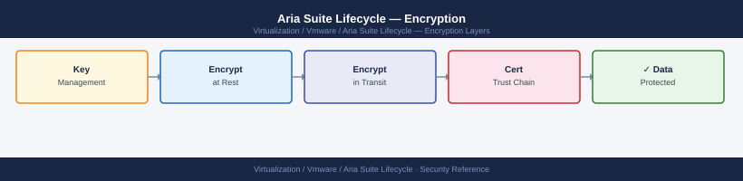

---
tags:
  - aria-lcm
  - security
  - vmware
---
# Aria Suite Lifecycle — Encryption

<div class="kb-summary">
Encryption reference covering Importing a Signed Certificate into Locker, Verifying a Certificate Before Import, Applying a Certificate to a Product, Password Encryption in Locker, TLS Standards and 1 more sections.

*Applies to: Aria LCM 8.x*
</div>


  LCM Encryption Coverage

Submit the generated CSR to the CA. Retrieve the signed certificate chain (leaf + intermediates + root) in PEM format.

---

## Before you begin

- **Access:** vCenter Administrator role
- **Change management:** security changes require CAB approval in most environments
- **Rollback plan:** document current state before any security control change
- **Testing:** validate in a non-production environment first where possible

---

## Importing a Signed Certificate into Locker

After the CA returns the signed certificate:

**Via UI:**

```text
LCM → Locker → Certificates → Import Certificate
```

Paste:
1. Certificate (leaf PEM only — not the chain)
2. Private key (unencrypted PEM — no passphrase)
3. CA chain (all intermediates + root, concatenated in PEM format)

**Via API:**

```bash
# Read PEM files and escape newlines for JSON payload
CERT=$(awk '{printf "%s\\n", $0}' leaf.pem)
KEY=$(awk '{printf "%s\\n", $0}' private.key)
CHAIN=$(awk '{printf "%s\\n", $0}' chain.pem)

curl -sk -X POST -H "x-xenon-auth-token: $TOKEN" \
  -H "Content-Type: application/json" \
  "https://lcm-prod-01.example.local/lcm/locker/api/v2/certificates/import" \
  -d "{
    \"alias\": \"vrops-prod-2027\",
    \"certificateChain\": \"$CERT\",
    \"privateKey\": \"$KEY\",
    \"caChain\": \"$CHAIN\"
  }"
```

---

## See also

- [Aria Suite Lifecycle — Hardening](hardening/)
- [Aria Suite Lifecycle — Health Checks](../operations/health-checks/)

## Verifying a Certificate Before Import

Always validate the certificate chain and key pair match before importing into Locker — a mismatch causes the certificate replacement workflow to fail mid-operation.

```bash
# Verify the certificate chain is valid (leaf verifiable against the CA chain)
openssl verify -CAfile chain.pem leaf.pem
# Expected: leaf.pem: OK

# Verify the private key matches the certificate (moduli must match)
openssl x509 -noout -modulus -in leaf.pem | md5sum
openssl rsa  -noout -modulus -in private.key | md5sum
# Both hashes must be identical

# Confirm the private key has no passphrase
openssl rsa -in private.key -check 2>&1 | head -1
# Expected: RSA key ok
# BAD: "Enter pass phrase" — LCM requires an unencrypted key

# Confirm SANs are present
openssl x509 -noout -text -in leaf.pem | grep -A 5 "Subject Alternative Name"

# Confirm validity period
openssl x509 -noout -dates -in leaf.pem

# Confirm key size (minimum 2048-bit; 4096-bit recommended)
openssl x509 -noout -text -in leaf.pem | grep "Public-Key"
```

---

## Applying a Certificate to a Product

After importing the certificate into Locker, apply it to the product:

```text
LCM → Lifecycle Operations → Environments → select environment → product card → Replace Certificate
```

1. Select the new Locker certificate alias from the dropdown
2. LCM validates the certificate is applicable (SANs cover all product node FQDNs)
3. Click **Replace** — LCM applies the certificate to all product nodes sequentially
4. Monitor progress: **Lifecycle Operations → Requests**

A successful certificate replacement shows the request in `COMPLETED` state. Verify by testing the product URL in a browser — the new certificate should be presented by the server.

```bash
# Verify the new certificate is active on the product
openssl s_client -connect vrops-prod-01.example.local:443 -servername vrops-prod-01.example.local \
  2>/dev/null | openssl x509 -noout -subject -dates -issuer
# Confirm: subject matches the new certificate, issuer is your internal CA
```

---

## Password Encryption in Locker

Passwords stored in the Locker (service account credentials, vCenter passwords, etc.) are encrypted using the Locker Master Password. They are never returned in plain text via the API — only the alias and username are readable.

```bash
# List stored passwords (alias and username only — not the values)
curl -sk -H "x-xenon-auth-token: $TOKEN" \
  "https://lcm-prod-01.example.local/lcm/locker/api/v2/passwords" | \
  jq '.passwords[] | {alias: .alias, username: .userName, description: .description}'

# Update a stored password (when the source password changes)
curl -sk -X PUT -H "x-xenon-auth-token: $TOKEN" \
  -H "Content-Type: application/json" \
  "https://lcm-prod-01.example.local/lcm/locker/api/v2/passwords/<password-id>" \
  -d '{"alias": "<alias>", "userName": "<username>", "password": "<new-password>"}'
```

After updating a Locker password, re-validate any product integrations that use the credential (vCenter cloud accounts in Aria Automation, adapter credentials in Aria Operations, etc.).

---

## TLS Standards

All LCM API and UI endpoints use TLS. Verify the appliance TLS configuration:

```bash
# Confirm TLS 1.2 is accepted
openssl s_client -connect lcm-prod-01.example.local:443 -tls1_2 2>/dev/null | \
  grep "Protocol"

# Confirm TLS 1.0 is rejected (expected: alert handshake failure)
openssl s_client -connect lcm-prod-01.example.local:443 -tls1 2>&1 | \
  grep -E "alert|error"

# Check cipher suite negotiated
openssl s_client -connect lcm-prod-01.example.local:443 2>/dev/null | \
  grep "Cipher is"
```

LCM 8.x defaults to TLS 1.2 minimum. If TLS 1.0 or 1.1 must be disabled explicitly, configure this via the NGINX configuration on the LCM appliance — consult the Broadcom hardening guide for the specific configuration path for each LCM version.

---

## Pre-Change Certificate Validation Checklist

Run before replacing any certificate via LCM:

- [ ] New certificate verified: `openssl verify -CAfile chain.pem leaf.pem` — output `OK`
- [ ] Key moduli match between leaf and private key
- [ ] Private key has no passphrase
- [ ] SAN entries cover all product node FQDNs and VIP
- [ ] Certificate validity period >= 90 days from today
- [ ] Locker Master Password is accessible (in case restore is needed)
- [ ] VM snapshot of the product appliance taken before replacement
- [ ] Old certificate alias retained in Locker for rollback reference (do not delete until new cert is confirmed working)
