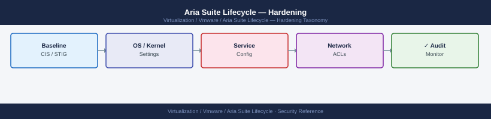

---
tags:
  - aria-lcm
  - security
  - vmware
---
# Aria Suite Lifecycle — Hardening


<div class="kb-summary">
Hardening reference covering SSH Hardening on the LCM Appliance, TLS Configuration, Firewall Rules for LCM, Hardening Checklist.

*Applies to: Aria LCM 8.x*
</div>



  LCM Hardening Controls

---

```d2
direction: down

external: External / Untrusted {shape: rectangle}
tls_configuration: "TLS Configuration" {shape: rectangle}
firewall_rules_for_lcm: "Firewall Rules for LCM" {shape: rectangle}
hardening_checklist: "Hardening Checklist" {shape: rectangle}
core: "Aria Suite Lifecycle Core" {shape: hexagon}

external -> tls_configuration: traffic in
tls_configuration -> firewall_rules_for_lcm
firewall_rules_for_lcm -> hardening_checklist
hardening_checklist -> core: secured path
```

## Before you begin

- **Access:** vCenter Administrator role
- **Change management:** security changes require CAB approval in most environments
- **Rollback plan:** document current state before any security control change
- **Testing:** validate in a non-production environment first where possible

---

## TLS Configuration

Ensure LCM does not expose weak TLS versions or cipher suites:

```bash
# Verify TLS version from an external client
openssl s_client -connect lcm-prod-01.example.local:443 -tls1_2 2>/dev/null | grep "Protocol"
openssl s_client -connect lcm-prod-01.example.local:443 -tls1   2>/dev/null | grep "alert"
# TLS 1.0 and 1.1 should return an alert — not supported in hardened deployments

# Check the cipher suite negotiated
openssl s_client -connect lcm-prod-01.example.local:443 -tls1_3 2>/dev/null | grep "Cipher"
```

LCM 8.x ships with TLS 1.2+ enabled by default. Verify no legacy cipher suites are active using an external scanner such as `testssl.sh` or Qualys SSL Labs.

---

## Firewall Rules for LCM

Only necessary ports should be open to the LCM appliance:

| Source | Destination | Port | Protocol | Purpose |
|---|---|---|---|---|
| Admin workstations | LCM appliance | 443 | TCP | Web UI and API |
| Admin workstations | LCM appliance | 22 | TCP | SSH (restrict to PAW/jump host) |
| LCM appliance | vCenter | 443 | TCP | vCenter API for VM deployment |
| LCM appliance | VIDM | 443 | TCP | SSO and group sync |
| LCM appliance | ESXi hosts | 443 | TCP | OVA deployment |
| LCM appliance | NFS server | 2049 | TCP/UDP | Binary repository |
| LCM appliance | DNS server | 53 | UDP | Name resolution |
| LCM appliance | NTP server | 123 | UDP | Time synchronisation |
| LCM appliance | SMTP relay | 25/587 | TCP | Email notifications |
| Product appliances | LCM appliance | 443 | TCP | Upgrade agent callback |

Close all other inbound ports at the network firewall. LCM does not require inbound access from the internet.

---

## Hardening Checklist

Run this checklist after initial deployment and after each major upgrade:

- [ ] `admin@local` password changed from default and stored in vault
- [ ] Locker Master Password stored in offline vault
- [ ] Root SSH login requires key-based authentication (no password SSH for root)
- [ ] SSH access restricted to management network CIDR only
- [ ] TLS 1.0 and 1.1 confirmed disabled (test with `openssl s_client -tls1`)
- [ ] Self-signed certificate replaced with CA-signed certificate in Locker
- [ ] VIDM integration configured — all interactive users authenticate via VIDM, not local accounts
- [ ] AD groups mapped to LCM roles (not individual user accounts)
- [ ] NFS binary repository mounted read-write only from LCM appliance IP (NFS export permission)
- [ ] Syslog forwarding to Aria Ops for Logs or SIEM configured and verified
- [ ] Firewall rules reviewed — only required ports open
- [ ] LCM software at current patch level (check: **LCM → Settings → System Details**)

## See also

- [Aria Suite Lifecycle — Access Control](access-control/)
- [Aria Suite Lifecycle — Authentication](authentication/)
- [Aria Suite Lifecycle — Health Checks](../operations/health-checks/)
