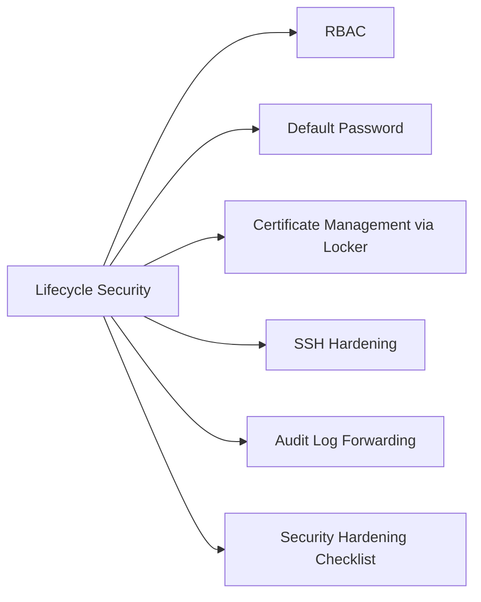

# Aria Suite Lifecycle Security



## RBAC

LCM roles are assigned via Workspace ONE Access (VIDM) groups — never assign to individual accounts:

| Role | Capabilities |
|---|---|
| LCM Admin | Full access: deploy products, run upgrades, manage Locker |
| LCM Content Developer | Read-only + content library (package management); no upgrades |
| Viewer | Read-only dashboard access |

Configure RBAC:
1. LCM → Settings → Access Control → Add Role Assignment
2. Select role → assign to AD group (synced via VIDM)

## Default Password

Change the default `admin` password immediately after deployment:
1. LCM → Settings → Local Users → admin → Change Password
2. Store the new password in CyberArk or enterprise vault

**Locker Master Password**: set during initial LCM configuration. If lost, all certificates and passwords in the Locker become inaccessible — requires re-import. Store securely in an offline vault.

## Certificate Management via Locker

All product certificates should be managed through the Locker — not by direct file replacement on appliances:

```bash
# Import a certificate into Locker (via UI)
# LCM → Locker → Certificates → Import Certificate
# Required: PEM certificate (with full chain), PEM private key

# Verify certificate in Locker
# LCM → Locker → Certificates → click certificate → view details
```

Security rules:
- Private keys must never be exported from the Locker except for documented break-glass scenarios
- All certificates must be SHA-256 signed, minimum 2048-bit RSA (4096-bit preferred)
- Include full SAN list: product FQDN + any load-balancer VIP FQDNs
- Wildcard certificates are supported but discouraged for individual product nodes

## SSH Hardening

```bash
# Restrict SSH on LCM appliance to management jump-host CIDR
# /etc/sysconfig/iptables (or firewalld)
iptables -A INPUT -p tcp --dport 22 -s <mgmt-jump-cidr> -j ACCEPT
iptables -A INPUT -p tcp --dport 22 -j DROP

# Or via NSX micro-segmentation — create DFW rule allowing port 22 from jump host group only

# Verify root login is permitted via key-only (for initial access), then disable
grep PermitRootLogin /etc/ssh/sshd_config
```

## Audit Log Forwarding

Configure syslog forwarding to SIEM:
1. LCM → Settings → Log Management → Syslog
2. Enter SIEM collector IP, port 514 (UDP) or 6514 (TLS)
3. Select log level: Info or above

Log files on LCM appliance:
```bash
/var/log/lcm/lcm-app.log        # Application operations
/var/log/lcm/access.log         # UI/API access log
/var/log/lcm/upgrade-runner.log # Upgrade workflow details
```

Alert in SIEM on:
- Admin login outside business hours
- Certificate private key access (export events)
- Product upgrade initiations
- RBAC role changes

## Security Hardening Checklist

- [ ] Default admin password changed; stored in vault
- [ ] Locker master password documented in offline vault
- [ ] SSH restricted to management jump-host CIDR
- [ ] RBAC roles assigned to AD groups (not individuals)
- [ ] All product certificates managed via Locker (not manual replacement)
- [ ] Syslog forwarding configured to SIEM
- [ ] NFS binary repository accessible only from LCM appliance IP (NFS export restriction)
- [ ] Unused default accounts removed or disabled in VIDM
- [ ] Regular review of Locker certificate expiry (weekly)
