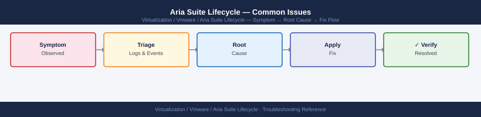
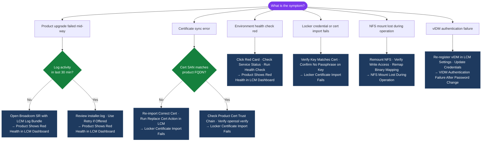

---
tags:
  - aria-lcm
  - troubleshooting
  - vmware
search:
  boost: 1.5
---
# Aria Suite Lifecycle — Common Issues


<div class="kb-summary">
Common Issues reference covering Upgrade Gets Stuck or Times Out, NFS Mount Lost During Operation, Locker Certificate Import Fails, VIDM Authentication Failure After Password Change, Product Shows Red Health in LCM Dashboard and 1 more sections.

*Applies to: Aria LCM 8.x*
</div>



  LCM Triage Decision Tree

If the upgrade is truly stuck (no log activity for 30+ minutes):
1. Do NOT power off product VMs — this risks split-brain state
2. Open a Broadcom SR with the LCM log bundle and the request ID
3. LCM may offer a **Retry** option for some stuck states — use only if advised by support

---

```d2
direction: down

symptom: Identify Symptom {shape: diamond}
diagnostic_flow: "Diagnostic Flow" {shape: rectangle}
nfs_mount_lost_during_operation: "NFS Mount Lost During Operation" {shape: rectangle}
locker_certificate_import_fails: "Locker Certificate Import Fails" {shape: rectangle}
vidm_authentication_failure_after_pa: "VIDM Authentication Failure After Password Change" {shape: rectangle}
product_shows_red_health_in_lcm_dash: "Product Shows Red Health in LCM Dashboard" {shape: rectangle}
checking_request_history: "Checking Request History" {shape: rectangle}
resolution: Resolve or Escalate {shape: oval}

symptom -> diagnostic_flow: investigate
symptom -> nfs_mount_lost_during_operation: investigate
symptom -> locker_certificate_import_fails: investigate
symptom -> vidm_authentication_failure_after_pa: investigate
symptom -> product_shows_red_health_in_lcm_dash: investigate
symptom -> checking_request_history: investigate
diagnostic_flow -> resolution
nfs_mount_lost_during_operation -> resolution
locker_certificate_import_fails -> resolution
vidm_authentication_failure_after_pa -> resolution
product_shows_red_health_in_lcm_dash -> resolution
checking_request_history -> resolution
```

## Diagnostic Flow



---

## Before you begin

- **Access:** SSH to vCenter Shell and ESXi hosts; vSphere Client read access
- **Gather first:** recent error message text, event timestamps, and affected object names
- **Scope:** confirm whether the issue affects a single object, host, cluster, or site
- **Escalation:** open a vendor support ticket before running any destructive step
- **Logging:** document each command and output — required if escalation is needed

---

## NFS Mount Lost During Operation

If the NFS share becomes unavailable while LCM is running:

```bash
# Check mount status
mount | grep /data
df -h /data

# Attempt remount
mount -a
# or explicitly:
mount -t nfs <nfs-server>:/lcm-repo /data

# Verify write access
touch /data/.write-test && echo "OK" && rm /data/.write-test

# Check for NFS errors in syslog
grep -i "nfs\|mount" /var/log/messages | tail -30
```

After restoring the NFS mount, any in-progress upgrade will need to be resumed or retried via LCM. If the upgrade failed due to missing binaries, re-map the product binaries in **Lifecycle Operations → Settings → Binary Mapping** before retrying.

---

## Locker Certificate Import Fails

```bash
# Verify certificate chain validity before importing
openssl verify -CAfile chain.pem leaf.pem
# Expected: leaf.pem: OK

# Check that the private key matches the certificate
openssl x509 -noout -modulus -in leaf.pem | md5sum
openssl rsa -noout -modulus -in private.key | md5sum
# Both MD5 hashes must match

# Verify SANs in the certificate
openssl x509 -noout -text -in leaf.pem | grep -A5 "Subject Alternative Name"

# Confirm no passphrase on the private key (LCM requires unencrypted key)
openssl rsa -in private.key -check 2>&1 | head -1
# Must output: RSA key ok (not: Enter pass phrase)
```

---

## VIDM Authentication Failure After Password Change

If the VIDM admin password is changed externally, LCM loses its registration credentials.

```bash
# Verify VIDM health from LCM appliance
curl -sk https://vidm.example.local/SAAS/API/1.0/REST/system/health
# If health is UP but login fails, re-register VIDM:
```

Re-register VIDM: **LCM → Settings → Identity Manager → Edit → update credentials → Save**.

After re-registration, verify that all AD-backed users can still log into LCM via the VIDM login button.

---

## Product Shows Red Health in LCM Dashboard

1. Click the red product card — LCM shows the specific component or service that is unhealthy
2. SSH to the product appliance and check service status:

```bash
ssh admin@<product-fqdn>
vracli status
systemctl status <failing-service>
journalctl -u <failing-service> --since "1 hour ago" | tail -100
```

3. Common causes: disk full on the product appliance, internal service crash, or expired certificate
4. If the product health does not self-recover after the root cause is resolved: **LCM → Environments → product card → Run Health Check** to force a re-evaluation

---

## Checking Request History

All LCM operations are tracked as requests with full audit logs:

```bash
TOKEN=$(curl -sk -X POST "https://lcm-prod-01.example.local/lcm/authz/api/v2/login" \
  -H "Content-Type: application/json" \
  -d '{"username":"admin@local","password":"<password>"}' | jq -r '.token')

# List last 20 requests
curl -sk -H "x-xenon-auth-token: $TOKEN" \
  "https://lcm-prod-01.example.local/lcm/lcmservice/api/v2/requests?size=20" | \
  jq -r '.[] | "\(.state)\t\(.requestType)\t\(.requestId)\t\(.startTime)"'

# Get detail of a failed request
curl -sk -H "x-xenon-auth-token: $TOKEN" \
  "https://lcm-prod-01.example.local/lcm/lcmservice/api/v2/requests/<request-id>" | \
  jq '.tasks[] | {name: .taskName, state: .taskState, message: .message}'
```

---

## See also

- [Aria Suite Lifecycle — Diagnostics](../diagnostics/)
- [Aria Suite Lifecycle — Escalation](../escalation/)
- [Aria Suite Lifecycle — Health Checks](../../operations/health-checks/)

## Verify resolution

- **Alarms cleared:** Home → Alarms — the triggering alarm is no longer active
- **Event log:** confirm no new related error events in the last 5 minutes
- **Functional test:** perform the action that was failing (connect, vMotion, storage I/O) — confirm it succeeds
- **Monitor:** leave the vSphere Client open for 10 minutes and confirm the issue does not recur
