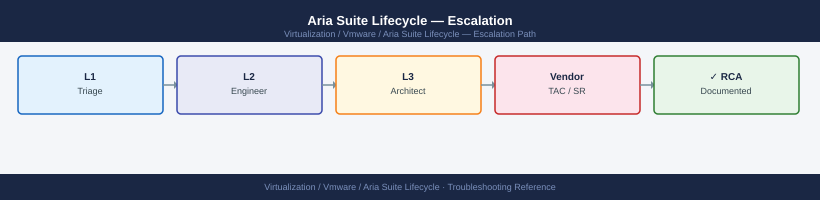

---
tags:
  - aria-lcm
  - troubleshooting
  - vmware
search:
  boost: 1.5
---
# Aria Suite Lifecycle — Escalation

<div class="kb-summary">
How to escalate VMware Aria Suite Lifecycle (LCM) issues to Broadcom support: what data to collect, how to run the logscraper bundle, step-by-step case creation on support.broadcom.com, and the escalation path when progress stalls.

*Applies to: Aria Suite Lifecycle (vRealize Suite Lifecycle Manager) 8.x*
</div>



---

```d2
direction: down

symptom: Identify Symptom {shape: diamond}
preescalation_selfcheck: "Pre-Escalation Self-Check" {shape: rectangle}
stepbystep_data_collection: "Step-by-Step Data Collection" {shape: rectangle}
how_to_open_the_sr_on_supportbroadco: "How to Open the SR on support.broadcom.com" {shape: rectangle}
escalation_path: "Escalation Path" {shape: rectangle}
what_not_to_do: "What NOT to Do" {shape: rectangle}
useful_commands_for_case_updates: "Useful Commands for Case Updates" {shape: rectangle}
resolution: Resolve or Escalate {shape: oval}

symptom -> preescalation_selfcheck: investigate
symptom -> stepbystep_data_collection: investigate
symptom -> how_to_open_the_sr_on_supportbroadco: investigate
symptom -> escalation_path: investigate
symptom -> what_not_to_do: investigate
symptom -> useful_commands_for_case_updates: investigate
preescalation_selfcheck -> resolution
stepbystep_data_collection -> resolution
how_to_open_the_sr_on_supportbroadco -> resolution
escalation_path -> resolution
what_not_to_do -> resolution
useful_commands_for_case_updates -> resolution
```

## Before you begin

- **Access required:** SSH root access to the LCM appliance; LCM UI admin access; Broadcom support account at support.broadcom.com with active Aria Suite Lifecycle entitlement
- **Do NOT power off the LCM appliance** during an in-progress upgrade — if an upgrade is stuck, powering off the VM can corrupt the LCM database and the product being upgraded, making recovery much more complex
- **Do NOT delete certificates from the Locker** during a certificate-related incident — the Locker state is what GSS uses to diagnose the certificate chain failure
- **Do NOT retry a failed upgrade immediately** without GSS guidance — a second upgrade attempt on top of a partially failed one may further corrupt the environment

---

## Pre-Escalation Self-Check

Run these before opening the case.

| Check | Command / Location | Expected result |
|---|---|---|
| LCM version | LCM UI → Settings → About or SSH: `curl -sk https://localhost/lcm/apis/status` | Note full version (e.g. 8.14.0) |
| LCM UI accessibility | Browse to `https://<lcm-fqdn>/` | LCM login page loads |
| VAMI accessibility | Browse to `https://<lcm-fqdn>:5480` | VAMI login page loads |
| LCM service status | SSH: `systemctl status vrlcm` | Active (running) |
| Last request status | LCM UI → Lifecycle Operations → Requests | Note request ID and status of last operation |
| Managed product health | LCM UI → Environments → [env] → Products | All products show green; note any red |
| Locker inventory | LCM UI → Locker → Certificates | Certificates list loads without error |
| VIDM status | LCM UI → Identity and Tenant Management → vIDM Integration | vIDM shows Connected |

---

## Step-by-Step Data Collection

### 1. Get the LCM version and managed product versions

```bash
# SSH to the LCM appliance as root
ssh root@<lcm-fqdn>

# LCM service status
systemctl status vrlcm

# LCM version via local API
curl -sk https://localhost/lcm/apis/status | python3 -m json.tool
```

In the LCM UI:
1. Click **Settings** → **About** — note the LCM version and build.
2. Click **Lifecycle Operations** → **Environments** → open the affected environment.
3. Note the version and status of each deployed product (Aria Automation, Aria Operations, etc.).

### 2. Note the failed request ID

Every LCM operation (deploy, upgrade, certificate rotation) generates a unique Request ID.

1. In LCM UI: click **Lifecycle Operations** → **Requests**.
2. Find the failed operation and note the **Request ID** (a UUID).
3. Click the request to see the failed step and the error message.
4. Screenshot the request detail — paste the error text into the case description.

The Request ID is the key that lets GSS find the specific log entries for your failure.

### 3. Run the logscraper bundle

**Method 1 — From the LCM UI:**

1. In LCM UI: click **Settings** → **Support** → **Generate Support Bundle**.
2. Select **Collect Logs from All Products** (includes LCM + all managed product logs).
3. Wait 10–30 minutes for the bundle to be generated.
4. Click **Download** when the bundle is ready.

**Method 2 — Via SSH (for when UI is inaccessible):**

```bash
# SSH to the LCM appliance as root
ssh root@<lcm-fqdn>

# Run the LCM support bundle script
/usr/lib/vmware-vrlcm/bin/lcm-support.sh

# Bundle is written to /tmp/
ls -lh /tmp/lcm-support-bundle*.tar.gz

# Copy to a local machine
scp root@<lcm-fqdn>:/tmp/lcm-support-bundle*.tar.gz /tmp/
```

The bundle includes: LCM application logs, service logs, deployment history, Locker metadata (no passwords), system diagnostics, and recent request audit trail.

### 4. Collect issue-specific additional data

| Issue Type | Additional Data |
|---|---|
| Upgrade failure | Request ID from LCM UI; upgrade log from `/var/log/vmware/vrlcm/upgrade/`; exact error message from the failed request |
| VIDM/authentication failure | VIDM appliance log bundle; browser HAR file of the failed login flow |
| Certificate failure | `openssl x509 -in <cert-file> -text -noout` output; trust chain verification; cert expiry date |
| UI inaccessibility | Browser console errors (F12 → Console tab → copy all errors); browser HAR file |
| Network/connectivity issue | `traceroute <target>`, `curl -v https://<target>` from LCM VM for each failing endpoint |

### 5. Write the timeline

```text
LCM version: 8.14.0 build XXXXXXXX
Environment: prod-aria-env (Aria Automation 8.16, Aria Operations 8.14, Aria Logs 8.14)
Issue first observed: 2026-06-14 11:00 UTC
Last known good LCM state: 2026-06-14 10:00 UTC
Changes in 24h before the issue:
  - 10:00: Aria Automation upgrade (8.15 → 8.16) initiated from LCM UI
  - 10:45: LCM upgrade request showed 45% progress then stopped responding
  - 11:00: LCM UI became inaccessible; VAMI also timing out
  - 11:10: SSH to LCM: systemctl status vrlcm shows "activating" — not running
Request ID of failed operation: xxxxxxxx-xxxx-xxxx-xxxx-xxxxxxxxxxxx
Failed step: "Triggering upgrade on vra-01 node"
Steps already taken:
  - Did NOT power off the LCM VM
  - Did NOT retry the upgrade
  - Did NOT delete any Locker entries
Blast radius: Aria Automation upgrade incomplete; vRA UI may be in mixed-version state; LCM inaccessible
```

---

## How to Open the SR on support.broadcom.com

1. Go to **support.broadcom.com** and sign in with your Broadcom account.

2. Click **Open a Support Request**.

3. Under **Product Group**, select **VMware Cloud Foundation and Virtualization** → **VMware Aria Suite Lifecycle** (or search "vRealize Suite Lifecycle Manager").

4. Under **Version**, select your LCM version from Step 1.

5. Under **Severity**, select:
   - **Severity 1 — Critical**: LCM VM completely down; a product is left in a broken mid-upgrade state; all managed products are inaccessible; no workaround; critical production tools offline
   - **Severity 2 — High**: LCM UI inaccessible but VM is running; an upgrade failed and left one product in a degraded state; certificate expiry is impacting product logins
   - **Severity 3 — Medium**: Single deployment or patch failed; VIDM integration error; specific LCM feature broken; workaround exists
   - **Severity 4 — Low**: How-to question, pre-upgrade planning, certificate rotation help, non-urgent configuration review

6. In the **Summary** field: product + symptom + scope. Example: `LCM 8.14 — Aria Automation upgrade 8.15→8.16 stuck at 45%, LCM UI now inaccessible, vRA may be in mixed-version state`.

7. In the **Description** field, paste:
   - LCM version and managed product versions from Step 1
   - The failed request ID and error message from Step 2
   - The issue-specific log paths from Step 4
   - The timeline from Step 5

8. Under **Attachments**, upload:
   - The logscraper support bundle from Step 3
   - Any screenshot of the failed request detail from Step 2

9. Click **Submit**. You will receive a case number by email immediately.

10. **Severity 1 only:** call Broadcom/VMware support after submission:
    - North America: +1 877-486-9273 (24×7 for Severity 1)
    - EMEA: +44 (0)3453 700 100
    - State "Severity 1 — Aria Suite Lifecycle down, upgrade has left managed product in broken state" at the start of the call.

---

## Escalation Path

```text
Step 1 — Open case at support.broadcom.com with logscraper bundle and request ID attached
         ↓
Step 2 — T1 support engineer acknowledges (Sev1: < 30 min; Sev2: < 2 hr)
         ↓
Step 3 — If no meaningful progress in 30 minutes for Sev1 or 2 hours for Sev2:
         → Reply: "Requesting escalation to Aria Suite Lifecycle Senior Engineer"
         → State: "[LCM down / upgrade stuck / product in broken state]"
         ↓
Step 4 — LCM T2 Senior Engineer is assigned
         → They will request SSH access to the LCM appliance for a live session
         → Have root SSH access to the LCM VM and all managed product VMs ready
         ↓
Step 5 — If the issue affects a specific managed product (e.g. Aria Automation in broken state):
         → GSS may open a parallel case for that specific product
         → The LCM case and the product case are linked internally
         ↓
Step 6 — For Sev1 with LCM down and multiple products affected, unresolved after 2 hours:
         → Request CritSit escalation; contact your Broadcom TAM
         → TAM convenes a bridge call with LCM and product engineering teams
```

---

## What NOT to Do

| Do NOT do this | Why | What to do instead |
|---|---|---|
| Power off the LCM VM during an in-progress upgrade | Interrupts the LCM state machine mid-operation; can corrupt the LCM database and the product being upgraded | Wait for GSS to assess the stuck state; they will direct the correct safe-shutdown procedure |
| Delete certificates from Locker during investigation | Locker state is needed by GSS to trace the certificate chain failure; deleting may break product authentication permanently | Leave Locker entries in place; only remove/replace certificates if GSS explicitly instructs |
| Retry a failed upgrade immediately without GSS | A second upgrade attempt on a partially failed state may push the product into an unrecoverable mixed-version condition | Let GSS examine the failed request log before any retry |
| Manually edit LCM database records or config files | LCM uses an internal database for state management; manual edits can corrupt the state machine beyond repair | Only make changes GSS explicitly specifies with the exact commands |
| Apply urgent certificate replacements during a non-cert incident | Changes the Locker state GSS is currently analysing | Hold all certificate changes until GSS confirms the cause is not certificate-related |
| Run back-to-back LCM operations on a failing environment | Each failed operation adds state complexity; multiple failures may make recovery impossible without a redeploy | Open the SR and wait for GSS direction before any further LCM operations |

---

## Useful Commands for Case Updates

```bash
# SSH to LCM appliance as root — paste these into every case update

# LCM service status
systemctl status vrlcm

# LCM version via local API
curl -sk https://localhost/lcm/apis/status | python3 -m json.tool

# LCM application log — recent errors
tail -100 /var/log/vmware/vrlcm/lcm.log | grep -i "error\|fail\|exception"

# Upgrade log (if upgrade is in progress or recently failed)
tail -100 /var/log/vmware/vrlcm/upgrade/upgrade.log | grep -i "error\|fail"

# Disk space (low disk can cause LCM to fail mid-operation)
df -h

# Memory usage
free -h

# VIDM connectivity check from LCM
curl -sk https://<vidm-fqdn>/SAAS/API/1.0/REST/system/health/heartbeat
```

---

## Support SLA Reference

| Severity | Definition | Initial Response SLA |
|---|---|---|
| Sev 1 — Critical | LCM VM down; product in broken mid-upgrade state; all managed products affected | < 30 min (24×7) |
| Sev 2 — High | LCM UI inaccessible; upgrade failed; one product degraded; cert expiry impacting logins | < 2 hours (24×7) |
| Sev 3 — Medium | Single deployment failed; VIDM integration error; specific feature broken; workaround exists | < 8 hours |
| Sev 4 — Low | How-to, pre-upgrade planning, cert rotation help, non-urgent config review | Next business day |

---

## See also

- [Aria Suite Lifecycle — Diagnostics](../diagnostics/)
- [Aria Suite Lifecycle — Common Issues](../common-issues/)

---

## Verify resolution

- Run `systemctl status vrlcm` on the LCM VM and confirm the service is `active (running)`
- Browse to the LCM UI and confirm the login page loads
- Log in and navigate to **Lifecycle Operations → Environments**: the affected environment shows all products in a healthy state (green)
- Navigate to **Locker → Certificates**: no certificate shows as expired or in an error state
- Trigger a non-destructive LCM operation (e.g. **Inventory Sync**) and confirm it completes successfully
- Check **Requests** and confirm the test operation shows `Completed`
- Monitor for 30 minutes to confirm LCM remains stable and no new request failures appear
