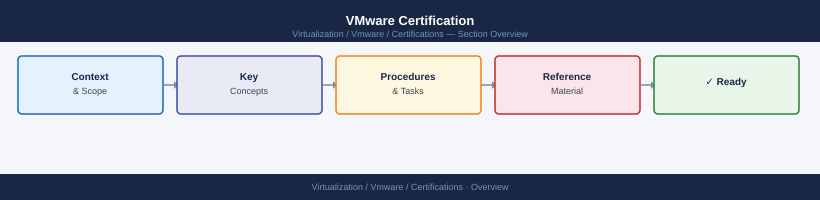

---
tags:
  - certifications
  - vmware
---
# VMware Certification


<div class="kb-summary">
VMware Certification reference covering Overview, Core Certification Paths, Daily Study Focus, Useful Commands, Renewal Notes.
</div>



<div class="kb-grid kb-grid-1">

<a class="kb-card" href="exam-tracking/">
  <strong>Exam Tracking</strong>
  <span>Exam scheduling, scores, and certification tracking.</span>
</a>

<a class="kb-card" href="practice-notes/">
  <strong>Practice Notes</strong>
  <span>Practice exam notes and study materials.</span>
</a>

<a class="kb-card" href="products/">
  <strong>Products</strong>
  <span>Product portfolio and certification paths.</span>
</a>

<a class="kb-card" href="review-plan/">
  <strong>Review Plan</strong>
  <span>Study plan and review schedule.</span>
</a>

<a class="kb-card" href="weak-areas/"><strong>Weak Areas</strong><span>Topics needing additional study and focus.</span></a>
<a class="kb-card" href="vcp-dcv/"><strong>VCP-DCV</strong><span>VMware Certified Professional – Data Center Virtualization study notes and exam prep.</span></a>

</div>

```d2
direction: right

center: "Certifications" {shape: hexagon}
core_certification_paths: "Core Certification Paths" {shape: rectangle}
daily_study_focus: "Daily Study Focus" {shape: rectangle}
useful_commands: "Useful Commands" {shape: rectangle}
renewal_notes: "Renewal Notes" {shape: rectangle}

center -> core_certification_paths
center -> daily_study_focus
center -> useful_commands
center -> renewal_notes
```

## Overview

VMware certifications validate skills in virtualization, storage, networking, and cloud infrastructure using VMware platforms.

## Core Certification Paths

- VCTA Associate
- VCP Professional
- VCAP Advanced Professional
- VCDX Expert

## Daily Study Focus

- Review vSphere architecture
- Practice host and cluster configuration
- Study storage and networking design
- Review troubleshooting scenarios

## Useful Commands

```bash
esxcli system version get
vim-cmd hostsvc/hostsummary
esxcli network nic list
esxcli storage core device list
```

## Renewal Notes

VMware certifications may require continuing education or recertification depending on level.
