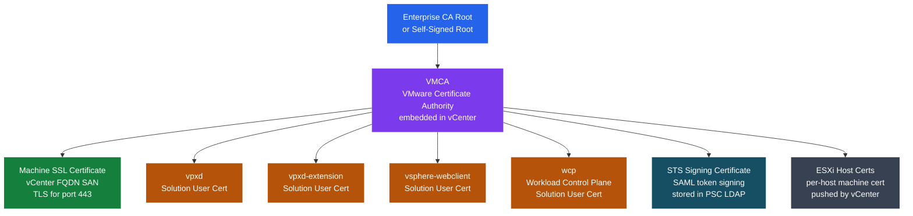

# Certificate Chain

<div class="kb-summary">
VMware Certificate Authority (VMCA) issues all vCenter machine SSL and solution user certificates. STS signing certificates are separate and have their own renewal path. Expired STS certificates cause total SSO authentication failure — the most critical certificate incident in a vSphere environment.
</div>



## VMCA: VMware Certificate Authority

VMCA is embedded in vCenter Server (7.0+; in 6.x it was part of the PSC). It acts as an internal CA:

- Issues all machine SSL certificates (vCenter FQDN cert used for port 443/636/8443).
- Issues solution user certificates (service-to-service authentication within the vCenter stack).
- Issues per-ESXi-host machine certificates (pushed by vCenter when host is added to inventory).
- Has its own self-signed root by default; this root must be added to browser trust stores for SSL to be trusted.

**VMCA root certificate location:**

```bash
# On vCenter (SSH or bash shell via appliance)
/var/lib/vmware/vmca/ca.crt          # VMCA root cert
/var/lib/vmware/vmca/ca.key          # VMCA root key (protect carefully)

# List all certs in VECS
/usr/lib/vmware-vmafd/bin/vecs-cli store list
/usr/lib/vmware-vmafd/bin/vecs-cli entry list --store MACHINE_SSL_CERT
```

## Trust Hierarchy

| Mode | VMCA role | Enterprise CA role | Use case |
|------|-----------|-------------------|----------|
| Default (VMCA self-signed) | Root CA; issues all certs | None | Lab, small environments |
| Custom CA (VMCA as subordinate) | Subordinate CA; signed by enterprise CA | Root CA; signs VMCA cert | Enterprise environments; full PKI chain |
| Hybrid mode | Issues solution user certs; not machine SSL | Signs machine SSL cert directly | Compromise: enterprise SSL for browsers, VMCA for internals |

In custom CA mode, browsers trust the enterprise CA root, so vCenter's machine SSL cert is trusted without manual import. VMCA continues to issue solution user and ESXi host certs as a subordinate.

## Certificate Stores (VECS)

VMware Endpoint Certificate Store (VECS) is the local certificate database on vCenter.

| Store name | Contents | Renewal command |
|-----------|---------|----------------|
| `MACHINE_SSL_CERT` | Machine SSL cert + private key | `certificate-manager` option 3 or `certool` |
| `TRUSTED_ROOTS` | Trusted CA roots (VMCA root + any enterprise CA root) | Add via `certool --rootca` or cert-manager UI |
| `machine` | Machine solution user cert | `certificate-manager` option 6 |
| `vpxd` | vpxd solution user cert | `certificate-manager` option 6 |
| `vpxd-extension` | vpxd-extension solution user cert | `certificate-manager` option 6 |
| `vsphere-webclient` | vsphere-webclient solution user cert | `certificate-manager` option 6 |
| `wcp` | Workload control plane cert (if Tanzu enabled) | Tanzu cert manager |

STS signing certificates are **not** in VECS — they are stored in the embedded LDAP (vmdir) under the PSC/STS configuration node.

## STS (Security Token Service) Certificate

STS issues SAML tokens for SSO authentication. Every login to vSphere Client, vCenter API, or any integrated product uses an STS-signed SAML token.

**STS cert characteristics:**
- Separate X.509 cert from machine SSL; different key pair.
- Default validity: 10 years (created during vCenter deployment).
- Stored in vmdir LDAP, not VECS.
- Not visible in normal cert monitoring tools that scan VECS or port 443.

**STS expiry impact:**
When the STS signing cert expires, all SAML token validation fails. Symptoms:
- vSphere Client shows "503 Service Unavailable" or login loops.
- All SSO-integrated products (Aria, NSX, Horizon) lose authentication.
- REST API calls return 401 Unauthorized.
- Local `administrator@vsphere.local` login also fails (uses SSO).

**Recovery when STS is expired:**

```bash
# SSH to vCenter as root (DCUI or direct SSH — SSO login is broken)
# Navigate to STS renewal script
cd /usr/lib/vmware-vmca/bin/

# Run the STS renewal script (vSphere 7.x)
python /usr/lib/vmware-vmca/bin/certificate_manager.py
# Select option 8: Reset all certificates (or specific STS renewal option)

# Alternative: use the STS renewal script directly
/usr/lib/vmware-sso/vmware-stsd/scripts/renew-sts-cert.sh
```

## Certificate Renewal Order (Critical)

Renewal must follow this strict order to prevent breaking service-to-service authentication:

1. **STS signing certificate** — renew first; all other services authenticate via STS tokens.
2. **Machine SSL certificate** — after STS is valid; replaces the vCenter TLS/HTTPS cert.
3. **Solution user certificates** — after machine SSL; vpxd, vpxd-extension, vsphere-webclient, wcp.
4. **ESXi host certificates** — last; pushed from vCenter to hosts via `Renew Certificate` in vCenter UI or `certmgr`.

Renewing out of order can leave services unable to authenticate mid-renewal. Always plan a maintenance window.

**Renew machine SSL using certificate-manager:**

```bash
# SSH to vCenter
/usr/lib/vmware-vmca/bin/certificate_manager

# Option 3: Replace Machine SSL cert with VMCA cert (VMCA-signed renewal)
# Option 1: Replace Machine SSL cert with Custom CA cert (enterprise CA path)
```

## ESXi Certificate Management

By default, VMCA issues a unique certificate per ESXi host when the host is added to vCenter inventory.

| Method | How | When to use |
|--------|-----|------------|
| VMCA-signed (default) | vCenter pushes VMCA-issued cert on host add | Standard; browser warns unless VMCA root is trusted |
| Custom CA | Enterprise CA issues per-host cert; admin pushes via vCenter | Enterprise PKI requirement |
| Thumbprint mode (legacy) | Host generates self-signed cert; vCenter trusts by thumbprint | Migration from pre-6.0; not recommended |

```bash
# Renew ESXi host cert via vCenter push (PowerCLI)
$hosts = Get-VMHost
foreach ($h in $hosts) {
    $h | Set-VMHost -CertificateOperation Refresh
}

# Or from ESXi host CLI
esxcli system security certificatestore refresh
```

## Common Certificate Failure Scenarios

| Failure | Root cause | Resolution |
|---------|-----------|-----------|
| STS cert expired | Default 10-year cert passed unnoticed | SSH root login, run STS renewal script |
| Browser SSL warning | VMCA root not in OS/browser trust store | Distribute VMCA root via GPO or manual import |
| Solution user auth failing | vpxd cert expired or wrong CA in TRUSTED_ROOTS | Renew solution user certs; re-add CA to TRUSTED_ROOTS |
| ESXi host not trusted by vCenter | Host cert thumbprint mismatch after cert change | Reconnect host; accept new thumbprint; push new cert |
| Horizon/NSX SSO broken | STS cert or machine SSL renewal broke SAML trust | Re-register the product with vCenter SSO after renewal |
