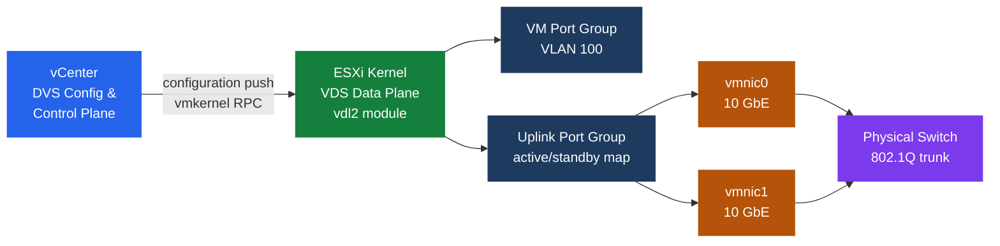

# vSphere Networking Internals

vSphere Distributed Switch separates control plane (vCenter) from data plane (ESXi kernel module). Port group types, NIOC traffic pools, teaming policies, and VMkernel adapter configuration determine performance, redundancy, and isolation for all cluster traffic.

## DVS Architecture

The vSphere Distributed Switch (vDS) splits function across two planes:

**Control plane (vCenter):**
- Stores switch configuration: port groups, VLAN assignments, teaming policies, NIOC settings, security policies.
- Pushes configuration to ESXi hosts via vmkernel RPC.
- Configuration is persistent in vCenter DB; hosts cache locally so VMs survive vCenter outage.

**Data plane (ESXi kernel module):**
- `vdl2.ko` kernel module implements forwarding at hardware interrupt priority.
- Per-port forwarding tables; MAC address learning per segment.
- Traffic never leaves host for VM-to-VM communication on the same port group (hair-pinning eliminated).
- Physical uplinks (vmnics) are directly bound to the data plane; no software bridge overhead for uplink traffic.

**Host-local cache:**
Each ESXi host caches the VDS configuration in `/etc/vmware/hostd/`. If vCenter is unavailable, the host continues forwarding using cached config. Port group additions or VLAN changes require vCenter to be reachable.

## Port Group Types

### VM Port Groups

Connect guest VMs to a logical network segment.

| VLAN mode | Configuration | Use case |
|-----------|--------------|----------|
| None (VLAN 0) | No tagging; traffic passes untagged | VM handles VLAN tagging itself (rare) |
| VLAN (access) | Single VLAN ID 1–4094 | Standard VM segment isolation |
| VLAN Trunk | Range or list of VLANs | VM running its own virtual switch (NSX, nested vSphere) |
| Private VLAN (PVLAN) | Primary + secondary PVLAN IDs | Granular L2 isolation within a single segment |

### Private VLAN (PVLAN) Modes

PVLAN implements secondary L2 isolation within a primary VLAN. The physical switch must also have PVLAN configured:

| Mode | Inter-VM traffic | External (promiscuous) access |
|------|-----------------|-------------------------------|
| Promiscuous | Can talk to all secondary PVLANs | Yes — typically used for gateway/firewall |
| Isolated | Cannot talk to any secondary PVLAN VM | Only through promiscuous port |
| Community | Can talk to VMs in same community only | Through promiscuous port for outside |

### Uplink Port Groups

Map physical vmnics to DVS uplinks. Teaming and failover policy applied here applies globally unless overridden per VM port group.

## NIOC — Network I/O Control

NIOC v3 divides physical uplink bandwidth into traffic type pools with configurable shares and limits.

| Traffic Type | Default Shares | Default Limit | Notes |
|-------------|---------------|--------------|-------|
| vSAN | 100 | Unlimited | Increase shares in all-flash or high-throughput environments |
| vMotion | 50 | Unlimited | Lower than vSAN to prevent migration storms |
| Management | 50 | Unlimited | vCenter, HA/FDM, ESXi management |
| VM traffic | 100 (per PG) | Per port group | Configurable per port group |
| vSphere Replication | 50 | Unlimited | Replication traffic to remote site |
| iSCSI | 50 | Unlimited | Software iSCSI adapter traffic |
| NFS | 50 | Unlimited | NFS datastore traffic |
| FT (Fault Tolerance) | 50 | Unlimited | FT logging traffic |

**Shares** determine relative allocation during contention. **Limits** impose hard upper bounds regardless of available capacity. NIOC requires the DVS version to support it and all hosts running 5.0+.

## Teaming Policies

### Load-Based Teaming (LBT)

LBT monitors per-vmnic utilization every 30 seconds and moves VMs to underutilized uplinks.

- **Trigger threshold**: vmnic utilization > 75% for two consecutive sampling intervals.
- **Action**: moves one VM's vnic to a less-utilized vmnic.
- **Requirement**: no specific physical switch config required (unlike LACP).
- **Limitation**: does not load-balance a single VM's traffic — only distributes different VMs across uplinks.

### IP Hash Teaming

IP hash selects uplink based on a hash of source + destination IP addresses.

- **Requirement**: physical switch must have static EtherChannel (`mode on`) or LACP configured for the corresponding ports.
- **Behavior**: deterministic per-flow; a single VM's TCP connections to the same destination always use the same uplink.
- **Use case**: database servers with few large flows benefit from per-flow (not per-VM) distribution with LACP.

### Other Teaming Modes

| Mode | Description | Failover behavior |
|------|-------------|------------------|
| Explicit failover order | Active/standby uplinks defined manually | Standby activates only when active fails |
| Route based on originating virtual port | Default; deterministic port-to-uplink mapping | No load rebalancing; simple failover only |
| Route based on source MAC hash | MAC hash selects uplink | More distribution than port-based; no physical switch config |

## LACP Configuration

LACP (IEEE 802.3ad) negotiates link aggregation with the physical switch.

| Parameter | Options | Notes |
|-----------|---------|-------|
| LACP mode | Active | ESXi sends LACP PDUs; recommended |
| LACP mode | Passive | ESXi responds to LACP PDUs from switch |
| PDU interval | Fast (1 s) / Slow (30 s) | Fast detects link failure in ~3 s |
| Load balancing | IP hash (DVS); srcDestIPTCPPortVlan for LACP v2 | IP hash is the only supported teaming with LACP LAG |

One DVS uplink port group per LAG. Multiple LAGs per DVS are supported (e.g., separate LAG per host for per-host EtherChannel).

## VMkernel Adapters

VMkernel adapters carry hypervisor traffic (not VM guest traffic). Each adapter binds to a port group and can have traffic type tagging:

| vmk Traffic Type | Default MTU | Recommended MTU | Notes |
|------------------|------------|----------------|-------|
| Management | 1500 | 1500 | vCenter access, DCUI, SSH |
| vMotion | 1500 | 9000 (jumbo) | Jumbo reduces CPU; requires end-to-end 9000 MTU |
| vSAN | 1500 | 9000 (jumbo) | Required for vSAN; all-flash clusters highly recommended |
| vSphere Replication | 1500 | 1500 or 9000 | Match with replication partner |
| iSCSI | 1500 | 9000 | Must match storage array setting |
| NFS | 1500 | 9000 | Must match NAS setting |
| Fault Tolerance | 1500 | 9000 | FT logging generates high throughput |

MTU must be consistently configured end-to-end: VMkernel adapter → port group → DVS uplink → physical switch port → physical switch → storage/remote target.

## CDP and LLDP

Discovery protocols allow vSphere to identify which physical switch port a vmnic connects to.

| Protocol | Configuration levels | Use with |
|----------|---------------------|----------|
| CDP (Cisco Discovery Protocol) | Listen, Advertise, Both, None | Cisco switches; listen allows ESXi to read CDP from switch |
| LLDP (Link Layer Discovery Protocol) | Listen, Advertise, Both, None | Non-Cisco (Arista, Juniper, HP); only available on DVS (not vSS) |

Both protocols are configured per-DVS uplink. Discovered data (switch hostname, port, VLAN) is visible in **Host → Configure → Physical Adapters** in vSphere Client.

## NSX-T Integration

NSX-T introduces N-VDS (NSX Virtual Distributed Switch), which replaces standard VDS uplinks for NSX-managed traffic.

**Host transport node preparation:**

1. vCenter selects hosts to add as transport nodes.
2. NSX Manager pushes N-VDS kernel module (`nsx-vswitch`) to each host.
3. vmnics migrated from VDS to N-VDS (or shared, if using NSX 3.2+ "VDS as N-VDS" mode).
4. TEP VMkernel adapters created and assigned TEP IP addresses.
5. Host joins the transport zone and is ready for overlay/VLAN segments.

**VDS as N-VDS (NSX 3.2+):**
From NSX 3.2, VDS version 7.0 can serve as the N-VDS — no separate N-VDS required. vmnics stay on VDS; NSX adds overlay datapath on top. This simplifies migration and preserves existing VDS port group configs for non-NSX VMs.
