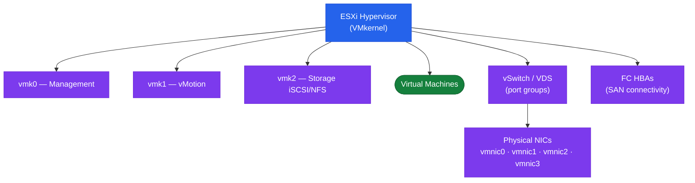

# ESXi — Components

## Networking Architecture

### Standard vSwitch (vSS)

Per-host configuration; does not synchronise across hosts. Each host has its own vSS with port groups. Suitable for simple deployments or management isolation.

### Distributed vSwitch (vDS)

Managed at vCenter cluster level; consistent configuration across all hosts in the cluster. Required for vMotion reliability, NSX-T, NIOC, and LACP.



### NIOC (Network I/O Control)

NIOC enforces bandwidth allocation on a shared uplink across traffic types: VM traffic, vMotion, vSAN, management, iSCSI, NFS. Prevents one traffic type from starving others.

### LACP / Link Aggregation

ESXi supports 802.3ad LACP on vDS for bonded uplinks. Requires physical switch LACP configuration. Provides both redundancy and throughput aggregation.

## VMkernel Adapters (vmk)

Standard production layout:

| Adapter | Traffic Type | Typical VLAN |
|---|---|---|
| vmk0 | Management | Mgmt VLAN |
| vmk1 | vMotion | vMotion VLAN |
| vmk2 | vSAN | vSAN VLAN |
| vmk3 | NFS or iSCSI | Storage VLAN |

Each vmk is associated with a port group and has a TCP/IP stack:
- **Default stack**: management, vMotion (can be moved), NFS
- **vMotion stack**: dedicated TCP/IP stack for vMotion
- **Provisioning stack**: NFC traffic for cold migration/clone
- **vSAN stack**: not used; vSAN uses vmk tagged with vSAN service

## Storage Architecture

| Type | Protocol | Notes |
|---|---|---|
| VMFS6 | FC, iSCSI, FCoE, SAS | Block; supports 64 TB LUNs, cluster locking |
| NFS 3 | NFS over TCP | Simple; no VAAI NAS for thin block |
| NFS 4.1 | NFS over TCP | Kerberos auth, session trunking |
| iSCSI (SW) | iSCSI over TCP | Software initiator built into VMkernel |
| FC / FCoE | FC fabric | Hardware HBA or CNA required |
| NVMe/FC | FC fabric | NVMe over FC; low-latency block |
| NVMe/TCP | TCP/IP | NVMe over TCP; supported vSphere 7.0 U3+ |
| vSAN | Internal (vSAN network) | HCI; managed from within vCenter |

### Multipathing (PSP)

ESXi multipathing is managed by NMP (Native Multipathing Plugin):

| Policy | Description | When to Use |
|---|---|---|
| Most Recently Used (MRU) | Uses last active path; fails over on failure | Active/Passive arrays |
| Fixed | Always uses preferred path; returns after failover | Active/Active arrays where path pinning is needed |
| Round Robin (RR) | Distributes I/O across active paths | Active/Active arrays (Pure, NetApp AFF, etc.) |

```bash
esxcli storage nmp device list | grep -A5 <device>
```
