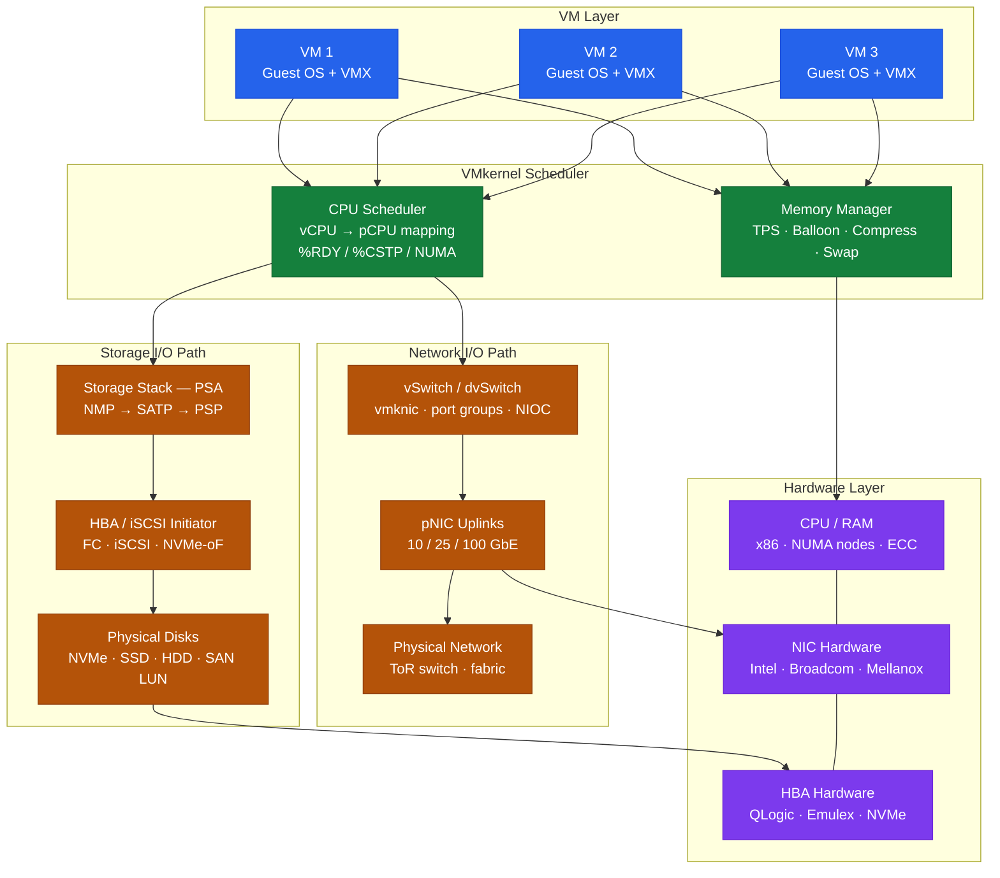

---
tags:
  - architecture
  - esxi
  - vmware
  - vsphere-8
---
# ESXi — How It Works


<div class="kb-summary">
How It Works reference covering Networking Architecture, VMkernel Adapters (vmk), Storage Architecture, CPU and Memory Scheduling, HA and DRS and 3 more sections.

*Applies to: vSphere 7.x · 8.x*
</div>

VMkernel Internals — Resource Stack
```text
┌───────────────────────────────────────── ESXi — How It Works ─────────────────────────────────────────┐
│                                                                                                       │
│  Type-1 hypervisor running directly on hardware; vmkernel mediates all I/O.                           │
│                                                                                                       │
│   ┌──────────────────────────────────────────────┐  ┌─────────────────────────────────────────────┐   │
│   │           vmkernel (Kernel Layer)            │  │             VM Execution Engine             │   │
│   │        Schedules CPUs across all VMs         │  │          VMX process per running VM         │   │
│   │         Memory balloon / swap / TPS          │  │         vCPU mapped to pCPU threads         │   │
│   │          VMkernel NIC (vmknic) mgmt          │  │          Guest OS in HW virt ring 0         │   │
│   │          Storage I/O via PSA stack           │  │            VMDK on VMFS/NFS/vSAN            │   │
│   │       Networking via vSwitch/dvSwitch        │  │            VMM, VMX, VCPU threads           │   │
│   └──────────────────────────────────────────────┘  └─────────────────────────────────────────────┘   │
│                                                                                                       │
│  vmkernel sends scheduled VM I/O to PSA (storage) and vSwitch (network).                              │
│                                                                                                       │
│                          ▼                                                 ▼                          │
│                                                                                                       │
│   ┌──────────────────────────────────────────────┐  ┌─────────────────────────────────────────────┐   │
│   │           Storage I/O Stack (PSA)            │  │              Network I/O Stack              │   │
│   │            NMP → SATP → PSP path             │  │           vSwitch / dvSwitch ports          │   │
│   │          iSCSI/FC/FCoE/NFS/NVMe-oF           │  │         Uplinks to physical switches        │   │
│   │           VMFS datastores on LUNs            │  │           vmk0 mgmt / vmk1 vMotion          │   │
│   │         vSAN uses local disk groups          │  │            vmk2 vSAN / vmk3 other           │   │
│   │         APD/PDL handling per policy          │  │         NIOC bandwidth reservations         │   │
│   └──────────────────────────────────────────────┘  └─────────────────────────────────────────────┘   │
│                                                                                                       │
│  Physical Infrastructure (the hardware everything above runs on):                                     │
│  x86 servers, NVMe/SSD/HDD, 10/25/100 GbE NICs, FC/iSCSI HBAs, ToR switches                           │
│                                                                                                       │
│  Key terms:                                                                                           │
│                                                                                                       │
│  vmkernel  = ESXi micro-kernel; schedules CPU/mem/I/O for all VMs on host                             │
│  VMX       = user-space process managing one running VM; I/O emulation                                │
│  PSA       = Pluggable Storage Architecture; ESXi storage I/O framework                               │
│  NMP       = Native Multipathing Plugin; default path selector in PSA                                 │
│  SATP      = Storage Array Type Plugin; array-specific PSA plugin                                     │
│  PSP       = Path Selection Policy; round-robin, fixed, or MRU per LUN                                │
│  vmknic    = VMkernel NIC; carries mgmt/vMotion/vSAN/overlay traffic                                  │
│  dvSwitch  = Distributed vSwitch; managed centrally by vCenter                                        │
│  VMFS      = VMware File System; clustered FS shared across ESXi hosts                                │
│  TPS       = Transparent Page Sharing; deduplicates identical guest mem pages                         │
│  APD       = All Paths Down; storage path loss without PDL declared                                   │
│  PDL       = Permanent Device Loss; device signals storage is gone permanently                        │
│                                                                                                       │
└───────────────────────────────────────────────────────────────────────────────────────────────────────┘
```
### VMkernel Resource Scheduling



---

## CPU and Memory Scheduling

### CPU Scheduling

The ESXi CPU scheduler assigns physical CPU time to VM vCPUs:

| Concept | Description |
|---|---|
| CPU Ready (`%RDY`) | Time a vCPU spent waiting for a physical CPU — high values indicate overcommitment |
| CPU Co-stop (`%CSTP`) | vCPUs in an SMP VM waiting for each other — reduce vCPU count |
| NUMA | VMs perform best when all vCPUs and memory fit in one NUMA node |
| CPU Limit | Maximum CPU allocation; set to -1 (unlimited) unless explicitly required |
| CPU Reservation | Guaranteed minimum CPU; use for latency-sensitive workloads |

### Memory Management

ESXi manages memory through a hierarchy of techniques (from least to most impactful on performance):

1. **Transparent Page Sharing (TPS)**: Deduplicates identical memory pages across VMs
2. **Balloon driver**: Inflates inside the guest, causing the guest OS to swap
3. **Memory Compression**: Compresses 4KB pages before swapping — faster than full swap
4. **Host Swap**: ESXi swaps VM memory to the `.vswp` file on a datastore — high latency

```bash
# Check memory stats on a host
esxtop
# Press 'm' for memory view
# Key columns: MCTLSZ (balloon), SWCUR (host swap), GRANT (memory given to VMs)
```

---

## HA and DRS

### vSphere HA

When a host fails, vCenter HA restarts VMs on surviving hosts. Key features:

| Feature | Function |
|---|---|
| VM Restart | Restarts VMs on surviving hosts after a host failure |
| VM Monitoring | Restarts individual VMs if VMware Tools heartbeat fails |
| Proactive HA | Pre-emptively migrates VMs from hosts with degrading hardware |
| Admission Control | Reserves capacity to absorb failure of N hosts (default: 1) |

**Host Isolation Response**: If a host loses management network connectivity, the isolation response determines VM behaviour: `Leave Powered On`, `Power Off`, or `Shut Down`.

### DRS (Distributed Resource Scheduler)

DRS balances VM load across the cluster using vMotion:

| Mode | Behaviour |
|---|---|
| Manual | DRS provides recommendations; admin applies them |
| Partially Automated | Auto-places on power-on; manual for ongoing balancing |
| Fully Automated | Auto-places and auto-migrates based on imbalance threshold (1–5) |

```powershell
# Check DRS recommendations
Get-Cluster "CL-PROD" | Get-DrsRecommendation

# Apply all pending recommendations
Get-Cluster "CL-PROD" | Get-DrsRecommendation | Apply-DrsRecommendation
```

---

## Boot Architecture

ESXi boots from one of:

| Boot Device | Notes |
|---|---|
| M.2 NVMe | Preferred for vSphere 7/8; allows persistent logging without SAN |
| M.2 SD card (older) | Factory default on many Dell/HP servers pre-2020; no local VMFS |
| USB (legacy) | Not recommended for production — high failure rate |
| SAN LUN (Boot from SAN) | FC or iSCSI; ESXi boot from a dedicated LUN on the storage array |

### Boot from SAN

Requirements:
- Dedicated boot LUN per host (do not share boot LUNs)
- HBA must be configured as boot initiator in BIOS
- SAN zoning: each HBA initiator sees only its own boot LUN
- LUN minimum 8 GB; 32 GB recommended

```bash
# Verify boot device
esxcli system boot device get

# View HBA boot configuration
esxcli storage san fc list
esxcli iscsi adapter get -A vmhba64
```

---

## Host Profiles

Host Profiles capture the entire ESXi host configuration and enforce it consistently across all cluster hosts. Deviations are flagged as non-compliant.

Key captured settings:
- VMkernel adapter configuration (IPs, services, MTU)
- NTP and DNS servers
- Firewall ruleset state
- VIB acceptance level
- PSP/SATP storage rules
- SSH and ESXi Shell state
- Syslog server
- Advanced settings (security timeouts, etc.)

```powershell
# Extract a host profile from a reference host
New-VMHostProfile -Name "HP-Cluster-Profile" `
    -ReferenceHost (Get-VMHost "esxi-01.example.local") `
    -Description "Cluster hardened baseline"

# Check compliance for all hosts
Get-VMHost | ForEach-Object {
    Test-VMHostProfileCompliance -VMHost $_ |
        Select-Object VMHost, ComplianceStatus, IncomplianceDescription
}
```

---

## Ports and Logs

| Use | Protocol | Port |
|---|---|---|
| vSphere Client / API | HTTPS | 443 |
| ESXi Host Client | HTTPS | 443 |
| vCenter to ESXi (vpxa) | HTTPS | 902 |
| NFC (migration / backup) | TCP | 902 |
| vSAN transport | TCP/UDP | 2233 |
| CIM (hardware monitoring) | HTTP/HTTPS | 5988 / 5989 |

**Key log files (ESXi host):**

- `/var/log/vmkernel.log` — kernel events, storage, network
- `/var/log/hostd.log` — host management agent
- `/var/log/vpxa.log` — vCenter agent
- `/var/log/fdm.log` — HA Fault Domain Manager
- `/var/log/vobd.log` — VM observer daemon (HA events)
- `/var/log/syslog.log` — general system log


---

## Storage Protocol Stack — Comparison

```text
┌───────────────────────────────── ESXi — Storage Protocol Comparison ──────────────────────────────────┐
│                                                                                                       │
│    Protocol     Initiator         Transport         Array presents     ESXi sees                      │
│    ─────────────────────────────────────────────────────────────────────────────────                  │
│    Fibre         HBA (QLogic/      FC fabric         LUN (SCSI block)   naa.xxxx                      │
│    Channel       Emulex)           16/32/64 GFC      Zoned per HBA      VMFS or RDM                   │
│                                                                                                       │
│    iSCSI SW      vmknic + TCP/IP   Ethernet (1/10/   LUN (SCSI block)   naa.xxxx                      │
│    initiator     stack (no HBA)    25 GbE)           CHAP auth          VMFS or RDM                   │
│                                                                                                       │
│    iSCSI HW      iSCSI HBA        Ethernet          LUN (SCSI block)   naa.xxxx                       │
│    initiator     (TOE offload)     1/10/25 GbE       CHAP auth          VMFS or RDM                   │
│                                                                                                       │
│    NFS v3        NFS client in     Ethernet          Export (file)      /vmfs/volumes/                │
│                  vmkernel          1/10/25 GbE       No CHAP; IP auth   UUID                          │
│                                                                                                       │
│    NFS v4.1      NFS client in     Ethernet          Export (file)      /vmfs/volumes/                │
│                  vmkernel          1/10/25 GbE       Kerberos / SYS     UUID (pNFS ok)                │
│                                                                                                       │
│    vSAN          vSAN VMkernel     Ethernet (RDMA    Local disk groups  vsanDatastore                 │
│                  (vmk UDP)         optional)         pooled across hosts (single DS)                  │
│                                                                                                       │
│    VAAI    = vStorage APIs for Array Integration; offloads clone/zeroing to array                     │
│    VMFS    = VMware File System; clustered; shared read/write across all ESXi hosts                   │
│    RDM     = Raw Device Mapping; guest OS accesses LUN directly; bypasses VMFS                        │
│    pNFS    = parallel NFS; NFSv4.1 feature; multiple I/O paths to same mount                          │
│    naa.    = Network Address Authority; ESXi canonical name for a storage device                      │
│                                                                                                       │
└───────────────────────────────────────────────────────────────────────────────────────────────────────┘
```

---

## vSphere HA — Admission Control

```text
┌──────────────────────────────── vSphere HA — Admission Control Modes ─────────────────────────────────┐
│                                                                                                       │
│  Admission Control ensures the cluster retains enough spare capacity to restart all                   │
│  VMs from N failed hosts. It blocks VM power-on if headroom would drop below the policy.              │
│                                                                                                       │
│   ┌──────────────────────────────────────────────┐  ┌─────────────────────────────────────────────┐   │
│   │         Cluster Resource Percentage          │  │                 Slot Policy                 │   │
│   │──────────────────────────────────────────────│  │─────────────────────────────────────────────│   │
│   │ Default mode in vSphere 6.5+                 │  │ Legacy mode; still available                │   │
│   │ Reserve X% of total cluster                  │  │ Slot = largest VM CPU + largest VM          │   │
│   │   CPU and memory as failover                 │  │   memory in cluster                         │   │
│   │   capacity (e.g. 25% each)                   │  │ Slots reserved = hosts to tolerate          │   │
│   │ Simple: easy to reason about                 │  │ Conservative: one large VM inflates         │   │
│   │ Adjustable per cluster                       │  │   slot size for all VMs                     │   │
│   │                                              │  │                                             │   │
│   └──────────────────────────────────────────────┘  └─────────────────────────────────────────────┘   │
│                                                                                                       │
│    Dedicated Failover Hosts mode:                                                                     │
│      Named ESXi hosts held completely idle — reserved exclusively for HA recovery.                    │
│      No VMs run on them normally; they are powered on and waiting.                                    │
│      Most resource-expensive option; guarantees instant failover capacity.                            │
│                                                                                                       │
│    Admission Control enforcement:                                                                     │
│      vCenter blocks VM power-on if the operation would consume reserved failover capacity.            │
│      DRS does not migrate VMs to failover hosts (VM-Host anti-affinity rule auto-created).            │
│                                                                                                       │
│    HA restarts VMs in priority order: High → Medium → Low → Disabled                                  │
│    VM Monitoring: restarts a VM if VMware Tools heartbeat fails for > threshold seconds               │
│                                                                                                       │
│    AC      = Admission Control; enforced by vCenter HA; not by ESXi itself                            │
│    Slot    = unit of failover reservation; slot policy sizes slot to worst-case VM                    │
│    FTH     = Failures To Host (tolerate); HA restarts VMs after this many host failures               │
│                                                                                                       │
└───────────────────────────────────────────────────────────────────────────────────────────────────────┘
```

---

## Proactive HA — Hardware Degradation Flow

```text
┌──────────────────────────── Proactive HA — Hardware Degradation Response ─────────────────────────────┐
│                                                                                                       │
│  Proactive HA works alongside DRS to evacuate VMs from hosts showing hardware degradation             │
│  before the hardware fails — rather than reacting after failure.                                      │
│                                                                                                       │
│    Flow:                                                                                              │
│                                                                                                       │
│    ① Hardware health event                                                                            │
│         Server management agent (IPMI/iDRAC/iLO) or partner module detects:                           │
│         degraded fan, PSU failure, memory ECC errors, NIC errors, temperature warning                 │
│                                                                                                       │
│    ② vCenter receives health update                                                                   │
│         CIM provider or Proactive HA provider sends event to vCenter                                  │
│         vCenter marks host with a degradation level: Moderate or Severe                               │
│                                                                                                       │
│    ③ DRS generates evacuation recommendation                                                          │
│         Moderate → DRS quarantines host: no new VMs placed; existing VMs may stay                     │
│         Severe   → DRS recommends evacuating all VMs off the host immediately                         │
│                                                                                                       │
│    ④ VMs migrated proactively                                                                         │
│         vMotion moves VMs to healthy hosts in cluster before hardware failure                         │
│         Host enters Quarantine Mode or Maintenance Mode per severity                                  │
│                                                                                                       │
│    ⑤ Hardware repaired                                                                                │
│         Admin repairs hardware → clears degradation state → host re-enters cluster                    │
│                                                                                                       │
│    Proactive HA = DRS extension; requires Proactive HA provider (Dell, HPE, Lenovo, etc.)             │
│    Quarantine   = host receives no new VMs but existing VMs can stay (Moderate)                       │
│    Maintenance  = host evacuated completely; no VMs running (Severe)                                  │
│                                                                                                       │
└───────────────────────────────────────────────────────────────────────────────────────────────────────┘
```

---

## NIOC — Network I/O Control

```text
┌───────────────────────────── NIOC — Network I/O Control Traffic Classes ──────────────────────────────┐
│                                                                                                       │
│  NIOC divides physical uplink bandwidth among competing traffic types using shares,                   │
│  reservations, and limits — preventing any single traffic class from starving others.                 │
│                                                                                                       │
│    Physical uplink (e.g. 2 × 25 GbE = 50 Gbps aggregate per host)                                     │
│    │                                                                                                  │
│    ├── System Traffic Classes (configured on the dvSwitch):                                           │
│    │     Management        shares: 20   limit: none   reservation: 0 Mbps                             │
│    │     vMotion           shares: 50   limit: none   reservation: 0 Mbps                             │
│    │     vSAN              shares: 100  limit: none   reservation: 0 Mbps                             │
│    │     vSphere Repl.     shares: 50   limit: none   reservation: 0 Mbps                             │
│    │     iSCSI             shares: 50   limit: none   reservation: 0 Mbps                             │
│    │     NFS               shares: 50   limit: none   reservation: 0 Mbps                             │
│    │     FT Logging        shares: 50   limit: none   reservation: 0 Mbps                             │
│    │                                                                                                  │
│    └── VM Traffic (per port group):                                                                   │
│          Each port group can set shares (High/Normal/Low) + optional bandwidth limit                  │
│          Applies when uplink is congested; no enforcement at < 75% utilisation                        │
│                                                                                                       │
│    Enforcement: NIOC only activates when an uplink exceeds 75% utilisation threshold.                 │
│    Below that, all traffic flows at line rate. Above it, shares determine allocation.                 │
│                                                                                                       │
│    NIOC    = Network I/O Control; requires dvSwitch (Enterprise Plus licence)                         │
│    Shares  = relative priority during congestion; vSAN 2x management gets 5x more                     │
│    Limit   = hard ceiling in Mbps/Gbps; enforced even when uplink is idle                             │
│    Reserv. = guaranteed Mbps always available; cluster must be able to meet total                     │
│                                                                                                       │
└───────────────────────────────────────────────────────────────────────────────────────────────────────┘
```

---

## vSphere Lifecycle Manager — Image Workflow

```text
┌─────────────────────────── vSphere Lifecycle Manager — Image-Based Upgrade ───────────────────────────┐
│                                                                                                       │
│  vLCM manages ESXi hosts using a cluster image (base ESXi + add-on VIBs + firmware).                  │
│  Compliance-based workflow: define desired state → measure deviation → remediate.                     │
│                                                                                                       │
│    ① Define Cluster Image                                                                             │
│         Base ESXi release  +  vendor add-ons (driver VIBs)  +  firmware spec                          │
│         Stored in SDDC depot (online) or imported from offline bundle                                 │
│                                                                                                       │
│    ② Check for Recommended Image                                                                      │
│         vLCM queries depot for latest validated image for this hardware                               │
│         Hardware Compatibility Check: cross-references host HCL automatically                         │
│                                                                                                       │
│    ③ Compliance Check                                                                                 │
│         vLCM compares each host installed components against cluster image                            │
│         Non-compliant hosts listed with delta: missing VIBs, wrong firmware version                   │
│                                                                                                       │
│    ④ Pre-check                                                                                        │
│         Validates host is ready for remediation: no open VMs, DRS enabled,                            │
│         sufficient cluster capacity to evacuate one host at a time                                    │
│                                                                                                       │
│    ⑤ Remediation (rolling, one host at a time)                                                        │
│         DRS evacuates host → host enters maintenance mode → vLCM applies image                        │
│         Host reboots → vLCM validates installed version → exits maintenance mode                      │
│                                                                                                       │
│    ⑥ Post-check                                                                                       │
│         All hosts compliant → cluster image version confirmed → health checks pass                    │
│                                                                                                       │
│    vLCM image  = desired state: base ESXi + add-ons + firmware spec                                   │
│    Baseline    = legacy VUM approach; vLCM images replace baselines in vSphere 7+                     │
│    HW compat.  = vLCM queries VMware HCL API; flags unsupported driver/firmware combos                │
│                                                                                                       │
└───────────────────────────────────────────────────────────────────────────────────────────────────────┘
```

---

## DPU / SmartNIC — Architecture

```text
┌───────────────────────── vSphere 8 — DPU (Data Processing Unit) Architecture ─────────────────────────┐
│                                                                                                       │
│  A DPU (SmartNIC) offloads networking and security from the host CPU to a dedicated                   │
│  processor on the NIC, freeing all host CPU cycles for VM workloads.                                  │
│                                                                                                       │
│   ┌──────────────────────────────────────────────┐  ┌─────────────────────────────────────────────┐   │
│   │        Without DPU (traditional ESXi)        │  │       With DPU (vSphere 8 + SmartNIC)       │   │
│   │──────────────────────────────────────────────│  │─────────────────────────────────────────────│   │
│   │ Host CPU handles everything:                 │  │ Host CPU: VM compute only                   │   │
│   │  · VM guest OS compute                       │  │ DPU handles all I/O plane work:             │   │
│   │  · NSX networking (overlay)                  │  │  · vNIC I/O + packet processing             │   │
│   │  · DFW rule evaluation                       │  │  · NSX overlay encap/decap                  │   │
│   │  · Encryption/decryption                     │  │  · Distributed Firewall rules               │   │
│   │  · vSwitch / uplink mgmt                     │  │  · Encryption offload                       │   │
│   │ CPU% used for networking                     │  │ Networking CPU% ≈ 0 on host CPU             │   │
│   │                                              │  │                                             │   │
│   └──────────────────────────────────────────────┘  └─────────────────────────────────────────────┘   │
│                                                                                                       │
│    DPU components (e.g. NVIDIA BlueField, Pensando/AMD):                                              │
│      · ARM processors on NIC SoC  · On-NIC RAM (8–32 GB)  · PCIe host interface                       │
│      · Runs a separate ESXi instance (ESXi-DPU) or management agent                                   │
│                                                                                                       │
│    vSphere 8 integration:                                                                             │
│      · vCenter manages DPU as part of host inventory                                                  │
│      · NSX policies pushed to DPU directly; no host CPU involvement for DFW                           │
│      · vSphere Distributed Services Engine = feature name for DPU offload in vSphere 8                │
│                                                                                                       │
│    DPU   = Data Processing Unit; SmartNIC with dedicated ARM CPUs and RAM                             │
│    SoC   = System on Chip; the DPU processor integrating CPU + NIC + crypto                           │
│    DSE   = vSphere Distributed Services Engine; the DPU offload feature in vSphere 8                  │
│                                                                                                       │
└───────────────────────────────────────────────────────────────────────────────────────────────────────┘
```

---

## vTPM & Secure Boot Chain

```text
┌─────────────────────────────── VM Security — vTPM & Secure Boot Chain ────────────────────────────────┐
│                                                                                                       │
│  vTPM provides a virtualised Trusted Platform Module 2.0 to guest VMs. Secure Boot                    │
│  validates the OS bootloader signature before the OS kernel loads — at UEFI layer.                    │
│                                                                                                       │
│    Secure Boot chain (UEFI firmware → OS):                                                            │
│                                                                                                       │
│    ① UEFI firmware (OVMF in VMware)                                                                   │
│         Contains Platform Key (PK), Key Exchange Keys (KEK), allowed DB signers                       │
│         Validates signature of bootloader before executing it                                         │
│                                                                                                       │
│    ② Bootloader (GRUB2 / Windows Boot Manager)                                                        │
│         Must be signed by a key in UEFI DB (Microsoft or custom CA)                                   │
│         Bootloader then validates OS kernel signature                                                 │
│                                                                                                       │
│    ③ OS Kernel                                                                                        │
│         Signed kernel modules only (Secure Boot enforced at kernel level too)                         │
│         Unsigned drivers blocked — common source of Secure Boot failures on ESXi                      │
│                                                                                                       │
│    vTPM provides (per VM):                                                                            │
│      · PCR (Platform Configuration Registers) — measurements of boot chain integrity                  │
│      · Key storage — BitLocker encryption keys sealed to TPM PCR state                                │
│      · Attestation — prove to remote party that VM booted from expected software                      │
│      · vTPM state stored encrypted in VM files; requires vCenter KMS to unseal                        │
│                                                                                                       │
│    Requirements for vTPM:                                                                             │
│      · VM hardware version 14+  · EFI firmware (not BIOS)  · vCenter KMS configured                   │
│                                                                                                       │
│    vTPM   = virtual TPM 2.0; provided by vSphere; no physical TPM on host needed                      │
│    PCR    = Platform Config Register; hash chain of boot measurements stored in TPM                   │
│    VBS    = Virtualisation Based Security (Windows); uses vTPM + Hyper-V compatibility                │
│    UEFI   = Unified Extensible Firmware Interface; replaces BIOS; required for vTPM                   │
│                                                                                                       │
└───────────────────────────────────────────────────────────────────────────────────────────────────────┘
```

## See also

- [ESXi — Design Standards](design-standards/)
- [ESXi Host Deployment](../deploy/)
- [ESXi — Integrations](integrations/)
