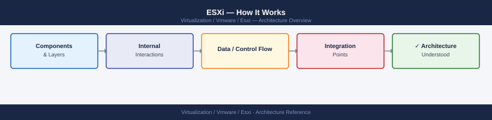
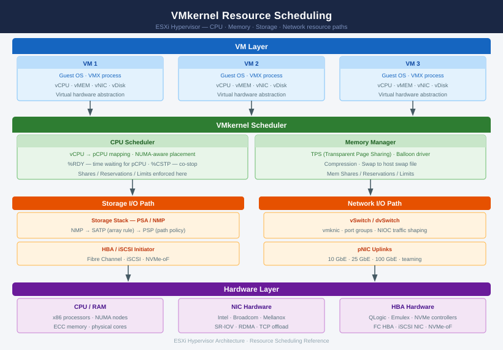

---
tags:
  - architecture
  - esxi
  - vmware
  - vsphere-8
---
# ESXi — How It Works


<div class="kb-summary">
How It Works reference covering Networking Architecture, VMkernel Adapters (vmk), Storage Architecture, CPU and Memory Scheduling, HA and DRS and 3 more sections.

*Applies to: vSphere 7.x · 8.x*
</div>



VMkernel Internals — Resource Stack


## VMkernel Architecture

```d2
direction: down

hardware: Physical Hardware {
  cpu: CPUs {shape: rectangle}
  mem: Memory {shape: rectangle}
  nic: Network (NICs) {shape: rectangle}
  hba: Storage (HBAs / NVMe) {shape: rectangle}
}

vmkernel: VMkernel (Hypervisor) {
  scheduler: CPU Scheduler {shape: rectangle}
  memctl: Memory Manager {shape: rectangle}
  netstack: TCP/IP Network Stack {shape: rectangle}
  psa: Storage Stack (PSA/NMP) {shape: rectangle}
}

userworld: User World (Processes) {
  hostd: hostd (host agent) {shape: rectangle}
  vpxa: vpxa (vCenter agent) {shape: rectangle}
  ntpd: ntpd / syslog {shape: rectangle}
}

vms: Virtual Machines {
  vm1: VM 1 (vCPU / vMEM / vNIC / vDisk) {shape: rectangle}
  vm2: VM 2 {shape: rectangle}
  vmn: VM N {shape: rectangle}
}

hardware -> vmkernel: direct hardware access
vmkernel -> userworld: system calls
vmkernel -> vms: virtualised resources
```

### VMkernel Resource Scheduling



---

## CPU and Memory Scheduling

### CPU Scheduling

The ESXi CPU scheduler assigns physical CPU time to VM vCPUs:

| Concept | Description |
|---|---|
| CPU Ready (`%RDY`) | Time a vCPU spent waiting for a physical CPU — high values indicate overcommitment |
| CPU Co-stop (`%CSTP`) | vCPUs in an SMP VM waiting for each other — reduce vCPU count |
| NUMA | VMs perform best when all vCPUs and memory fit in one NUMA node |
| CPU Limit | Maximum CPU allocation; set to -1 (unlimited) unless explicitly required |
| CPU Reservation | Guaranteed minimum CPU; use for latency-sensitive workloads |

### Memory Management

ESXi manages memory through a hierarchy of techniques (from least to most impactful on performance):

1. **Transparent Page Sharing (TPS)**: Deduplicates identical memory pages across VMs
2. **Balloon driver**: Inflates inside the guest, causing the guest OS to swap
3. **Memory Compression**: Compresses 4KB pages before swapping — faster than full swap
4. **Host Swap**: ESXi swaps VM memory to the `.vswp` file on a datastore — high latency

```bash
# Check memory stats on a host
esxtop
# Press 'm' for memory view
# Key columns: MCTLSZ (balloon), SWCUR (host swap), GRANT (memory given to VMs)
```


```text title="Expected output"
ESXTOP - VMware ESXi Top Utility (Press 'h' for help)
GID  NAME                                   NWCFG  MEMSZ  GRANT  MCTLSZ  SWCUR  MEMMCTL
  1  vmkernel                               4096   8192   8192      0      0      0
  2  vm-prod-web-01                         2048   4096   3840    256      0      0
  3  vm-prod-db-01                          4096   8192   7680    512      0      0
  4  vm-dev-test-01                         1024   2048   1536    512      0      0
  5  vm-backup-01                           2048   4096   2048   2048    512      0
```

!!! warning "Common errors"
    **`ESXTOP: command not found`** — Ensure you are logged into the ESXi host directly via SSH or console; esxtop is not available on vCenter or Windows management stations.
    **`Cannot open /proc/vmware/sched/cpu: Permission denied`** — Run esxtop with root privileges or as a user with administrative rights on the ESXi host.
    **`ESXTOP: Unable to connect to the host`** — Verify network connectivity to the ESXi host and confirm SSH/direct console access is enabled in the host's management interface.
---

## HA and DRS

### vSphere HA

When a host fails, vCenter HA restarts VMs on surviving hosts. Key features:

| Feature | Function |
|---|---|
| VM Restart | Restarts VMs on surviving hosts after a host failure |
| VM Monitoring | Restarts individual VMs if VMware Tools heartbeat fails |
| Proactive HA | Pre-emptively migrates VMs from hosts with degrading hardware |
| Admission Control | Reserves capacity to absorb failure of N hosts (default: 1) |

**Host Isolation Response**: If a host loses management network connectivity, the isolation response determines VM behaviour: `Leave Powered On`, `Power Off`, or `Shut Down`.

### DRS (Distributed Resource Scheduler)

DRS balances VM load across the cluster using vMotion:

| Mode | Behaviour |
|---|---|
| Manual | DRS provides recommendations; admin applies them |
| Partially Automated | Auto-places on power-on; manual for ongoing balancing |
| Fully Automated | Auto-places and auto-migrates based on imbalance threshold (1–5) |

```powershell
# Check DRS recommendations
Get-Cluster "CL-PROD" | Get-DrsRecommendation

# Apply all pending recommendations
Get-Cluster "CL-PROD" | Get-DrsRecommendation | Apply-DrsRecommendation
```

---

## Boot Architecture

ESXi boots from one of:

| Boot Device | Notes |
|---|---|
| M.2 NVMe | Preferred for vSphere 7/8; allows persistent logging without SAN |
| M.2 SD card (older) | Factory default on many Dell/HP servers pre-2020; no local VMFS |
| USB (legacy) | Not recommended for production — high failure rate |
| SAN LUN (Boot from SAN) | FC or iSCSI; ESXi boot from a dedicated LUN on the storage array |

### Boot from SAN

Requirements:
- Dedicated boot LUN per host (do not share boot LUNs)
- HBA must be configured as boot initiator in BIOS
- SAN zoning: each HBA initiator sees only its own boot LUN
- LUN minimum 8 GB; 32 GB recommended

```bash
# Verify boot device
esxcli system boot device get

# View HBA boot configuration
esxcli storage san fc list
esxcli iscsi adapter get -A vmhba64
```


```text title="Expected output"
Boot Device: /vmfs/devices/disks/naa.6001405a1b2c3d4e5f6g7h8i9j0k1l2m
Boot Partition: 1
Boot Driver: lpfc
Boot Adapter: vmhba0

Adapter: vmhba1
HBA Link State: link up
Speed: 8Gbps
Node WWN: 50:00:14:40:5a:1b:2c:3d
Port WWN: 50:00:14:40:5a:1b:2c:3e
Status: online

Adapter: vmhba2
HBA Link State: link down
Speed: 16Gbps
Node WWN: 50:00:14:40:5a:1b:2c:4d
Port WWN: 50:00:14:40:5a:1b:2c:4e
Status: offline

iSCSI Adapter: vmhba64
Adapter State: Enabled
Authentication Method: CHAP
Current Speed: 1Gbps
Link State: up
```

!!! warning "Common errors"
    **`Error: Could not find adapter vmhba64`** — Verify the iSCSI adapter exists with `esxcli iscsi adapter list` and use the correct adapter name.
    **`Error: Could not retrieve boot device information`** — Ensure you have root privileges and the system is fully booted; try again after waiting for storage initialization.
---

## Host Profiles

Host Profiles capture the entire ESXi host configuration and enforce it consistently across all cluster hosts. Deviations are flagged as non-compliant.

Key captured settings:
- VMkernel adapter configuration (IPs, services, MTU)
- NTP and DNS servers
- Firewall ruleset state
- VIB acceptance level
- PSP/SATP storage rules
- SSH and ESXi Shell state
- Syslog server
- Advanced settings (security timeouts, etc.)

```powershell
# Extract a host profile from a reference host
New-VMHostProfile -Name "HP-Cluster-Profile" `
    -ReferenceHost (Get-VMHost "esxi-01.example.local") `
    -Description "Cluster hardened baseline"

# Check compliance for all hosts
Get-VMHost | ForEach-Object {
    Test-VMHostProfileCompliance -VMHost $_ |
        Select-Object VMHost, ComplianceStatus, IncomplianceDescription
}
```

---

## Ports and Logs

| Use | Protocol | Port |
|---|---|---|
| vSphere Client / API | HTTPS | 443 |
| ESXi Host Client | HTTPS | 443 |
| vCenter to ESXi (vpxa) | HTTPS | 902 |
| NFC (migration / backup) | TCP | 902 |
| vSAN transport | TCP/UDP | 2233 |
| CIM (hardware monitoring) | HTTP/HTTPS | 5988 / 5989 |

**Key log files (ESXi host):**

- `/var/log/vmkernel.log` — kernel events, storage, network
- `/var/log/hostd.log` — host management agent
- `/var/log/vpxa.log` — vCenter agent
- `/var/log/fdm.log` — HA Fault Domain Manager
- `/var/log/vobd.log` — VM observer daemon (HA events)
- `/var/log/syslog.log` — general system log


---

## Storage Protocol Stack — Comparison


---

## vSphere HA — Admission Control


---

## Proactive HA — Hardware Degradation Flow


---

## NIOC — Network I/O Control


---

## vSphere Lifecycle Manager — Image Workflow


---

## DPU / SmartNIC — Architecture


---

## vTPM & Secure Boot Chain


## See also

- [ESXi — Design Standards](../design-standards/)
- [ESXi Host Deployment](../../deploy/)
- [ESXi — Integrations](../integrations/)
