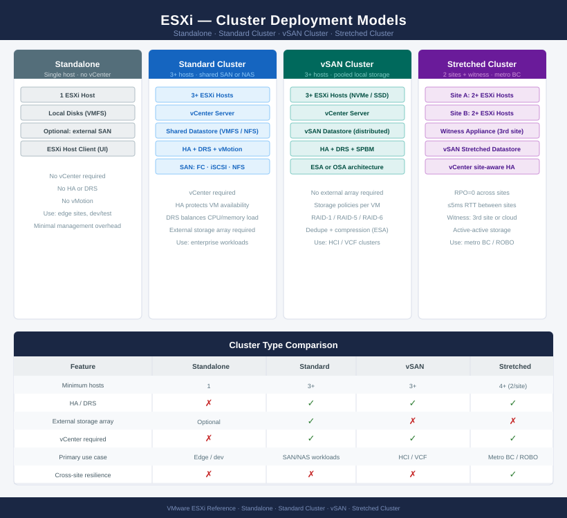
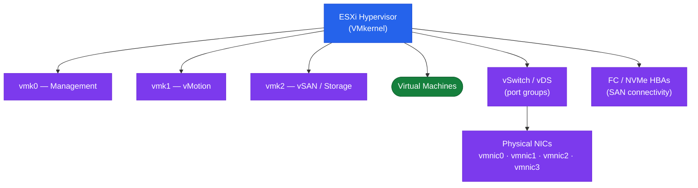

# ESXi — Architecture

ESXi is VMware's Type-1 hypervisor. It is deployed in standalone, standard cluster, vSAN cluster, or stretched cluster configurations depending on resilience, storage, and scale requirements.

ESXi is VMware's Type-1 hypervisor. It is deployed in several cluster configurations depending on resilience, storage, and scale requirements.

| Cluster Type | Min Hosts | Storage | HA / DRS |
|---|---|---|---|
| Standalone | 1 | Local / external | No |
| Standard Cluster | 3+ | Shared SAN or NAS | Yes |
| vSAN Cluster | 3+ | Pooled from hosts (HCI) | Yes |
| Stretched Cluster | 4+ (2 per site) | vSAN stretched | Yes (site-level) |

<a class="kb-card" href="how-it-works/"><strong>How It Works</strong>VMkernel, networking, storage paths, CPU/memory scheduling, HA/DRS, and boot architecture.</a>
<a class="kb-card" href="integrations/"><strong>Integrations</strong>vCenter, storage, network, backup, and monitoring integrations.</a>
<a class="kb-card" href="design-standards/"><strong>Design Standards</strong>Host naming, BIOS baseline, vmkernel layout, NTP, VIB policy, and cluster sizing.</a>

## ESXi Cluster Deployment Models

---

## Host Architecture

