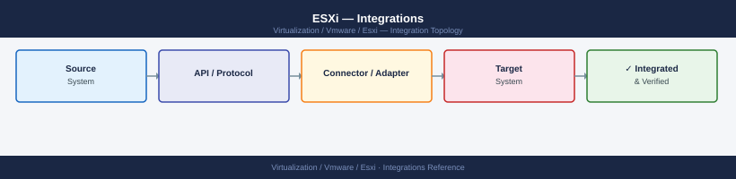

---
tags:
  - architecture
  - esxi
  - vmware
  - vsphere-8
---
# ESXi — Integrations

<div class="kb-summary">
Integrations reference covering Network Integration, Backup Integration, Monitoring Integration.

*Applies to: vSphere 7.x · 8.x*
</div>


Ensure the NFS vmkernel adapter is on the correct VLAN and the NFS server export allows the ESXi management/NFS IP.

**NVMe/FC:** NVMe over Fabrics adapters appear as `vmhba` devices; configure via `esxcli nvme` subcommands. Requires NVMe-capable HBA and array.

**VAAI (vStorage APIs for Array Integration):** Offloads clone, zero, and lock primitives to compatible arrays (Pure Storage, Dell PowerStore, NetApp ONTAP). Verify VAAI is active:

```bash
esxcli storage core plugin list | grep NMP
vmkfstools -P /vmfs/volumes/<datastore>
```

VAAI primitives (XCOPY, WRITE_SAME, ATS) significantly reduce ESXi CPU overhead during cloning and provisioning.

## Network Integration

ESXi networking uses either Standard vSwitch (vSS) or Distributed vSwitch (vDS). vDS is managed from vCenter and provides advanced features including LACP, LLDP, NetFlow, and port mirroring.

**vmkernel adapters** are created for each traffic type:

| vmkernel | Traffic Type | Typical IP |
|---|---|---|
| vmk0 | Management | Management subnet |
| vmk1 | vMotion | vMotion subnet |
| vmk2 | vSAN | vSAN subnet |
| vmk3 | NFS/iSCSI | Storage subnet |

**LACP/LAG:** On vDS, configure a Link Aggregation Group for uplink bonding. Requires LACP support on the upstream physical switch. Configure via vCenter > vDS > Configure > LACP.

**CDP/LLDP:** ESXi supports Cisco Discovery Protocol (CDP) and Link Layer Discovery Protocol (LLDP) for upstream switch discovery. View neighbour information:

```bash
esxcli network nic get --nic-name=vmnic0
# CDP/LLDP info visible in vSphere Client > host > Configure > Physical Adapters
```

## Backup Integration

**Veeam Backup & Replication** uses the VMware VADP (vStorage APIs for Data Protection) framework. A Backup Proxy VM (Windows-based) connects to ESXi hosts and the vCenter API to read VM data.

Changed Block Tracking (CBT) must be enabled on VMs for incremental backups:

```bash
# Check CBT status via PowerCLI
Get-VM <VMname> | Get-View | Select -ExpandProperty Config | Select ChangeTrackingEnabled
```

CBT is enabled per VM in the VM's advanced settings (`ctkEnabled = TRUE`). Veeam enables this automatically when the first backup job runs.

**Transport modes:**

- **Hot-add:** Backup proxy VM is on the same ESXi host; VMDKs are attached directly — most efficient.
- **Network (NBD):** VMDKs are read over the network via ESXi NFC port (TCP 902); used when hot-add is unavailable.
- **Direct SAN:** Backup proxy reads VMDKs directly from FC/iSCSI LUNs; requires shared storage access.

## Monitoring Integration

**Aria Operations for Logs (Log Insight):** Forward ESXi syslog to a central log server:

```bash
esxcli system syslog config set --loghost=tcp://loginsight.example.com:514
esxcli system syslog reload
esxcli system syslog config get
```

The Aria Operations for Logs VMware vSphere content pack parses ESXi syslog fields automatically.

**SNMP:** Configure SNMP traps for alerting to a monitoring platform:

```bash
esxcli system snmp set --communities=public --targets=monitor.example.com@162/public
esxcli system snmp set --enable=true
esxcli system snmp get
```

**Aria Operations (vROps):** The ESXi adapter connects through vCenter. Add vCenter as an account in Aria Operations and the ESXi adapter automatically discovers all managed hosts. Metrics include CPU ready, memory balloon, storage latency, and network utilisation per host.

## See also

- [ESXi — How It Works](../how-it-works/)
- [ESXi Host Deployment](../../deploy/)
