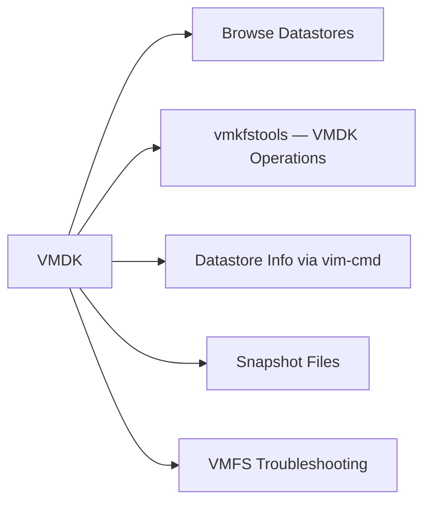

# Datastores & VMDK

> Part of the [VMware ESXi CLI Reference](../).



## Browse Datastores

```bash
# List all datastores visible to the host
ls /vmfs/volumes/
esxcli storage filesystem list

# List contents of a datastore
ls /vmfs/volumes/<datastore>/
ls -lah /vmfs/volumes/<datastore>/<vm_folder>/

# Disk usage per directory
du -sh /vmfs/volumes/<datastore>/*
du -sh /vmfs/volumes/<datastore>/<vm_folder>/
```

## vmkfstools — VMDK Operations

```bash
# List VMDK info (size, type, chain)
vmkfstools -l /vmfs/volumes/<ds>/<vm>/<vm>.vmdk

# Create a new thin VMDK
vmkfstools -c 100G -d thin /vmfs/volumes/<ds>/<vm>/<vm>.vmdk

# Clone a VMDK
vmkfstools -i source.vmdk dest.vmdk

# Expand a VMDK (grows the file — guest must still expand the partition)
vmkfstools -X 200G /vmfs/volumes/<ds>/<vm>/<vm>.vmdk

# Inflate a thin VMDK to eagerzeroedthick
vmkfstools -k /vmfs/volumes/<ds>/<vm>/<vm>.vmdk

# Defragment / punch holes in a thin VMDK
vmkfstools -p /vmfs/volumes/<ds>/<vm>/<vm>.vmdk

# Check VMDK for consistency
vmkfstools -e /vmfs/volumes/<ds>/<vm>/<vm>.vmdk
```

## Datastore Info via vim-cmd

```bash
# List all datastores and their status
vim-cmd hostsvc/datastore/listsummary

# Detailed info on a specific datastore
vim-cmd hostsvc/datastore/info <datastore_name>

# Rescan all storage adapters (after new LUN presented)
esxcli storage core adapter rescan --all
vim-cmd hostsvc/storage/refresh
```

## Snapshot Files

```bash
# Identify snapshot delta files (-.delta.vmdk)
find /vmfs/volumes/<ds>/ -name "*-delta.vmdk" -o -name "*-0000*.vmdk" 2>/dev/null

# Check snapshot size vs. base disk
ls -lah /vmfs/volumes/<ds>/<vm>/
```

## VMFS Troubleshooting

```bash
# Check VMFS filesystem metadata
esxcli storage vmfs extent list

# Resignature a VMFS copy (after snapshot/LUN clone)
esxcli storage vmfs snapshot list
esxcli storage vmfs snapshot resignature -l <label>

# Unmount a datastore from this host (does not remove from vCenter)
esxcli storage filesystem unmount -l <datastore_label>
```
