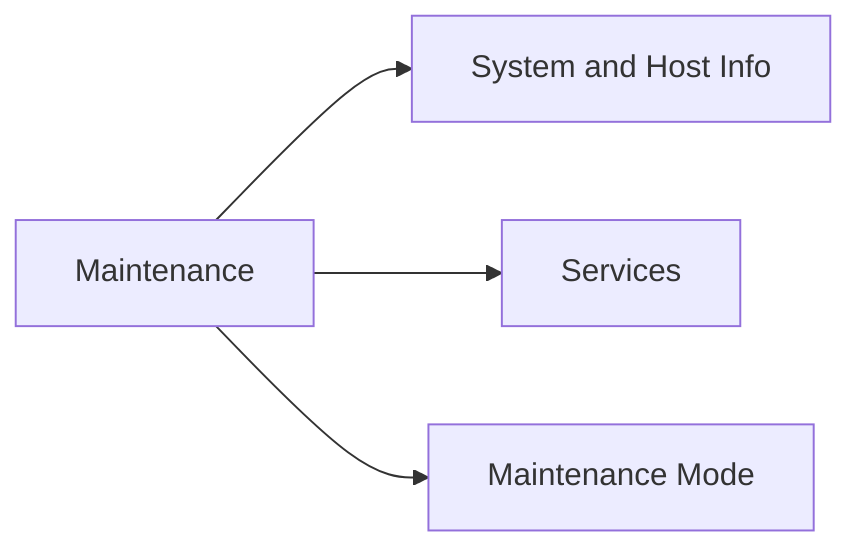

# System, Services & Maintenance

> Part of the [VMware ESXi CLI Reference](../).



---

## System & Host Info

```bash
# Version and identity
esxcli system version get
esxcli system hostname get
esxcli system hostname set --host <hostname> --domain <domain>
esxcli system uuid get
esxcli system uptime get
esxcli system time get

# Accounts and permissions
esxcli system account list
esxcli system account add -i <username> -p <password> -d "Description"
esxcli system account remove -i <username>
esxcli system permission list
esxcli system permission set -i <username> -r Admin

# Kernel modules
esxcli system module list
esxcli system module get -m <module>

# Syslog
esxcli system syslog config get
esxcli system syslog config set --loghost udp://<ip>:514
esxcli system syslog reload
```

---

## Services

```bash
# Restart management agents
/etc/init.d/hostd restart
/etc/init.d/vpxa restart
/etc/init.d/ntpd restart
/etc/init.d/ssh start
/etc/init.d/ssh stop

# All services
services.sh restart
services.sh status

# Check host version
vmware -v
vmware -l

# Uptime
uptime
```

---

## Maintenance Mode

```bash
esxcli system maintenanceMode get
esxcli system maintenanceMode set --enabled true
esxcli system maintenanceMode set --enabled false

# Via vim-cmd
vim-cmd hostsvc/maintenance_mode_enter
vim-cmd hostsvc/maintenance_mode_exit
```
