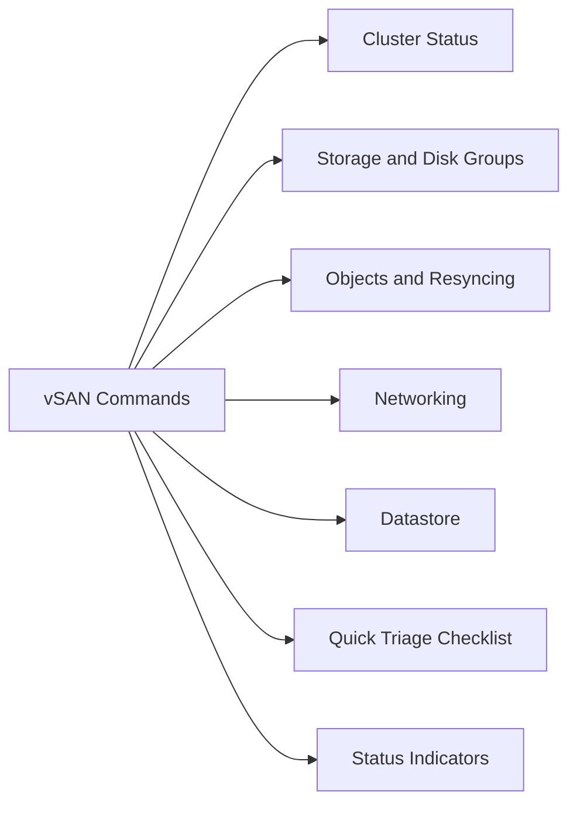

# vSAN Commands

> Part of the [VMware ESXi CLI Reference](../).



## Cluster Status

```bash
# Cluster membership and UUID
esxcli vsan cluster get

# Cluster health summary (all checks)
esxcli vsan health cluster get
esxcli vsan health summary get

# Health check details — filter for failures only
esxcli vsan health cluster get | grep -v "GREEN\|green"
```

## Storage and Disk Groups

```bash
# List all vSAN storage devices (SSD cache + capacity)
esxcli vsan storage list

# Per-disk statistics (reads, writes, errors)
esxcli vsan storage stats get

# Disk group layout — which SSD maps to which capacities
esxcli vsan storage list | grep -E "Is SSD|Disk Group"
```

## Objects and Resyncing

```bash
# List vSAN objects — state, policy compliance
esxcli vsan debug object list

# Filter for non-healthy objects
esxcli vsan debug object list | grep -v "healthy"

# Resync status — active rebuild/repair operations
esxcli vsan debug resync list

# Resync byte count (estimate time remaining)
esxcli vsan debug resync list | grep -E "Total Bytes|Remaining"
```

## Networking

```bash
# vSAN VMkernel adapters
esxcli vsan network list

# Unicast agent configuration per NIC
esxcli vsan network ipconfig list

# Connectivity test between cluster hosts
esxcli vsan debug network test
```

## Datastore

```bash
# vSAN datastore UUID and mount info
esxcli vsan datastore list

# Trace vSAN I/O (debugging, brief capture)
esxcli vsan trace get
```

## Quick Triage Checklist

```bash
# 1. Cluster health
esxcli vsan health summary get

# 2. Any resync in progress
esxcli vsan debug resync list

# 3. Objects needing attention
esxcli vsan debug object list | grep -v healthy

# 4. Network VMkernel tagged
esxcli vsan network list

# 5. Storage devices visible
esxcli vsan storage list | grep -c "naa\."
```

## Status Indicators

| Indicator | Meaning |
|---|---|
| Health: GREEN | Check passing |
| Health: YELLOW | Warning — monitor |
| Health: RED | Failure — action required |
| Resync bytes > 0 | Rebuild or repair active — avoid maintenance |
| Object state: absent | Component missing — check disk/host |
| Object state: degraded | Redundancy reduced — replace disk before next failure |
