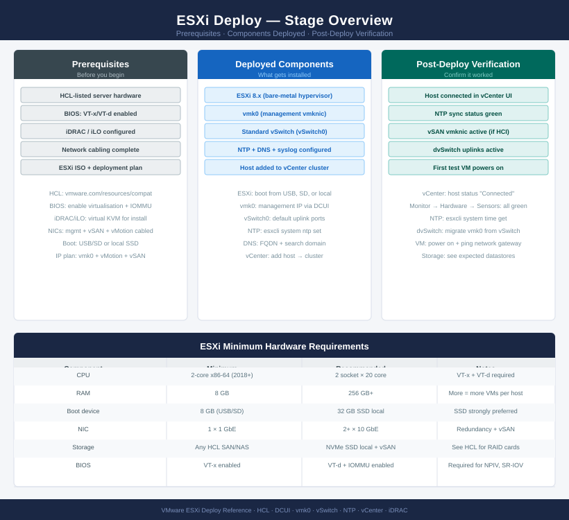
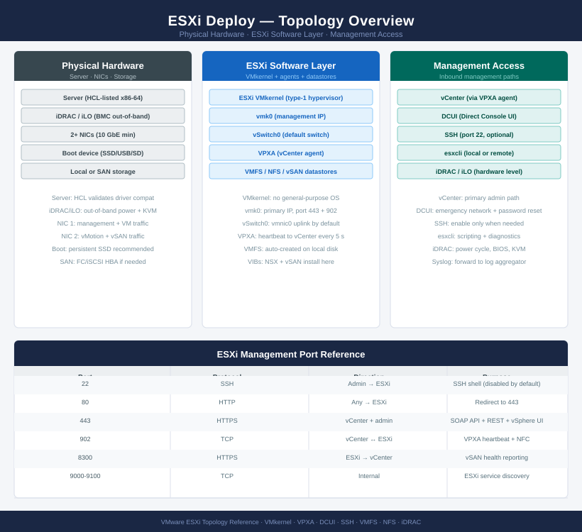
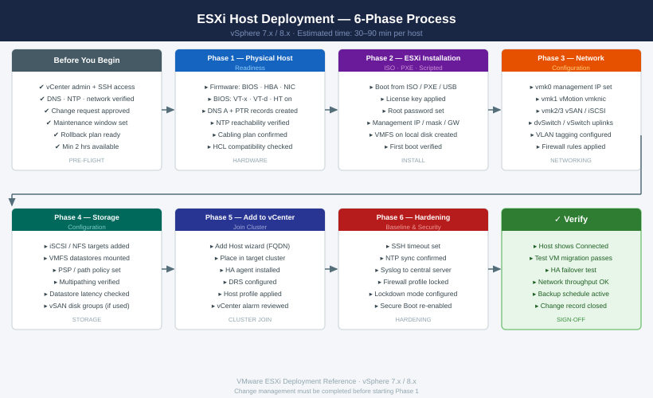

---
tags:
  - deployment
  - esxi
  - vmware
  - vsphere-8
search:
  boost: 2
---
# ESXi Host Deployment

<div class="kb-summary">
Step-by-step guide to deploying a new ESXi host: hardware readiness, installation, network and storage configuration, vCenter join, and baseline hardening.

*Applies to: vSphere 7.x / 8.x*
</div>







## Before you begin

<!-- video-link -->
!!! tip "Video Walkthrough"
    [:fontawesome-brands-youtube: How to Install & Configure VMware ESXi | Full Lab Setup + Real-World Guide](https://www.youtube.com/watch?v=gtlEhKQGd0k){ .md-button }
<!-- /video-link -->


- **Access:** vCenter Administrator role and SSH access to VCSA/ESXi hosts
- **Environment:** DNS, NTP, and network connectivity verified before starting
- **Change management:** change request approved; maintenance window scheduled
- **Rollback:** snapshot or backup taken immediately before deployment begins
- **Time estimate:** 30–90 minutes — do not start if less than 2 hours are available

---

## Phase 1: Physical Host Readiness

Before installing ESXi, validate the hardware platform.

**Firmware**

Update server BIOS, HBA, and NIC firmware to vendor-recommended minimums before ESXi install. Mismatched firmware causes unreliable driver binding and PSOD.

**BIOS settings to verify**

| Setting | Required Value |
|---|---|
| VT-x / AMD-V | Enabled |
| VT-d / IOMMU | Enabled (for DirectPath I/O) |
| Hyperthreading | Enabled |
| C-States / Power management | OS Control or Performance |
| Secure Boot | Disabled during install; re-enable after |
| Boot order | ISO first, then local disk |

**DNS pre-creation**

Create A and PTR records for the host FQDN before installing ESXi. ESXi registers its hostname at first boot — missing DNS causes vCenter join failures and HA agent errors.

```bash
# Verify DNS resolves in both directions after record creation
nslookup esxi-host-01.domain.local
nslookup 10.0.0.10
```


```text title="Expected output"
Server:		10.0.0.1
Address:	10.0.0.1#53

Name:	esxi-host-01.domain.local
Address: 10.0.0.10

Server:		10.0.0.1
Address:	10.0.0.1#53

10.0.0.10.in-addr.arpa	name = esxi-host-01.domain.local.
```

!!! warning "Common errors"
    **`** server can't find esxi-host-01.domain.local: NXDOMAIN`** — Verify the DNS A record exists in your DNS server and the domain suffix is correct; check `nslookup esxi-host-01.domain.local <dns-server-ip>` against the authoritative nameserver.
    **`** server can't find 10.0.0.10.in-addr.arpa: NXDOMAIN`** — Create a reverse DNS PTR record for 10.0.0.10 pointing to esxi-host-01.domain.local in your DNS reverse zone.
    **`nslookup: command not found`** — Install `bind-utils` (RHEL/CentOS) or `dnsutils` (Debian/Ubuntu), or use `dig` or `host` as alternatives.
**NTP reachability**

```bash
# From a jump host on the management VLAN
ntpdate -q ntp1.domain.local
```


```text title="Expected output"
server 10.45.12.8, stratum 4, offset 0.002341, delay 0.045821
ntpdate[12847]: adjust time server 10.45.12.8 offset 0.002341 sec
```

!!! warning "Common errors"
    **`ntpdate[12847]: no server suitable for synchronization found`** — Verify NTP server hostname resolves and is reachable from the management VLAN (ping ntp1.domain.local).
    **`ntpdate: command not found`** — Install ntpdate package or use `chronyc -a makestep` / `timedatectl set-ntp true` on modern systems instead.
    **`ntpdate[12847]: socket in use - exiting`** — Stop the ntpd/chronyd service first with `systemctl stop ntpd` or `systemctl stop chronyd` before running ntpdate.
**Cabling**

- Dedicated NICs for management, vMotion, vSAN, and VM traffic (or LACP bond)
- IPMI/iDRAC configured with its own management IP for out-of-band access

---

## Phase 2: ESXi Installation

**Boot media options**

| Method | Command / Notes |
|---|---|
| USB ISO | Write ISO to USB with Rufus or `dd`; boot from USB in BIOS |
| iDRAC/iLO virtual media | Mount ISO via BMC web UI; set virtual CD first in boot order |
| PXE (TFTP/HTTP) | Requires PXE server with `mboot.c32` and ESXi boot.cfg |
| Auto Deploy | Requires vCenter + Auto Deploy service; rule-based iPXE |

**Interactive installation sequence**

1. Boot from media — `VMware ESXi <version> Installer` screen appears
2. Press **Enter** to continue, **F11** to accept EULA
3. Select install disk (local SSD/HDD — not shared storage)
4. Select keyboard layout, set root password
5. Confirm install — data on disk will be overwritten
6. Reboot — remove boot media

**DCUI initial configuration (F2 → Configure Management Network)**

```text
Network Adapters:    vmnic0 (select management NIC)
VLAN (optional):     <management VLAN ID>
IPv4 Configuration:  Static — IP, Subnet, Gateway
DNS Configuration:   Primary + Secondary DNS, Hostname (FQDN)
Custom DNS Suffixes: domain.local
```

After saving, test connectivity:

```text
F12 → Test Management Network → ping gateway, DNS, hostname
```

**Enable SSH temporarily for configuration**

```text
F2 → Troubleshooting Options → Enable SSH
```

---

## Phase 3: Network Configuration

**VMkernel ports required per host**

| VMkernel | Traffic | VLAN | MTU | Required Service Tag |
|---|---|---|---|---|
| vmk0 | Management | MGMT VLAN | 1500 | Management |
| vmk1 | vMotion | vMotion VLAN | 9000 | vMotion |
| vmk2 | vSAN | vSAN VLAN | 9000 | vSAN |
| vmk3 | NFS/iSCSI | Storage VLAN | 9000 | — |

**Create vMotion VMkernel via esxcli**

```bash
# Add VMkernel port for vMotion
esxcli network ip interface add --interface-name vmk1 --portgroup-name "vMotion"
esxcli network ip interface ipv4 set --interface-name vmk1 --type static \
  --ipv4 10.10.1.10 --netmask 255.255.255.0

# Tag for vMotion traffic
esxcli vsan network list   # verify vSAN VMk
esxcli network ip interface tag add --interface-name vmk1 --tagname VMotion
```


```text title="Expected output"
vmk1 added.
(no output — command completes silently)
Interface  VmknicIndex  IP Address      Netmask         Broadcast       MAC Address        MTU  TSO MSS  Enabled
vmk0       0            192.168.1.100   255.255.255.0   192.168.1.255   00:0c:29:a1:2b:3c  1500 65535   true
vmk1       1            10.10.1.10      255.255.255.0   10.10.1.255     00:0c:29:a1:2b:3d  1500 65535   true
vmk2       2            10.20.1.10      255.255.255.0   10.20.1.255     00:0c:29:a1:2b:3e  1500 65535   true
VmknicIndex  IP Address      Netmask         MAC Address        MTU  TSO MSS  Enabled
1            10.10.1.10      255.255.255.0   00:0c:29:a1:2b:3d  1500 65535   true
Tag added to vmk1.
```

!!! warning "Common errors"
    **`Error: The object already exists.`** — Verify the VMkernel interface name does not already exist with `esxcli network ip interface list`.
    **`Error: The portgroup 'vMotion' does not exist.`** — Create the vMotion portgroup on the vSwitch before adding the interface using `esxcli vswitch standard portgroup add`.
    **`Error: The tag 'VMotion' is not a valid tag.`** — Use the correct tag name `vMotion` (case-sensitive) instead of `VMotion` with `esxcli network ip interface tag add --interface-name vmk1 --tagname vMotion`.
**Create vSAN VMkernel**

```bash
esxcli network ip interface add --interface-name vmk2 --portgroup-name "vSAN"
esxcli network ip interface ipv4 set --interface-name vmk2 --type static \
  --ipv4 10.20.1.10 --netmask 255.255.255.0
esxcli network ip interface tag add --interface-name vmk2 --tagname VSAN

# Set MTU to 9000 on vSwitch (or on dvSwitch from vCenter)
esxcli network vswitch standard set --vswitch-name vSwitch1 --mtu 9000
```


```text title="Expected output"
(no output — command completes silently)
(no output — command completes silently)
(no output — command completes silently)
(no output — command completes silently)
```

!!! warning "Common errors"
    **`Error: The object already exists.`** — Verify the vmk2 interface doesn't already exist with `esxcli network ip interface list` before adding it.
    **`Error: The portgroup "vSAN" does not exist.`** — Create the vSAN portgroup on vSwitch1 first using vCenter or `esxcli network vswitch standard portgroup add --vswitch-name vSwitch1 --portgroup-name "vSAN"`.
    **`Error: The vswitch vSwitch1 does not exist.`** — Confirm the vSwitch name with `esxcli network vswitch standard list` and use the correct vSwitch identifier.
**Verify connectivity from each VMkernel**

```bash
# Ping gateway from specific VMkernel
vmkping -I vmk1 10.10.1.1
vmkping -I vmk2 10.20.1.1 -d -s 8972   # 9000 MTU test (8972 = 9000 - 28 byte header)
```


```text title="Expected output"
PING 10.10.1.1 (10.10.1.1): 56 data bytes
64 bytes from 10.10.1.1: icmp_seq=0 ttl=255 time=2.341 ms
64 bytes from 10.10.1.1: icmp_seq=1 ttl=255 time=2.156 ms
64 bytes from 10.10.1.1: icmp_seq=2 ttl=255 time=2.289 ms
^C
--- 10.10.1.1 statistics ---
3 packets transmitted, 3 packets received, 0% packet loss
round-trip min/avg/max = 2.156/2.262/2.341 ms

PING 10.20.1.1 (10.20.1.1): 8972 data bytes
8972 bytes from 10.20.1.1: icmp_seq=0 ttl=255 time=3.847 ms
8972 bytes from 10.20.1.1: icmp_seq=1 ttl=255 time=3.721 ms
8972 bytes from 10.20.1.1: icmp_seq=2 ttl=255 time=3.912 ms
^C
--- 10.20.1.1 statistics ---
3 packets transmitted, 3 packets received, 0% packet loss
round-trip min/avg/max = 3.721/3.826/3.912 ms
```

!!! warning "Common errors"
    **`vmkping: Unknown interface vmk2`** — Verify the VMkernel interface exists with `esxcli network ip interface list` and use the correct interface name.
    **`PING 10.20.1.1 (10.20.1.1): 8972 data bytes ... 100% packet loss`** — Confirm the gateway IP is reachable and that the MTU is set to 9000 on both the ESXi interface and upstream switch port with `esxcli network ip interface get -i vmk2`.
**List all VMkernel interfaces**

```bash
esxcli network ip interface list
```


```text title="Expected output"
Name  IPv4 Address         IPv4 Netmask      IPv6 Address                         Enabled
----  ----------------     ----------------  ------------------------------------  -------
vmk0  192.168.1.42         255.255.255.0     fe80::250:56ff:fe9a:b1c2%vmk0       true
vmk1  10.0.0.15            255.255.255.0     fe80::250:56ff:fe9a:b1c3%vmk1       true
vmk2  172.16.50.8          255.255.255.0     fe80::250:56ff:fe9a:b1c4%vmk2       true
vmk3  0.0.0.0              255.255.255.0     ::                                   false
```

!!! warning "Common errors"
    **`Error: Unknown command or namespace esxcli`** — Ensure you are logged into an ESXi host directly via SSH or console; this command does not work on vCenter Server.
    **`Error: Permission denied`** — Run the command as root or a user with administrative privileges on the ESXi host.
---

## Phase 4: Storage Configuration

**iSCSI software initiator**

```bash
# Enable software iSCSI initiator
esxcli iscsi software set --enabled=true

# Get initiator name (provide to storage team for IQN-based access)
esxcli iscsi adapter list

# Add dynamic discovery target
esxcli iscsi adapter discovery sendtarget add \
  --address 10.30.1.10:3260 --adapter vmhba65

# Rescan to discover LUNs
esxcli storage core adapter rescan --adapter vmhba65

# Verify targets
esxcli iscsi adapter target list
```


```text title="Expected output"
Software iSCSI initiator enabled successfully.
Adapter  Driver     State   PortName                          Model
vmhba65  iscsi_vmk  online  iqn.1998-01.com.vmware:esx-prod-01  iSCSI Software Adapter

Discovery Address: 10.30.1.10:3260
Discovery Method: SendTargets
Status: Configured

Rescan initiated for adapter vmhba65...
Scanning complete. 3 new LUN(s) discovered.

Target: iqn.1991-05.com.example:storage.lun1
  Portal: 10.30.1.10:3260
  Status: Connected
Target: iqn.1991-05.com.example:storage.lun2
  Portal: 10.30.1.10:3260
  Status: Connected
Target: iqn.1991-05.com.example:storage.lun3
  Portal: 10.30.1.10:3260
  Status: Connected
```

!!! warning "Common errors"
    **`Error: Could not connect to the host. The host is not reachable.`** — Verify network connectivity to the ESXi host and ensure you have valid credentials in your esxcli session.
    **`Error: Discovery sendtarget failed: Connection refused (111)`** — Confirm the iSCSI target portal IP address and port are correct, and that the storage array is reachable from the ESXi management network.
    **`Error: Adapter vmhba65 not found`** — Verify the software iSCSI initiator is enabled and the adapter name is correct by running `esxcli iscsi adapter list` first.
**Fibre Channel**

```bash
# List HBA WWPNs (provide to storage team for zoning)
esxcli storage core adapter list | grep -i fc

# After zoning is confirmed, rescan
esxcli storage core adapter rescan --all

# Verify LUN visibility
esxcli storage core device list | grep naa
```


```text title="Expected output"
HBA Name    Driver     Link State    Oper State    Phy Link State    MAC Address
vmhba0      lpfc       link up       online        up                00:0a:95:9d:2e:78
vmhba1      lpfc       link up       online        up                00:0a:95:9d:2e:79
vmhba2      qla2xxx    link up       online        up                00:14:4f:45:a1:c2
vmhba3      qla2xxx    link up       online        up                00:14:4f:45:a1:c3

Rescanning HBA vmhba0...
Rescanning HBA vmhba1...
Rescanning HBA vmhba2...
Rescanning HBA vmhba3...
Rescan complete.

Device naa.60060e8007e2d0000007e2d000010001 Size: 1048576 MB Display Name: NETAPP LUN01 (naa.60060e8007e2d0000007e2d000010001)
Device naa.60060e8007e2d0000007e2d000010002 Size: 2097152 MB Display Name: NETAPP LUN02 (naa.60060e8007e2d0000007e2d000010002)
Device naa.60060e8007e2d0000007e2d000010003 Size: 512000 MB Display Name: PURE STORAGE VOL-PROD (naa.60060e8007e2d0000007e2d000010003)
```

!!! warning "Common errors"
    **`Could not get device list. Error: Permission denied`** — Run the commands as root or with sudo, or ensure your account has ESXi administrator privileges.
    **`No matching HBAs found`** — Verify FC HBAs are installed and detected by running `esxcli storage core adapter list` without grep to confirm adapter presence.
**Multipathing (PSP)**

```bash
# Set Round Robin for active-active arrays
esxcli storage nmp device set --device naa.<id> --psp VMW_PSP_RR

# Set IOPS threshold for Round Robin (default 1000; lower for better spread)
esxcli storage nmp psp roundrobin deviceconfig set --device naa.<id> \
  --type iops --iops 1

# Verify paths
esxcli storage nmp path list --device naa.<id>
```


```text title="Expected output"
NMP device naa.6001405abc123def456789abcdef0123 policy set to VMW_PSP_RR
(no output — command completes silently)

Name: naa.6001405abc123def456789abcdef0123
Device: naa.6001405abc123def456789abcdef0123
Transport: SAN
Paths: 4
States: active;active;active;active
PathName                          State     ChannelNumber TargetNumber LunNumber
vmhba3:C0:T2:L0                   active    0             2            0
vmhba4:C0:T2:L0                   active    0             2            0
vmhba5:C0:T2:L0                   active    0             2            0
vmhba6:C0:T2:L0                   active    0             2            0
```

!!! warning "Common errors"
    **`Error: Could not find device naa.6001405abc123def456789abcdef0123`** — Verify the device NAA ID with `esxcli storage nmp device list` and use the correct identifier.
    **`Error: The specified path is not valid for this device`** — Ensure all paths are properly discovered and active by rescanning storage with `esxcli storage core adapter rescan --adapter vmhbaX`.
**VAAI plugin**

Install the array vendor's VAAI plugin via VUM/LCM if the array supports hardware acceleration (XCOPY, ATS, WriteSame). Verify:

```bash
esxcli storage core device vaai status get
```


```text title="Expected output"
Name                                    VAAI Status
----                                    -----------
mpx.vmhba0:C0:T0:L0                     supported
mpx.vmhba0:C0:T1:L0                     supported
mpx.vmhba1:C0:T0:L0                     supported
mpx.vmhba2:C0:T0:L0                     supported
mpx.vmhba3:C0:T0:L0                     not supported
mpx.vmhba4:C0:T0:L0                     not supported
```

!!! warning "Common errors"
    **`Error: Unknown command or namespace esxcli storage core device vaai`** — Verify the ESXi version supports VAAI (vSphere 5.0+) and that esxcli is properly initialized.
    **`Error: Unable to connect to the local hostd agent`** — Restart the hostd service with `services.sh restart` or reboot the ESXi host.
**Confirm datastores**

```bash
esxcli storage filesystem list
```


```text title="Expected output"
Mount Point                                        Volume Name      UUID                                 Mounted  Type
-------------------------------------------------  ---------------  ------------------------------------  -------  ------
/                                                  OSDATA-1234abcd   5a8c9f2e-7b1d-4e9c-a3f5-2b8d6c1a9e7f  true     VMFS
/boot                                              boot-5678efgh    8f2a1b3c-9d4e-5f6a-7b8c-9d0e-1f2a3b  true     vfat
/vmfs/volumes/datastore1-5a8c9f2e-7b1d-4e9c       datastore1       5a8c9f2e-7b1d-4e9c-a3f5-2b8d6c1a9e7f  true     VMFS
/vmfs/volumes/datastore2-9f2e7b1d-4e9c-a3f5       datastore2       9f2e7b1d-4e9c-a3f5-2b8d6c1a9e7f00  true     VMFS
/vmfs/volumes/nfs-backup-share                    nfs-backup       a1b2c3d4-e5f6-7a8b-9c0d-1e2f3a4b5c6d  true     NFS
/scratch                                          scratch-1a2b3c   1a2b3c4d-5e6f-7a8b-9c0d-1e2f3a4b5c6d  true     VMFS
```

!!! warning "Common errors"
    **`Error: Could not get list of filesystems`** — Verify the esxcli service is running with `systemctl status esxcli` and check network connectivity to the ESXi host.
    **`Error: Permission denied`** — Run the command as root or with appropriate vSphere credentials; non-root users cannot access esxcli storage commands.
---

## Phase 5: Add Host to vCenter

**Via vCenter UI**

1. Navigate to the target **Datacenter** or **Cluster**
2. Right-click → **Add Host**
3. Enter the host FQDN (not IP address)
4. Accept the SSL thumbprint
5. Enter root credentials
6. Assign the ESXi licence
7. Select **Datacenter/Cluster placement**
8. Host Profile: apply if a baseline profile exists → **Remediate**
9. Confirm — vCenter installs HA agent automatically

**Verify host state**

```bash
# In vCenter PowerCLI
Connect-VIServer vcenter.domain.local
Get-VMHost esxi-host-01.domain.local | Select-Object Name, ConnectionState, PowerState
```


```text title="Expected output"
Name                      ConnectionState PowerState
----                      --------------- ----------
esxi-host-01.domain.local Connected       PoweredOn
```

!!! warning "Common errors"
    **`Connect-VIServer : Cannot find a certificate or crmf request for the object named 'vcenter.domain.local'.`** — Verify the vCenter FQDN is correct and resolvable via DNS, or use the IP address instead.
    **`Get-VMHost : The object 'esxi-host-01.domain.local' was not found on the server.`** — Confirm the ESXi hostname matches exactly in vCenter inventory (check capitalization and domain suffix).
Expected output:

```text
Name                          ConnectionState  PowerState
----                          ---------------  ----------
esxi-host-01.domain.local     Connected        PoweredOn
```

**HA agent and DRS**

Once the host is in a cluster with HA and DRS enabled, vCenter automatically:
- Installs `vmware-fdm` HA agent
- Adds host to DRS resource pool
- Assigns cluster-level vSAN disk claim (if vSAN cluster)

**Verify HA agent**

```bash
# From ESXi SSH
/etc/init.d/vmware-fdm status
```


```text title="Expected output"
vmware-fdm is running (pid 2847)
```

!!! warning "Common errors"
    **`vmware-fdm is stopped`** — Start the service with `/etc/init.d/vmware-fdm start` and verify cluster membership with `esxcli cluster get`.
    **`Command not found: /etc/init.d/vmware-fdm`** — Verify you are on an ESXi host with vSAN or HA enabled; if not present, the service is not installed on this host.
---

## Phase 6: Hardening & Baseline

**Lockdown mode**

```bash
# Enable normal lockdown mode (via vCenter — disables direct root login)
# vCenter → Host → Configure → Security Profile → Lockdown Mode → Edit → Normal

# Via PowerCLI
$host = Get-VMHost "esxi-host-01.domain.local"
$hostView = Get-View $host
$hostView.EnterLockdownMode()
```


```text title="Expected output"
(no output — command completes silently)
```

!!! warning "Common errors"
    **`You do not have permission to perform this operation.`** — Verify your vCenter user account has Administrator role or equivalent Host.Config.Security privileges on the target ESXi host.
    **`The object has already been deleted or has not been completely created.`** — Ensure the ESXi host is still connected to vCenter and in a healthy state; reconnect the host if necessary.
**Disable SSH and ESXi Shell post-configuration**

```bash
# vCenter → Host → Configure → Security Profile → Services → SSH → Stop + Policy: Start/stop manually
# Via esxcli from local console or one final SSH session:
esxcli system maintenanceMode set --enable false   # if in maintenance
vim-cmd hostsvc/disable_ssh
vim-cmd hostsvc/disable_esx_shell
```


```text title="Expected output"
(no output — command completes silently)
(no output — command completes silently)
(no output — command completes silently)
```

!!! warning "Common errors"
    **`vim-cmd: command not found`** — Run commands directly on the ESXi host console or via an active SSH session before disabling SSH access.
    **`Error: The object or item referenced could not be found.`** — Verify the host is not in a disconnected state in vCenter; reconnect the host and retry the vim-cmd commands.
**NTP service**

```bash
esxcli system ntp set --server ntp1.domain.local --server ntp2.domain.local
esxcli system ntp set --enabled true

# Confirm sync
esxcli system ntp get
ntpq -p
```


```text title="Expected output"
(no output — command completes silently)
(no output — command completes silently)

Enabled: true
Server: ntp1.domain.local
Server: ntp2.domain.local

     remote           refid      st t when poll reach   delay   offset  jitter
==============================================================================
 ntp1.domain.loc 10.0.1.50        2 u   32   64  377   12.456    2.341   1.203
 ntp2.domain.loc 10.0.1.51        2 u   28   64  377   14.123   -1.892   0.987
 LOCAL(0)        .LOCL.          10 l  998 1024    1    0.000    0.000   0.000
```

!!! warning "Common errors"
    **`Error: Unable to set NTP server ntp1.domain.local`** — Verify the NTP server hostname is resolvable and reachable from the ESXi host using `ping` or `nslookup`.
    **`ntpq: read: Connection refused`** — Ensure the NTP daemon is running with `systemctl start ntpd` or restart the service with `systemctl restart ntpd`.
**Syslog forwarding**

```bash
# Forward to Aria Operations for Logs or a syslog server
esxcli system syslog config set --loghost=udp://arialogs.domain.local:514
esxcli system syslog config get   # verify
esxcli system syslog reload

# Open firewall for syslog
esxcli network firewall ruleset set --ruleset-id syslog --enabled true
esxcli network firewall refresh
```


```text title="Expected output"
(no output — command completes silently)
Syslog Config:
   Default Network Retry Timeout: 180
   Default Network Retry Attempts: 3
   Queue Drop Mark: 90
   Log Output: /scratch/log
   Log Host: udp://arialogs.domain.local:514
   Unique Size: 100
   Default Network Timeout: 30
(no output — command completes silently)
(no output — command completes silently)
(no output — command completes silently)
```

!!! warning "Common errors"
    **`Error: The object has already been modified.`** — Wait 30 seconds before running the reload command, as the config set operation may still be processing.
    **`Error: Unknown option or malformed command.`** — Verify the syslog server hostname is reachable and the UDP port 514 is not blocked by upstream firewalls; use `esxcli network firewall ruleset list` to confirm syslog ruleset exists.
**LCM baseline remediation**

1. vCenter → **Menu → Lifecycle Manager**
2. Attach the cluster baseline to the host
3. **Check Compliance** — note missing patches
4. **Stage** patches during business hours; **Remediate** in maintenance window
5. Host reboots automatically if kernel patches are included

---

## Post-Deployment Checklist

| Check | Command / Location | Expected |
|---|---|---|
| Host connected | vCenter inventory | Connected |
| HA agent running | `/etc/init.d/vmware-fdm status` | Running |
| NTP synced | `esxcli system ntp get` | NTP enabled, peers shown |
| Syslog forwarding | `esxcli system syslog config get` | loghost set |
| SSH disabled | vCenter → Security Profile | Stopped |
| Lockdown mode | vCenter → Security Profile | Normal |
| Datastores visible | `esxcli storage filesystem list` | All expected datastores |
| VMkernel pings | `vmkping -I vmk1 <gateway>` | 0% packet loss |
| LCM compliant | vCenter → Lifecycle Manager | Compliant / no critical patches |
| Host profile | vCenter → Host Profiles | Compliant |

---

## See also

- [ESXi — How It Works](../architecture/how-it-works/)
- [ESXi — Health Checks](../operations/health-checks/)
- [ESXi — Common Issues](../troubleshooting/common-issues/)

## Verify

- **Host connected:** vSphere Client → host status shows Connected (green)
- **NTP sync:** `esxcli system time get` — time within 5 seconds of authoritative source
- **Network:** `esxcli network ip interface list` — vmk0 (management) shows Up
- **SSH disabled:** `esxcli system ssh get` — Policy: off (re-enable only when needed)
