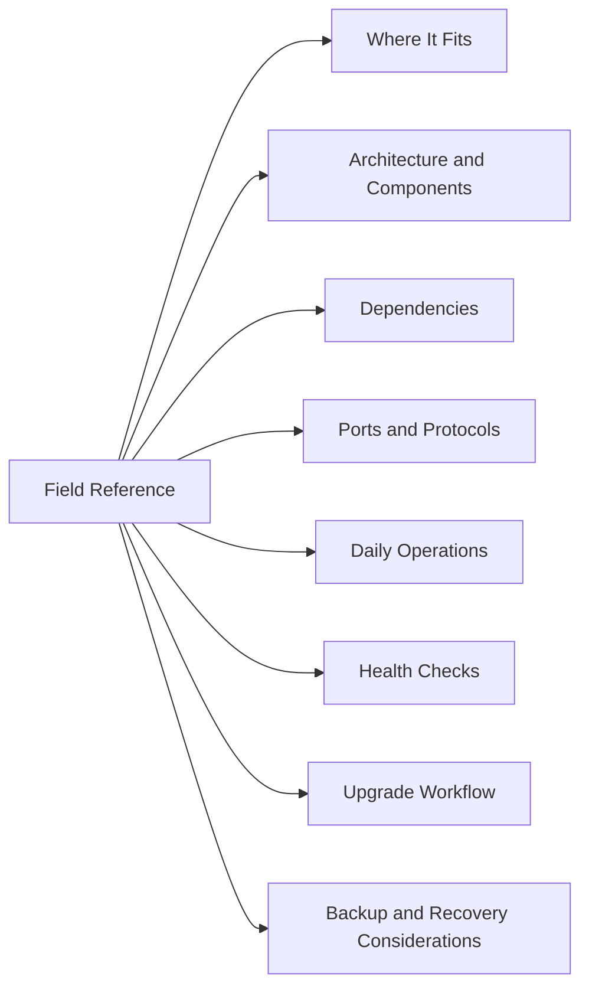

# ESXi Field Reference

## Overview

ESXi is the VMware hypervisor layer that runs virtual machines and provides compute, networking, and storage access to workloads.

## Where It Fits

This sits in the virtualization stack with compute, storage, networking, monitoring, backup, automation, and security controls. Treat it as a Tier 1 infrastructure area when workloads depend on it.

## Architecture and Components

- Physical server hardware
- ESXi hypervisor
- VMkernel networking
- Management network
- Standard or distributed switches
- Datastore access
- Host agents
- Local logs and services

## Dependencies

Common dependencies:

- DNS
- NTP
- Active Directory or LDAP
- Network connectivity
- Storage availability
- Licensing
- Monitoring
- Backup or recovery tooling
- Vendor support access

## Ports and Protocols

| Function | Protocol | Typical Port |
|----------|----------|--------------|
| Management | HTTPS | 443 |
| Monitoring | SNMP | 161 |
| Logging | Syslog | 514 |
| API | HTTPS | 443 |

## Daily Operations

- Confirm host connection state in vCenter.
- Review hardware health.
- Check CPU and memory pressure.
- Confirm datastore access.
- Review storage path status.
- Review network uplink status.
- Check recent host alarms and tasks.

## Health Checks

- Host hardware sensors
- CPU utilization
- Memory utilization
- Datastore latency
- Path redundancy
- NIC link state
- NTP status
- DNS resolution
- Host services

## Upgrade Workflow

1. Verify compatibility.
2. Confirm backups or recovery point.
3. Validate maintenance window.
4. Check current platform health.
5. Apply the upgrade or patch.
6. Monitor logs and tasks.
7. Validate health after the change.
8. Record results and follow-up items.

## Backup and Recovery Considerations

- Confirm configuration backup coverage.
- Confirm appliance or platform backup status where supported.
- Confirm snapshots are used only when appropriate.
- Confirm restore steps are documented.
- Test recovery periodically.
- Keep backup evidence with change records.

## Common Issues

- Host disconnected
- Host not responding
- Storage path down
- High datastore latency
- Failed maintenance mode
- VM performance issue
- Time drift
- Hardware alert

## Troubleshooting Steps

1. Confirm scope.
2. Review recent changes.
3. Check alarms and events.
4. Review system logs.
5. Validate DNS, NTP, authentication, network, and storage.
6. Check resource utilization.
7. Escalate with timestamps, errors, screenshots, and support bundle if unresolved.

## Root Cause Examples

| Symptom | Possible Cause | Resolution |
|--------|----------------|------------|
| Host disconnected | Management network issue | Validate vmkernel, VLAN, DNS, and host agents |
| Failed maintenance mode | VM evacuation issue | Check DRS, pinned VMs, mounted media, and cluster capacity |
| Storage path down | SAN, HBA, or multipath issue | Validate paths, zoning, masking, and adapters |
| Time drift | NTP issue | Validate NTP configuration and host time sync |

## Best Practices

| Recommendation | Detail |
|---|---|
| Maintain consistent patch levels. | Maintain consistent patch levels. |
| Monitor capacity trends. | Monitor capacity trends. |
| Document configuration changes. | Document configuration changes. |
| Perform routine health checks. | Perform routine health checks. |
| Test recovery procedures. | Test recovery procedures. |
| Keep support contracts current. | Keep support contracts current. |
| Keep naming and ownership clean. | Keep naming and ownership clean. |
| Validate changes after implementation. | Validate changes after implementation. |

## Certification Relevance

Useful certification study areas:

- Architecture design
- High availability
- Performance optimization
- Troubleshooting workflows
- Security controls
- Backup and recovery
- Lifecycle management
