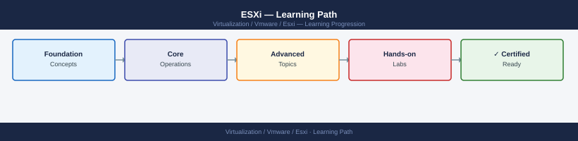

---
tags:
  - esxi
  - learning-path
  - vmware
  - vsphere-8
---
# ESXi — Learning Path

<div class="kb-summary">
Recommended reading order for ESXi. Follow these stages in order to build a complete mental model before working with it in production.

*Applies to: vSphere 7.x · 8.x*
</div>



```d2
direction: right

stage_1_architecture: "Stage 1 — Architecture" {shape: rectangle}
stage_2_deployment: "Stage 2 — Deployment" {shape: rectangle}
stage_3_operations: "Stage 3 — Operations" {shape: rectangle}
stage_4_security: "Stage 4 — Security" {shape: rectangle}
stage_5_troubleshooting: "Stage 5 — Troubleshooting" {shape: rectangle}

stage_1_architecture -> stage_2_deployment: next
stage_2_deployment -> stage_3_operations: next
stage_3_operations -> stage_4_security: next
stage_4_security -> stage_5_troubleshooting: next
```

## Stage 1 — Architecture

**Goal**: Understand how ESXi's VMkernel scheduler, storage stack, and networking stack interact to provide compute isolation for VMs.

**Read in this order**:

- [How It Works](../architecture/how-it-works/) — VMkernel architecture, worlds and resource pools, the VMFS/NFS/vSAN storage stack, and vmk port assignment
- [Design Standards](../architecture/design-standards/) — NIC teaming policies, vDS vs vSwitch tradeoffs, vmk port layout standards, and NUMA-aware sizing
- [Integrations](../architecture/integrations/) — how ESXi registers with vCenter, joins a vSAN cluster, connects to NSX transport nodes, and surfaces hardware via IPMI/iDRAC

**Why first**: ESXi is the bare-metal Type-1 hypervisor everything else runs on. Understanding how the VMkernel arbitrates CPU, memory, and I/O — and how vmk ports map to physical NICs — is foundational before any network or storage change can be made safely.

---

## Stage 2 — Deployment

**Goal**: Know the host build standard, image creation with vLCM, and the network prerequisites that must be correct before joining a cluster.

**Read**:

- [Deploy](../deploy/) — ISO vs scripted install, custom image with ESXi Image Builder, kickstart automation, and host profile application
- [Install & Upgrade](../operations/install-upgrade/) — vLCM baseline vs image lifecycle, staging patches, remediation order in a cluster, and PSOD recovery after a failed update

**Why second**: An incorrectly built host — wrong vmk layout, missing driver, or NTP misconfiguration — causes cluster-level problems that are hard to diagnose after the fact. Deploying correctly from a known-good image baseline prevents most host stability issues.

---

## Stage 3 — Operations

**Goal**: Operate hosts confidently using esxcli, esxtop, and host profiles, and know the health routine to run before any change window.

**Read in this order**:

- [Health Checks](../operations/health-checks/) — start here every shift; run the routine covering hardware sensors, storage paths, vmk connectivity, and vSAN component health
- [CLI Reference](../operations/cli-reference/) — `esxcli` namespaces (network, storage, system, vsan), `esxtop` counters to watch, and `vim-cmd` for VM-level control
- [Procedures](../operations/procedures/) — entering/exiting maintenance mode safely, adding a vmk port, replacing a NIC in a vDS, and managing host profiles for compliance drift
- [Backup & Restore](../operations/backup-restore/) — host configuration export with `vim-cmd hostsvc/firmware/backup_config`, profile-based restore, and scratch partition management
- [Scripts](../operations/scripts/) — PowerCLI scripts for bulk host health reporting, NTP validation, and adapter queue depth tuning

**Why third**: Operational procedures assume you know what a healthy host looks like. Understanding esxtop baselines and normal storage path counts before an incident means you can act quickly instead of learning the tool under pressure.

---

## Stage 4 — Security

**Goal**: Apply lockdown mode, manage ESXi shell and SSH access, and enforce the host hardening baseline without losing management connectivity.

**Read**:

- [Access Control](../security/access-control/) — local users vs AD integration, DCUI access control, and the role of the ESXi host client vs vCenter for permission management
- [Authentication](../security/authentication/) — SSH key-based auth, smart card integration via vCenter, and managing the root password rotation process
- [Encryption](../security/encryption/) — VM Encryption at the host level, encrypted vMotion negotiation, and the impact of vTPM on VM portability
- [Hardening](../security/hardening/) — lockdown mode (normal vs strict), disabling MOB, SSH, and ESXi shell timeouts, and audit log forwarding to syslog

**Why fourth**: Lockdown mode and SSH restrictions must be applied after you have confirmed that vCenter connectivity and host profiles are working correctly — otherwise you can lock yourself out of the host entirely.

---

## Stage 5 — Troubleshooting

**Goal**: Diagnose and resolve host disconnections, PSOD events, storage path failures, and network vmk misconfiguration.

**Read**:

- [Common Issues](../troubleshooting/common-issues/) — host disconnected from vCenter, purple screen of death (PSOD), APD/PDL storage events, and vmk routing conflicts
- [Diagnostics](../troubleshooting/diagnostics/) — `esxcli` for live path and adapter state, `esxtop` for latency spikes, vm-support bundle collection, and interpreting vmkernel.log
- [Escalation](../troubleshooting/escalation/) — PSOD core dump analysis prerequisites, required logs for a GSS case, and hardware vendor coordination for iDRAC/IPMI data

**Why last**: Troubleshooting makes most sense once you know the normal operating state.

---

## See also

- [ESXi — Deploy](../deploy/)
- [ESXi — Procedures](../operations/procedures/)
- [ESXi — Common Issues](../troubleshooting/common-issues/)
